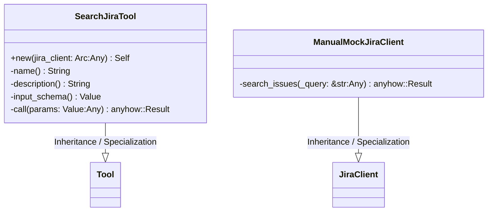
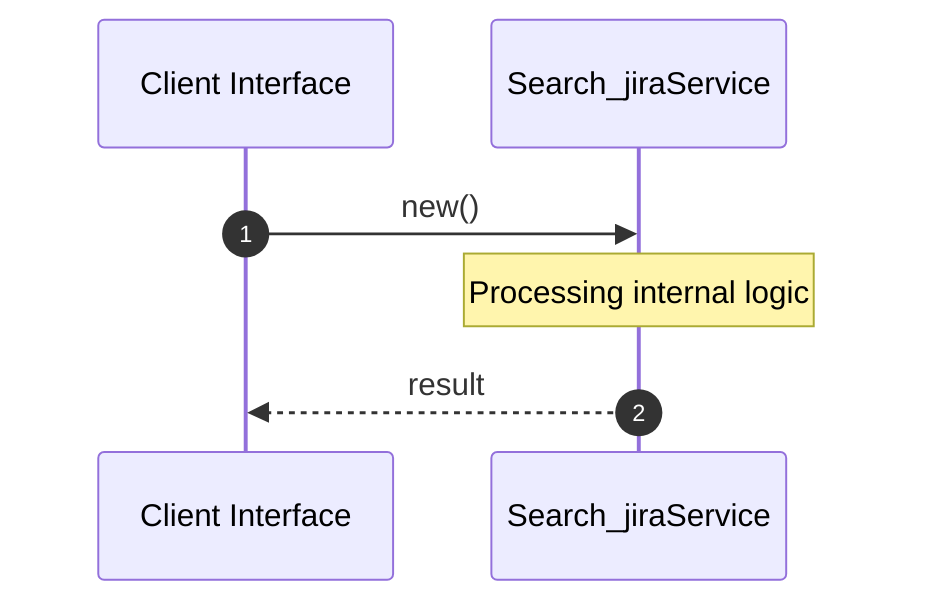

# File: search_jira.rs

**Source Path:** `crates/factory-mcp-server/src/tools/search_jira.rs`

## Overview

### Purpose
Provides implementation for search_jira.rs.

### Responsibilities
* Handles logic related to search_jira.

### Dependencies
* std::sync::Arc, async_trait::async_trait, super::*, crate::tools::Tool, factory_infrastructure::JiraClient, serde_json::{json, Value}, crate::protocol::{CallToolResult, McpContent}

## Public API & Architecture

### Exported Classes / Structs / Interfaces

#### SearchJiraTool

**Overview:** Represents SearchJiraTool.

**Public Methods:**

##### `new(jira_client: Arc<dyn JiraClient> (Any)) -> Self`
Executes new.

#### ManualMockJiraClient

**Overview:** Represents ManualMockJiraClient.

**Public Methods:**

None.

### Exported Functions

None.

## Internal Architecture & Execution Flow

### Sequence Explanation

## Cross References
* **Parent module:** `crates/factory-mcp-server/src/tools`
* **Dependencies:** std::sync::Arc, async_trait::async_trait, super::*, crate::tools::Tool, factory_infrastructure::JiraClient, serde_json::{json, Value}, crate::protocol::{CallToolResult, McpContent}
