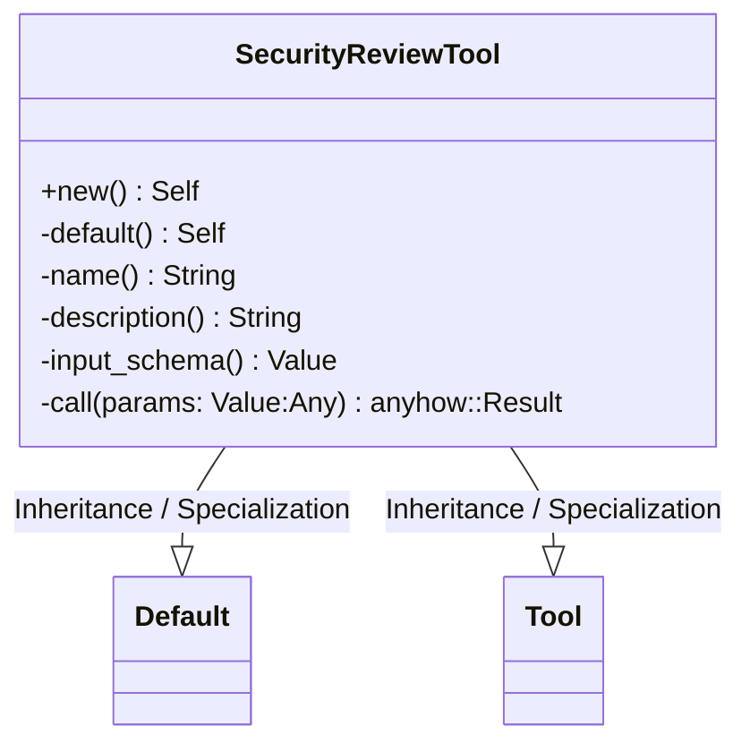
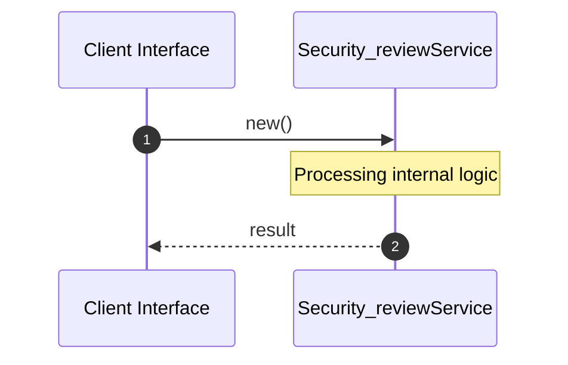

# File: security_review.rs

**Source Path:** `crates/factory-mcp-server/src/tools/security_review.rs`

## Overview

### Purpose
Provides implementation for security_review.rs.

### Responsibilities
* Handles logic related to security_review.

### Dependencies
* serde_json::{json, Value}, crate::protocol::{CallToolResult, McpContent}, std::env, async_openai::Client, crate::tools::Tool, async_openai::config::OpenAIConfig, async_trait::async_trait

## Public API & Architecture

### Exported Classes / Structs / Interfaces

#### SecurityReviewTool

**Overview:** Represents SecurityReviewTool.

**Public Methods:**

##### `new() -> Self`
Executes new.

### Exported Functions

None.

## Internal Architecture & Execution Flow

### Sequence Explanation

## Cross References
* **Parent module:** `crates/factory-mcp-server/src/tools`
* **Dependencies:** serde_json::{json, Value}, crate::protocol::{CallToolResult, McpContent}, std::env, async_openai::Client, crate::tools::Tool, async_openai::config::OpenAIConfig, async_trait::async_trait
