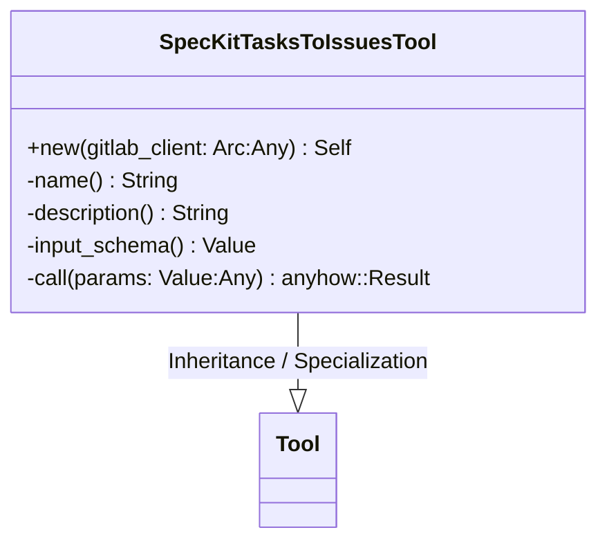
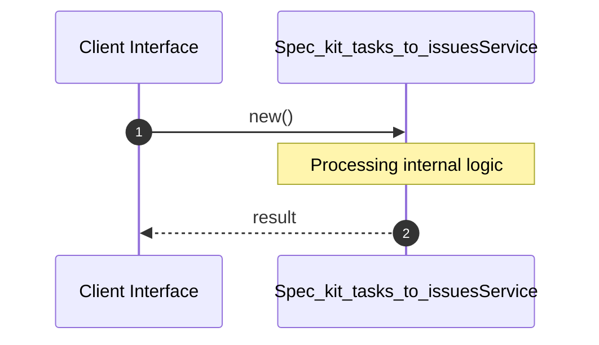

# File: spec_kit_tasks_to_issues.rs

**Source Path:** `crates/factory-mcp-server/src/tools/spec_kit_tasks_to_issues.rs`

## Overview

### Purpose
Provides implementation for spec_kit_tasks_to_issues.rs.

### Responsibilities
* Handles logic related to spec_kit_tasks_to_issues.

### Dependencies
* crate::protocol::CallToolResult, async_trait::async_trait, factory_infrastructure::GitlabClient, serde_json::{json, Value}, std::sync::Arc, crate::tools::Tool

## Public API & Architecture

### Exported Classes / Structs / Interfaces

#### SpecKitTasksToIssuesTool

**Overview:** Represents SpecKitTasksToIssuesTool.

**Public Methods:**

##### `new(gitlab_client: Arc<dyn GitlabClient> (Any)) -> Self`
Executes new.

### Exported Functions

None.

## Internal Architecture & Execution Flow

### Sequence Explanation

## Cross References
* **Parent module:** `crates/factory-mcp-server/src/tools`
* **Dependencies:** crate::protocol::CallToolResult, async_trait::async_trait, factory_infrastructure::GitlabClient, serde_json::{json, Value}, std::sync::Arc, crate::tools::Tool
