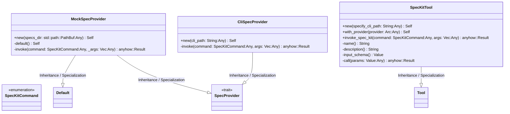
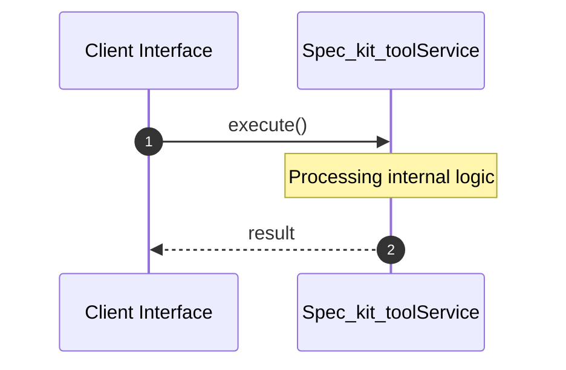

# File: spec_kit_tool.rs

**Source Path:** `crates/factory-mcp-server/src/tools/spec_kit_tool.rs`

## Overview

### Purpose
Provides implementation for spec_kit_tool.rs.

### Responsibilities
* Handles logic related to spec_kit_tool.

### Dependencies
* std::sync::Arc, crate::protocol::CallToolResult, crate::tools::Tool, serde_json::{json, Value}, serde::{Deserialize, Serialize}, async_trait::async_trait, super::*

## Public API & Architecture

### Exported Classes / Structs / Interfaces

#### SpecKitCommand

**Overview:** Represents SpecKitCommand.

**Public Methods:**

None.

#### SpecProvider

**Overview:** Represents SpecProvider.

**Public Methods:**

None.

#### MockSpecProvider

**Overview:** Represents MockSpecProvider.

**Public Methods:**

##### `new(specs_dir: std::path::PathBuf (Any)) -> Self`
Executes new.

#### CliSpecProvider

**Overview:** Represents CliSpecProvider.

**Public Methods:**

##### `new(cli_path: String (Any)) -> Self`
Executes new.

#### SpecKitTool

**Overview:** Represents SpecKitTool.

**Public Methods:**

##### `new(specify_cli_path: String (Any)) -> Self`
Executes new.

##### `with_provider(provider: Arc<dyn SpecProvider> (Any)) -> Self`
Executes with_provider.

##### `invoke_spec_kit(command: SpecKitCommand (Any), args: Vec<String> (Any)) -> anyhow::Result<String>`
Executes invoke_spec_kit.

### Exported Functions

None.

## Internal Architecture & Execution Flow

### Sequence Explanation

## Cross References
* **Parent module:** `crates/factory-mcp-server/src/tools`
* **Dependencies:** std::sync::Arc, crate::protocol::CallToolResult, crate::tools::Tool, serde_json::{json, Value}, serde::{Deserialize, Serialize}, async_trait::async_trait, super::*
