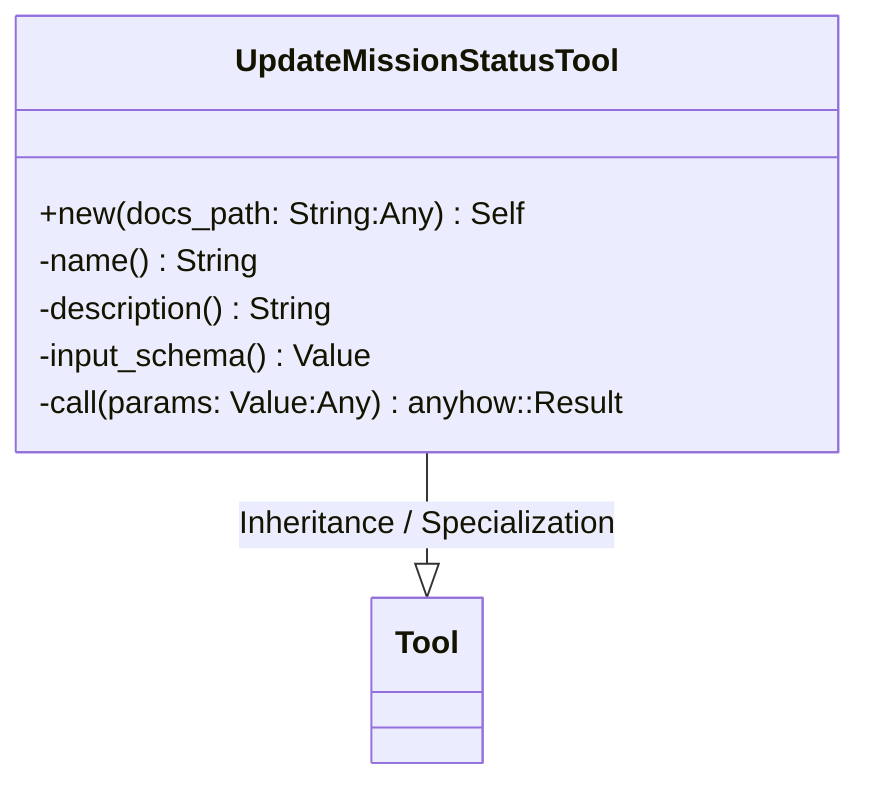
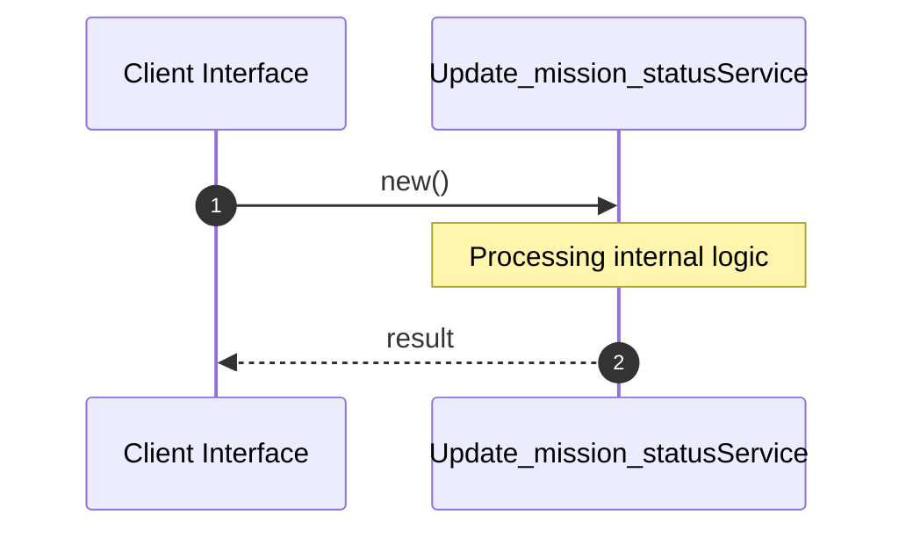

# File: update_mission_status.rs

**Source Path:** `crates/factory-mcp-server/src/tools/update_mission_status.rs`

## Overview

### Purpose
Provides implementation for update_mission_status.rs.

### Responsibilities
* Handles logic related to update_mission_status.

### Dependencies
* serde_json::{json, Value}, async_trait::async_trait, crate::tools::Tool, crate::protocol::{CallToolResult, McpContent}, std::fs::{File, OpenOptions}, std::io::Write, chrono::Local

## Public API & Architecture

### Exported Classes / Structs / Interfaces

#### UpdateMissionStatusTool

**Overview:** Represents UpdateMissionStatusTool.

**Public Methods:**

##### `new(docs_path: String (Any)) -> Self`
Executes new.

### Exported Functions

None.

## Internal Architecture & Execution Flow

### Sequence Explanation

## Cross References
* **Parent module:** `crates/factory-mcp-server/src/tools`
* **Dependencies:** serde_json::{json, Value}, async_trait::async_trait, crate::tools::Tool, crate::protocol::{CallToolResult, McpContent}, std::fs::{File, OpenOptions}, std::io::Write, chrono::Local
