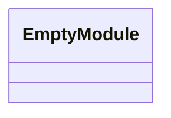
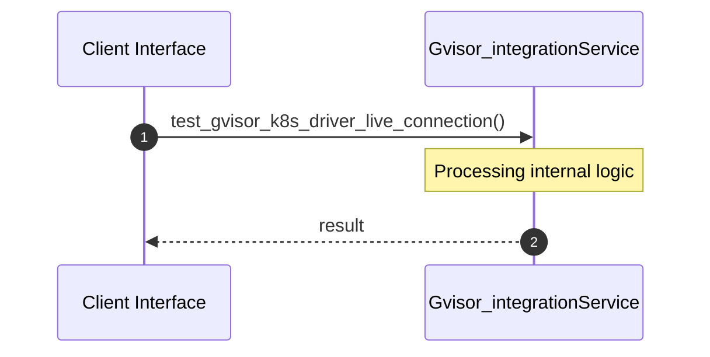

# File: gvisor_integration.rs

**Source Path:** `crates/factory-mcp-server/tests/gvisor_integration.rs`

## Overview

### Purpose
Provides implementation for gvisor_integration.rs.

### Responsibilities
* Handles logic related to gvisor_integration.

### Dependencies
* serde_json::json, kube::{
    api::{Api, PostParams},
    Client,
}, factory_mcp_server::sandbox::{GvisorK8sDriver, SandboxDriver}, k8s_openapi::api::core::v1::Namespace

## Public API & Architecture

### Exported Classes / Structs / Interfaces

### Exported Functions

None.

## Internal Architecture & Execution Flow

### Sequence Explanation

## Cross References
* **Parent module:** `crates/factory-mcp-server/tests`
* **Dependencies:** serde_json::json, kube::{
    api::{Api, PostParams},
    Client,
}, factory_mcp_server::sandbox::{GvisorK8sDriver, SandboxDriver}, k8s_openapi::api::core::v1::Namespace
