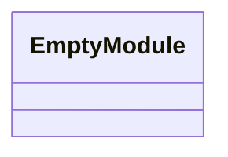
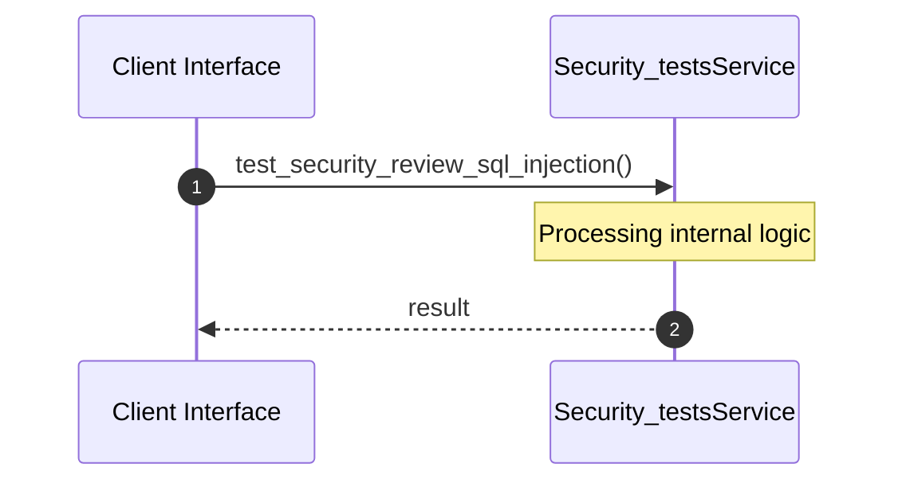

# File: security_tests.rs

**Source Path:** `crates/factory-mcp-server/tests/security_tests.rs`

## Overview

### Purpose
Provides implementation for security_tests.rs.

### Responsibilities
* Handles logic related to security_tests.

### Dependencies
* serde_json::{json, Value}, factory_mcp_server::protocol::McpContent, factory_mcp_server::tools::security_review::SecurityReviewTool, factory_mcp_server::tools::Tool

## Public API & Architecture

### Exported Classes / Structs / Interfaces

### Exported Functions

None.

## Internal Architecture & Execution Flow

### Sequence Explanation

## Cross References
* **Parent module:** `crates/factory-mcp-server/tests`
* **Dependencies:** serde_json::{json, Value}, factory_mcp_server::protocol::McpContent, factory_mcp_server::tools::security_review::SecurityReviewTool, factory_mcp_server::tools::Tool
