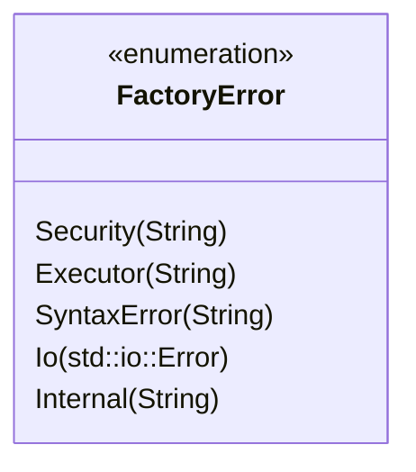

# Module Specification: `factory-core::error`

* **Source File Reference:** `crates/factory-core/src/error.rs` (Lines: L1-L45)
* **Upstream Dependencies:** Standard library `thiserror` crate
* **Downstream Consumers:** All workspace crates

---

## 1. Architectural Role & Responsibilities

Encapsulates error handling across all factory components using the `FactoryError` enum and standard `Result<T, FactoryError>` alias.

---

## 2. Error Enumeration Diagram

