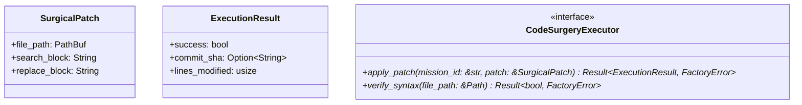

# Module Specification: `factory-core::executor`

* **Source File Reference:** `crates/factory-core/src/executor.rs` (Lines: L1-L28)
* **Upstream Dependencies:** [[Modules/FactoryCore/Error|factory-core::error]]
* **Downstream Consumers:** [[Modules/FactoryMCPServer/Sandbox|factory-mcp-server::sandbox]]

---

## 1. Architectural Role & Responsibilities

The `executor` module defines data structures (`SurgicalPatch`, `ExecutionResult`) and the asynchronous `CodeSurgeryExecutor` trait responsible for applying AST-level or text-block replacement patches to source files across the factory workspace.

---

## 2. UML 2.0 Class Diagram

---

## 3. Data Structure Contracts

### `SurgicalPatch`
- **Source Line Citation:** `crates/factory-core/src/executor.rs:L5-L10`
- **Fields**:
  - `file_path: PathBuf`: Target file relative path.
  - `search_block: String`: Original code block to match.
  - `replace_block: String`: Modified replacement content.

### `ExecutionResult`
- **Source Line Citation:** `crates/factory-core/src/executor.rs:L12-L17`
- **Fields**:
  - `success: bool`: Patch execution status.
  - `commit_sha: Option<String>`: Git commit SHA if committed.
  - `lines_modified: usize`: Count of lines altered.
