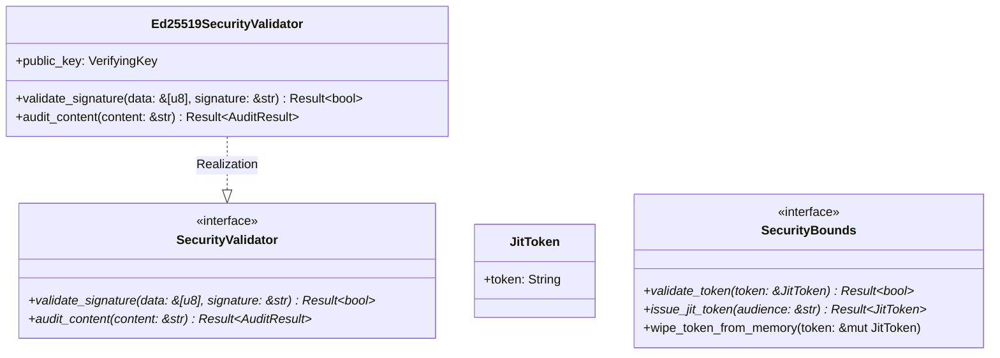

# Module Specification: `factory-core::security`

* **Source File Reference:** `crates/factory-core/src/security.rs` (Lines: L1-L72)
* **Upstream Dependencies:** [[Modules/FactoryCore/Error|factory-core::error]]
* **Downstream Consumers:** [[Modules/FactoryMCPServer/Sandbox|factory-mcp-server::sandbox]], [[Modules/FactoryInfrastructure/Aethalgard|factory-infrastructure::aethalgard]]

---

## 1. Architectural Role & Responsibilities

Provides zero-trust security components including `Ed25519SecurityValidator` for signature verification, `JitToken` with automated RAM wiping via `zeroize::ZeroizeOnDrop`, and `SecurityBounds` trait bounds.

---

## 2. UML 2.0 Class Diagram

---

## 3. Cryptographic & Security Contracts

### `Ed25519SecurityValidator::validate_signature(data: &[u8], signature: &str)`
- **Source Line Citation:** `crates/factory-core/src/security.rs:L31-L46`
- **Behavior**: Decodes URL-safe Base64 signature and verifies against `public_key`.

### `JitToken`
- **Source Line Citation:** `crates/factory-core/src/security.rs:L56-L61`
- **Memory Safety**: Derives `zeroize::Zeroize` and `zeroize::ZeroizeOnDrop` to erase token buffers automatically upon drop.
