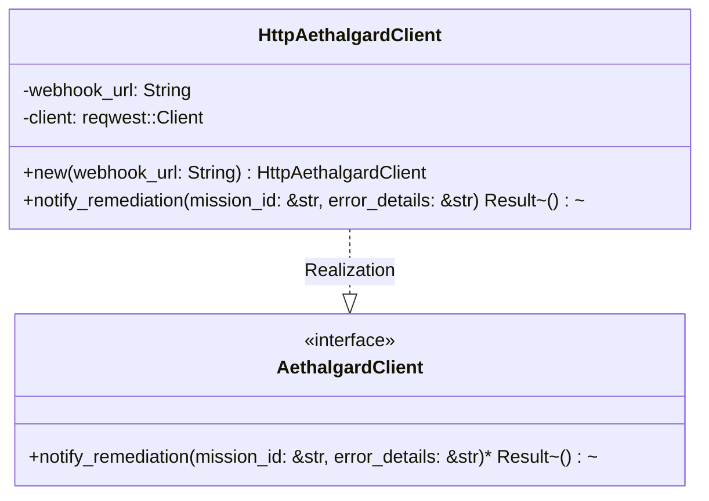

# Module Specification: `factory-infrastructure::aethalgard`

* **Source File Reference:** `crates/factory-infrastructure/src/aethalgard.rs` (Lines: L1-L56)
* **Upstream Dependencies:** `reqwest`, `serde_json`, `uuid`
* **Downstream Consumers:** [[Modules/FactoryMCPServer/Sandbox|factory-mcp-server::sandbox]]

---

## 1. Architectural Role & Responsibilities

Provides `AethalgardClient` trait and `HttpAethalgardClient` implementation to dispatch remediation alert webhooks on mission execution errors.

---

## 2. UML 2.0 Class Diagram

---

## 3. Method Contracts

### `HttpAethalgardClient::notify_remediation(mission_id: &str, error_details: &str)`
- **Source Line Citation:** `crates/factory-infrastructure/src/aethalgard.rs:L26-L54`
- **Protocol**: HTTP POST sending JSON-RPC 2.0 payload to `webhook_url`.
