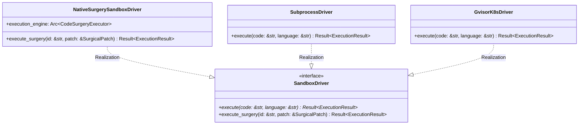

# Module Specification: `factory-mcp-server::sandbox`

* **Source File Reference:** `crates/factory-mcp-server/src/sandbox.rs` (Lines: L1-L190)
* **Upstream Dependencies:** [[Modules/FactoryCore/Executor|factory-core::executor]], [[Modules/FactoryCore/Error|factory-core::error]]
* **Downstream Consumers:** MCP Tool Handlers (`crates/factory-mcp-server/src/tools/`)

---

## 1. Architectural Role & Responsibilities

Provides the execution core for code blocks and surgical patches across three drivers:
1. `NativeSurgerySandboxDriver`: Executes AST surgical patches using `CodeSurgeryExecutor`.
2. `SubprocessDriver`: Local CLI process execution with a strict 30-second timeout.
3. `GvisorK8sDriver`: Containerized Kubernetes pod execution isolated via gVisor.

---

## 2. UML 2.0 Class Diagram

---

## 3. Driver Method Contracts

### `SubprocessDriver::execute(code: &str, language: &str)`
- **Source Line Citation:** `crates/factory-mcp-server/src/sandbox.rs:L52-L111`
- **Supported Languages**: Python (`python3 -c`), Rust (`rustc`), Go (`go run`), TypeScript (`ts-node -e`).
- **Timeout**: Enforces 30-second execution bound via `tokio::time::timeout`.

### `GvisorK8sDriver::execute(code: &str, language: &str)`
- **Source Line Citation:** `crates/factory-mcp-server/src/sandbox.rs:L121-L175`
- **Isolation**: Invokes `LaunchSandboxPodTool` to run code inside a gVisor sandboxed Kubernetes pod.
