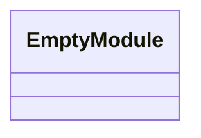
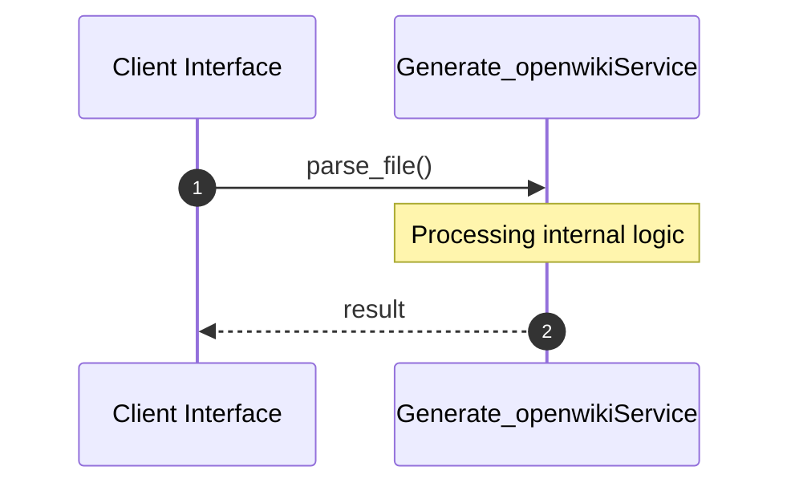

# File: generate_openwiki.py

**Source Path:** `generate_openwiki.py`

## Overview

### Purpose
Provides implementation for generate_openwiki.py.

### Responsibilities
* Handles logic related to generate_openwiki.

### Dependencies
* sys, datetime, json, subprocess, shutil, os

## Public API & Architecture

### Exported Classes / Structs / Interfaces

### Exported Functions

#### `parse_file(filepath (Any)) -> None`
Executes parse_file.

#### `generate_mermaid_classes(classes (Any)) -> None`
Executes generate_mermaid_classes.

#### `generate_sequence_diagram(module_name (Any), classes (Any), free_functions (Any)) -> None`
Executes generate_sequence_diagram.

#### `write_file_doc(file_path (Any), parsed (Any), now (Any)) -> None`
Executes write_file_doc.

#### `setup_okf_structure() -> None`
Executes setup_okf_structure.

#### `main() -> None`
Executes main.

#### `generate_indexes(now (Any)) -> None`
Executes generate_indexes.

## Internal Architecture & Execution Flow

### Sequence Explanation

## Cross References
* **Parent module:** ``
* **Dependencies:** sys, datetime, json, subprocess, shutil, os
