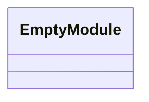
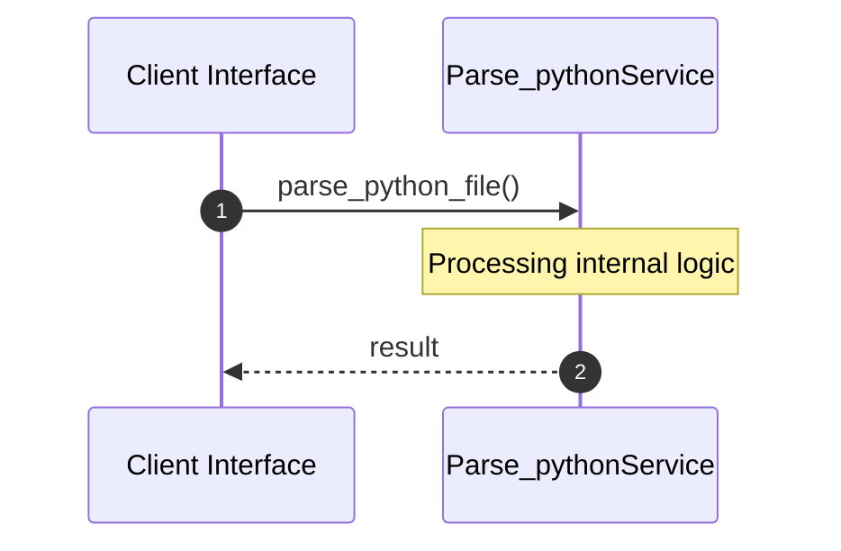

# File: parse_python.py

**Source Path:** `parse_python.py`

## Overview

### Purpose
Provides implementation for parse_python.py.

### Responsibilities
* Handles logic related to parse_python.

### Dependencies
* ast, sys, json

## Public API & Architecture

### Exported Classes / Structs / Interfaces

### Exported Functions

#### `parse_python_file(filepath (Any)) -> None`
Executes parse_python_file.

## Internal Architecture & Execution Flow

### Sequence Explanation

## Cross References
* **Parent module:** ``
* **Dependencies:** ast, sys, json
