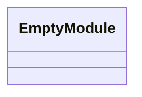
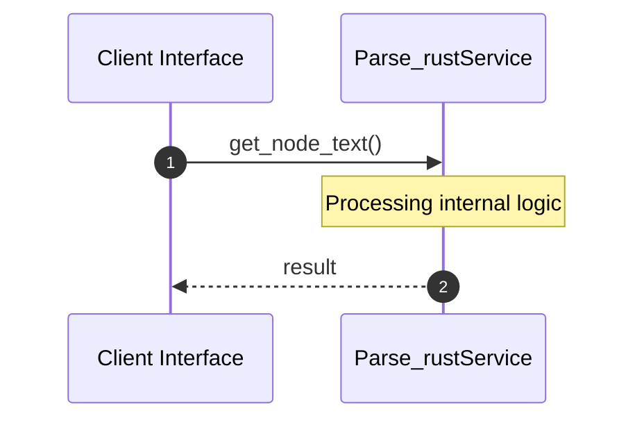

# File: parse_rust.py

**Source Path:** `parse_rust.py`

## Overview

### Purpose
Provides implementation for parse_rust.py.

### Responsibilities
* Handles logic related to parse_rust.

### Dependencies
* tree_sitter, sys, json, tree_sitter_rust

## Public API & Architecture

### Exported Classes / Structs / Interfaces

### Exported Functions

#### `get_node_text(node (Any), source_bytes (Any)) -> None`
Executes get_node_text.

#### `parse_rust(filepath (Any)) -> None`
Executes parse_rust.

## Internal Architecture & Execution Flow

### Sequence Explanation

## Cross References
* **Parent module:** ``
* **Dependencies:** tree_sitter, sys, json, tree_sitter_rust
