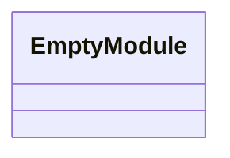
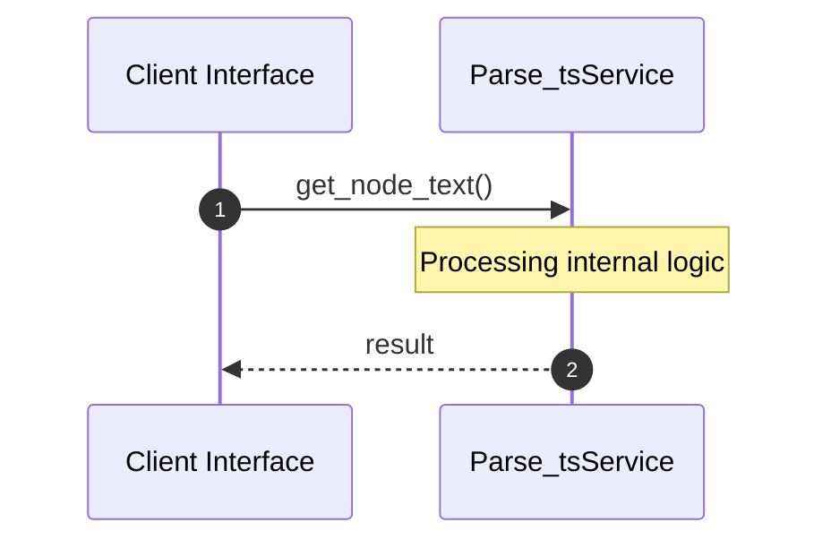

# File: parse_ts.py

**Source Path:** `parse_ts.py`

## Overview

### Purpose
Provides implementation for parse_ts.py.

### Responsibilities
* Handles logic related to parse_ts.

### Dependencies
* sys, tree_sitter_typescript, tree_sitter, json

## Public API & Architecture

### Exported Classes / Structs / Interfaces

### Exported Functions

#### `get_node_text(node (Any), source_bytes (Any)) -> None`
Executes get_node_text.

#### `parse_ts(filepath (Any)) -> None`
Executes parse_ts.

## Internal Architecture & Execution Flow

### Sequence Explanation

## Cross References
* **Parent module:** ``
* **Dependencies:** sys, tree_sitter_typescript, tree_sitter, json
