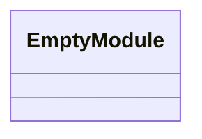
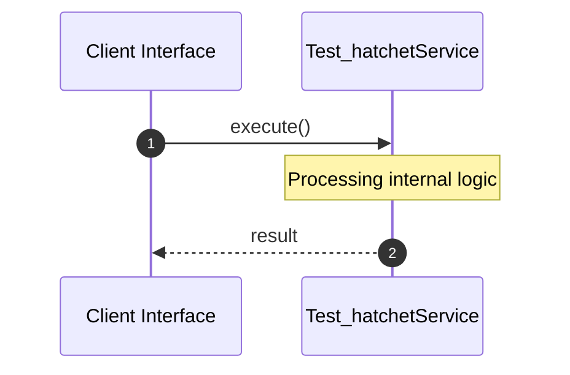

# File: test_hatchet.py

**Source Path:** `test_hatchet.py`

## Overview

### Purpose
Provides implementation for test_hatchet.py.

### Responsibilities
* Handles logic related to test_hatchet.

### Dependencies
* requests

## Public API & Architecture

### Exported Classes / Structs / Interfaces

### Exported Functions

None.

## Internal Architecture & Execution Flow

### Sequence Explanation

## Cross References
* **Parent module:** ``
* **Dependencies:** requests
