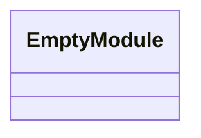
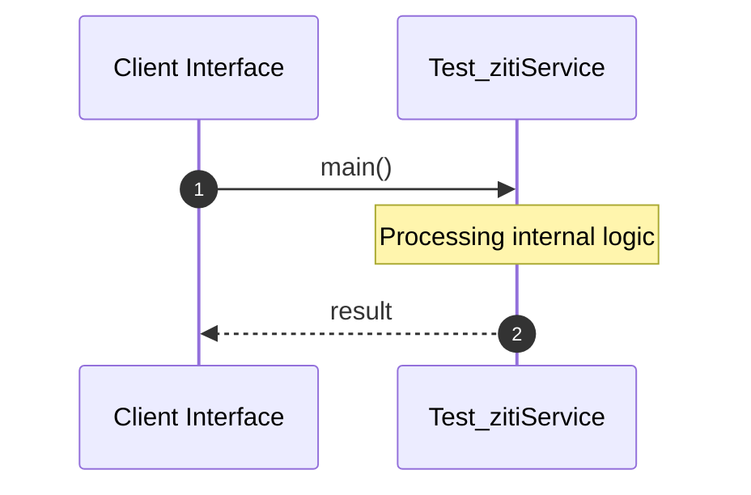

# File: test_ziti.rs

**Source Path:** `test_ziti.rs`

## Overview

### Purpose
Provides implementation for test_ziti.rs.

### Responsibilities
* Handles logic related to test_ziti.

### Dependencies
* ziti_sdk::ZitiConfig

## Public API & Architecture

### Exported Classes / Structs / Interfaces

### Exported Functions

None.

## Internal Architecture & Execution Flow

### Sequence Explanation

## Cross References
* **Parent module:** ``
* **Dependencies:** ziti_sdk::ZitiConfig
