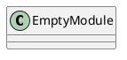
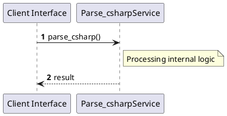

# File: parse_csharp.py

**Source Path:** `parse_csharp.py`

## Overview

### Purpose
Provides implementation for parse_csharp.py.

### Responsibilities
* Handles logic related to parse_csharp.

### Dependencies
* json, sys, tree_sitter, tree_sitter_c_sharp

### Imported modules
* None

### Exported classes
* None

### Exported interfaces
* None

### Exported functions
* parse_csharp

## Public API

### Exported Classes / Structs / Interfaces

### Exported Functions

#### `parse_csharp(filepath (Any)) -> None`
No description provided.

## Internal architecture



## Execution flow & Sequence explanation



## Examples

```
// Example usage of parse_csharp.py components
import { ... } from 'parse_csharp.py';
```

## Cross References
* **Parent module:** ``
* **Dependencies:** json, sys, tree_sitter, tree_sitter_c_sharp
