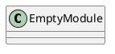
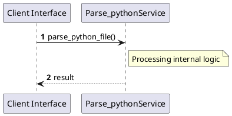

# File: parse_python.py

**Source Path:** `parse_python.py`

## Overview

### Purpose
Provides implementation for parse_python.py.

### Responsibilities
* Handles logic related to parse_python.

### Dependencies
* ast, json, sys

### Imported modules
* None

### Exported classes
* None

### Exported interfaces
* None

### Exported functions
* parse_python_file

## Public API

### Exported Classes / Structs / Interfaces

### Exported Functions

#### `parse_python_file(filepath (Any)) -> None`
No description provided.

## Internal architecture



## Execution flow & Sequence explanation




## Examples

```
// Example usage of parse_python.py components
import { ... } from 'parse_python.py';
```


## Cross References
* **Parent module:** ``
* **Dependencies:** ast, json, sys
