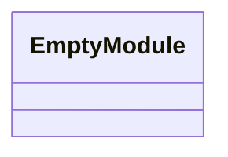
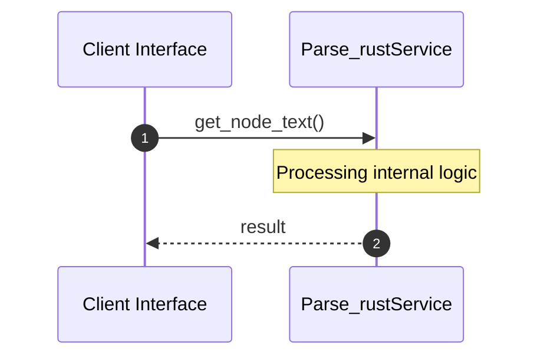

# File: parse_rust.py

**Source Path:** `parse_rust.py`

## Overview

### Purpose
Provides implementation for parse_rust.py.

### Responsibilities
* Handles logic related to parse_rust.

### Dependencies
* json, sys, tree_sitter, tree_sitter_rust

### Imported modules
* None

### Exported classes
* None

### Exported interfaces
* None

### Exported functions
* get_node_text, parse_rust

## Public API

### Exported Classes / Structs / Interfaces

### Exported Functions

#### `get_node_text(node (Any), source_bytes (Any)) -> None`
Executes get_node_text.

#### `parse_rust(filepath (Any)) -> None`
Executes parse_rust.

## Internal architecture



## Execution flow & Sequence explanation




## Examples

```
// Example usage of parse_rust.py components
import { ... } from 'parse_rust.py';
```


## Cross References
* **Parent module:** ``
* **Dependencies:** json, sys, tree_sitter, tree_sitter_rust
