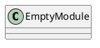
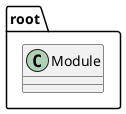
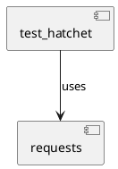
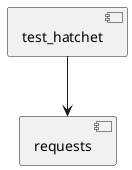
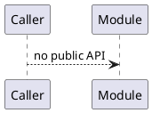
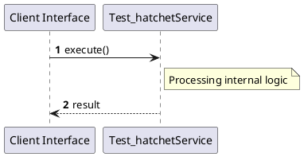

# File: test_hatchet.py

**Source Path:** `test_hatchet.py`

## Overview

### Purpose
Provides implementation for test_hatchet.py.

### Responsibilities
* Handles logic related to test_hatchet.

### Dependencies
* requests

### Imported modules
* None

### Exported classes
* None

### Exported interfaces
* None

### Exported functions
* None

## Public API

### Exported Classes / Structs / Interfaces

### Exported Functions

None.

## Internal architecture



## Package Diagram



## Component Diagram



## Dependency Graph



## Call Graph



## Execution flow & Sequence explanation



## Examples

```
// Example usage of test_hatchet.py components
import { ... } from 'test_hatchet.py';
```

## Cross References
* **Parent module:** ``
* **Dependencies:** requests
