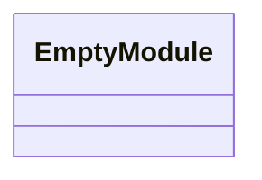
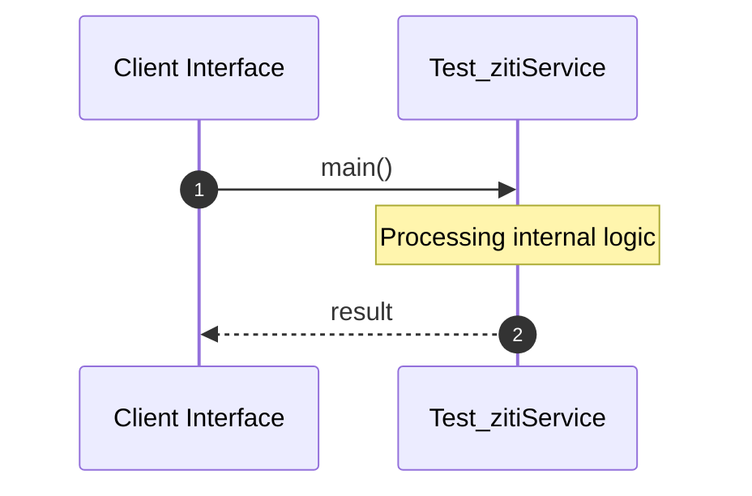

# File: test_ziti.rs

**Source Path:** `test_ziti.rs`

## Overview

### Purpose
Provides implementation for test_ziti.rs.

### Responsibilities
* Handles logic related to test_ziti.

### Dependencies
* ziti_sdk::ZitiConfig

### Imported modules
*

### Exported classes
* None

### Exported interfaces
* None

### Exported functions
*

## Public API

### Exported Classes / Structs / Interfaces

### Exported Functions

None.

## Internal architecture



## Execution flow & Sequence explanation




## Examples

```
// Example usage of test_ziti.rs components
import { ... } from 'test_ziti.rs';
```


## Cross References
* **Parent module:** ``
* **Dependencies:** ziti_sdk::ZitiConfig
