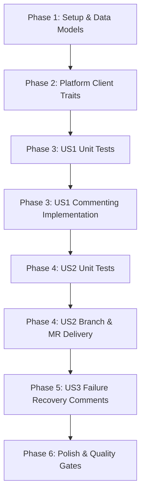

# Tasks: Work Item Progress Comments & Remote Branch GitOps Delivery

**Input**: Design documents from `specs/001-workitem-status-and/` (`plan.md`, `spec.md`, `data-model.md`, `contracts/`, `research.md`, `quickstart.md`)  
**Prerequisites**: `plan.md` (approved), `spec.md` (clarified)  
**Tests**: Included per Dark Gravity Verification Triad (TDD / non-negotiable test gates)  
**Organization**: Tasks are grouped by foundational layer and user story to enable independent implementation and testing.

---

## Format: `- [ ] [TaskID] [P?] [Story?] Description with file path`

- **[P]**: Parallelizable task (independent file, no blocking prerequisites)
- **[Story]**: User story identifier ([US1], [US2], [US3])
- Exact file paths referenced for every task

---

## Phase 1: Setup & Data Model Foundation

**Purpose**: Establish data models, protobuf extensions, and provenance representations across workspace crates.

- [ ] T001 Extend `MissionInput` struct with `source_platform`, `repository`, and `issue_number` in `crates/factory-application/src/workflows/autonomous_mission.rs`
- [ ] T002 [P] Define `GitlabCommitAction` and `GitDeliveryResult` models in `crates/factory-infrastructure/src/gitlab.rs`
- [ ] T003 [P] Ensure `PollerDaemonService` serializes `source_platform`, `repository`, and `issue_number` into `MissionInput` payload in `crates/factory-application/src/poller_service.rs`

---

## Phase 2: Foundational Platform Client Traits

**Purpose**: Extend abstract traits `GitlabClient` and `GithubClient` with mock support for unit tests.

- [ ] T004 Extend `GitlabClient` trait with `post_issue_note`, `create_branch`, `create_commit_files`, and `create_merge_request` in `crates/factory-infrastructure/src/gitlab.rs`
- [ ] T005 [P] Extend `GithubClient` trait with `post_issue_comment` and `create_branch` in `crates/factory-infrastructure/src/github.rs`

**Checkpoint**: Core traits and data structures defined; user story implementations can begin.

---

## Phase 3: User Story 1 - Real-Time Status Comments on Originating Work Items (Priority: P1) 🎯 MVP

**Goal**: Enable autonomous factory agents to post incremental, structured Markdown milestone comments to the originating issue at each DAG phase transition (Ingestion, Plan, Execute, Validate, Review).

**Independent Test**: Mock unit tests verify that HTTP `POST /issues/:id/notes` and `POST /issues/:number/comments` are executed with formatted Markdown bodies containing mission ID and phase markers.

### Tests for User Story 1 ⚠️
- [ ] T006 [P] [US1] Unit test for `HttpGitlabClient::post_issue_note` with mock HTTP responder in `crates/factory-infrastructure/src/gitlab.rs`
- [ ] T007 [P] [US1] Unit test for `HttpGithubClient::post_issue_comment` with mock HTTP responder in `crates/factory-infrastructure/src/github.rs`

### Implementation for User Story 1
- [ ] T008 [US1] Implement `post_issue_note` on `HttpGitlabClient` via `POST /api/v4/projects/{id}/issues/{iid}/notes` in `crates/factory-infrastructure/src/gitlab.rs`
- [ ] T009 [P] [US1] Implement `post_issue_comment` on `HttpGithubClient` via `POST /repos/{owner}/{repo}/issues/{number}/comments` in `crates/factory-infrastructure/src/github.rs`
- [ ] T010 [US1] Add non-blocking milestone commenting helper `post_mission_milestone` in `crates/factory-application/src/workflows/autonomous_mission.rs`
- [ ] T011 [US1] Instrument `rustant-plan` task to emit "Planning Initiated" and "Plan Formulated" comments in `crates/factory-application/src/workflows/autonomous_mission.rs`
- [ ] T012 [US1] Instrument `zeroclaw-execute` and `zeroclaw-validate` tasks to emit test verification comments in `crates/factory-application/src/workflows/autonomous_mission.rs`
- [ ] T013 [US1] Instrument `rustant-review` task to emit security audit score comments in `crates/factory-application/src/workflows/autonomous_mission.rs`

**Checkpoint**: At this point, any ingested work item receives automated, structured milestone comments as the DAG progresses.

---

## Phase 4: User Story 2 - Real Remote Git Branch Generation & Merge Request Delivery (Priority: P1)

**Goal**: Replace Phase 5 (`factory-deliver`) mock URL stubs with real API-driven remote branch creation, multi-file commits, and Merge Request opening on GitLab/GitHub.

**Independent Test**: Mock unit tests verify `create_branch`, `create_commit_files`, and `create_merge_request` invoke the corresponding platform endpoints and return genuine MR web URLs.

### Tests for User Story 2 ⚠️
- [ ] T014 [P] [US2] Unit test for `HttpGitlabClient::create_branch` in `crates/factory-infrastructure/src/gitlab.rs`
- [ ] T015 [P] [US2] Unit test for `HttpGitlabClient::create_commit_files` (multi-file atomic commit) in `crates/factory-infrastructure/src/gitlab.rs`
- [ ] T016 [P] [US2] Unit test for `HttpGitlabClient::create_merge_request` in `crates/factory-infrastructure/src/gitlab.rs`
- [ ] T017 [P] [US2] Unit test for `HttpGithubClient::create_branch` in `crates/factory-infrastructure/src/github.rs`

### Implementation for User Story 2
- [ ] T018 [US2] Implement `create_branch` on `HttpGitlabClient` via `POST /api/v4/projects/{id}/repository/branches` in `crates/factory-infrastructure/src/gitlab.rs`
- [ ] T019 [US2] Implement `create_commit_files` on `HttpGitlabClient` via `POST /api/v4/projects/{id}/repository/commits` in `crates/factory-infrastructure/src/gitlab.rs`
- [ ] T020 [US2] Implement `create_merge_request` on `HttpGitlabClient` via `POST /api/v4/projects/{id}/merge_requests` in `crates/factory-infrastructure/src/gitlab.rs`
- [ ] T021 [P] [US2] Implement `create_branch` on `HttpGithubClient` via `POST /repos/{owner}/{repo}/git/refs` in `crates/factory-infrastructure/src/github.rs`
- [ ] T022 [US2] Wire `HttpGitlabClient` and `HttpGithubClient` dependencies into `create_mission_workflow` in `crates/factory-application/src/workflows/autonomous_mission.rs`
- [ ] T023 [US2] Pass platform clients into `create_mission_workflow` from `crates/factory-cli/src/main.rs`
- [ ] T024 [US2] Refactor Phase 5 (`factory-deliver`) to generate remote branch, commit file actions, open real MR targeting `main`, and post completion comment with the real MR link in `crates/factory-application/src/workflows/autonomous_mission.rs`

**Checkpoint**: At this point, Phase 5 successfully creates genuine remote branches and Merge Requests on GitLab and GitHub without mock stubs.

---

## Phase 5: User Story 3 - Stashed Error Recovery & Failure Audit Trail (Priority: P2)

**Goal**: In the event of validation failure or circuit breaker trips, post a diagnostic explanation and stash reference tag to the originating work item.

**Independent Test**: Verify that a rejected security review or failed validation emits an escalation comment detailing failure logs and stash tags.

### Implementation for User Story 3
- [ ] T025 [US3] Instrument failure branch in Phase 5 (`factory-deliver`) to post rejection diagnostic comments to the originating work item in `crates/factory-application/src/workflows/autonomous_mission.rs`
- [ ] T026 [US3] Add circuit breaker escalation comment emitter in `crates/factory-application/src/workflows/comment_control.rs` and `crates/factory-application/src/poller_service.rs`

---

## Phase 6: Polish & Quality Gates

**Purpose**: Ensure zero compiler warnings, clean formatting, and 100% test passing across the Cargo workspace.

- [ ] T027 [P] Run `cargo fmt --all -- --check` across the entire workspace
- [ ] T028 [P] Run `cargo clippy --workspace -- -D warnings` and fix any warnings
- [ ] T029 Execute full test suite `cargo test --workspace` and ensure all tests pass
- [ ] T030 Validate scenarios from `specs/001-workitem-status-and/quickstart.md`

---

## Dependencies & Completion Order

### Parallel Execution Opportunities
- **Phase 1**: `T002` (`GitlabCommitAction` models) can run in parallel with `T003` (`PollerDaemonService` serialization).
- **Phase 2**: `T004` (`GitlabClient` traits) can run in parallel with `T005` (`GithubClient` traits).
- **Phase 3**: `T006` (GitLab comment test) and `T007` (GitHub comment test) can be written in parallel.
- **Phase 4**: `T014`, `T015`, `T016`, `T017` (unit tests for branch, commit, and MR) can all be written in parallel before implementation.
- **Phase 6**: `T027` (formatting) and `T028` (clippy) can run concurrently.

---

## Implementation Strategy (MVP First)

1. **MVP Slice (Phase 1 + Phase 2 + Phase 3)**: Establish work item context propagation and deliver real-time progress commenting on GitLab issues. Verify directly on GitLab Issue #1.
2. **Delivery Slice (Phase 4)**: Implement remote branch creation and Merge Request opening via platform REST APIs, eliminating mock URLs completely.
3. **Resilience Slice (Phase 5 + Phase 6)**: Stash reference tags, failure escalation comments, and full CI/clippy verification.
