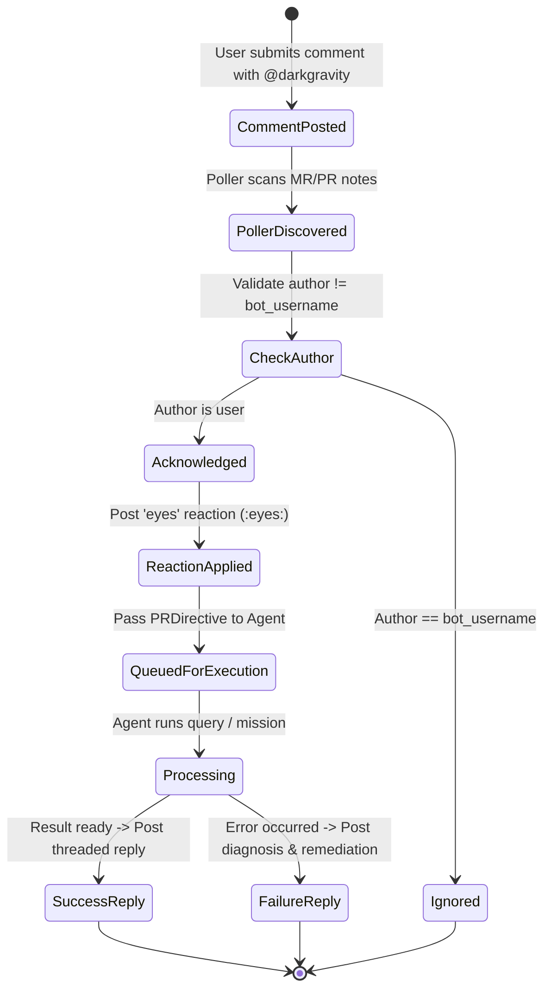

# Data Model: Merge Request Comment Interaction & Acknowledgment

**Feature Branch**: `002-mr-comment-interaction`  
**Date**: 2026-09-19  
**Specification**: [specs/002-mr-comment-interaction/spec.md](file:///mnt/F024B17C24B145FE/Repos/rust_CACD_autonomous_factory/specs/002-mr-comment-interaction/spec.md)

---

## 1. Domain Entities & Value Objects (`factory-core`)

```rust
/// Supported Git hosting platform type.
#[derive(Debug, Serialize, Deserialize, Clone, Copy, PartialEq, Eq)]
#[serde(rename_all = "snake_case")]
pub enum GitPlatform {
    GitLab,
    GitHub,
}

/// Represents the extracted intent from a tagged comment.
#[derive(Debug, Serialize, Deserialize, Clone, PartialEq, Eq)]
#[serde(tag = "type", content = "payload", rename_all = "snake_case")]
pub enum PRDirective {
    Spec { prompt: String },
    Refine { instruction: String },
    Retry,
    Status,
    Validate,
    Interact { prompt: String },
}

/// Event representing a detected comment tagged for the agent.
#[derive(Debug, Serialize, Deserialize, Clone)]
pub struct PRCommentEvent {
    pub source_platform: String,
    pub repository: String,
    pub pr_number: u64,
    pub comment_id: u64,
    pub author: String,
    pub body: String,
    pub directive: PRDirective,
    pub updated_at: DateTime<Utc>,
    pub html_url: String,
}

/// Reaction to apply to an acknowledged comment.
#[derive(Debug, Serialize, Deserialize, Clone, PartialEq, Eq)]
pub struct CommentReaction {
    pub platform: GitPlatform,
    pub project_id: String,
    pub pr_number: u64,
    pub comment_id: u64,
    pub emoji_name: String, // "eyes"
}

/// Result of executing an agent interaction from an MR comment.
#[derive(Debug, Serialize, Deserialize, Clone)]
pub struct CommentInteractionResponse {
    pub success: bool,
    pub response_markdown: String,
    pub error_details: Option<String>,
    pub remediation_steps: Option<Vec<String>>,
}
```

---

## 2. Infrastructure Client Extensions (`factory-infrastructure`)

### GitlabClient Trait Addition
```rust
#[async_trait]
pub trait GitlabClient: Send + Sync {
    // ... existing methods ...

    /// Adds an award emoji reaction (e.g., "eyes") to a merge request note.
    async fn add_merge_request_note_award_emoji(
        &self,
        project_id: &str,
        mr_iid: u64,
        note_id: u64,
        emoji_name: &str,
    ) -> anyhow::Result<GitlabAwardEmoji>;
}
```

### GithubClient Trait Addition
```rust
#[async_trait]
pub trait GithubClient: Send + Sync {
    // ... existing methods ...

    /// Adds a reaction (e.g., "eyes") to an issue or pull request comment.
    async fn add_comment_reaction(
        &self,
        repo: &str,
        comment_id: u64,
        reaction: &str,
    ) -> anyhow::Result<GithubReaction>;
}
```

---

## 3. State Transitions & Lifecycle


