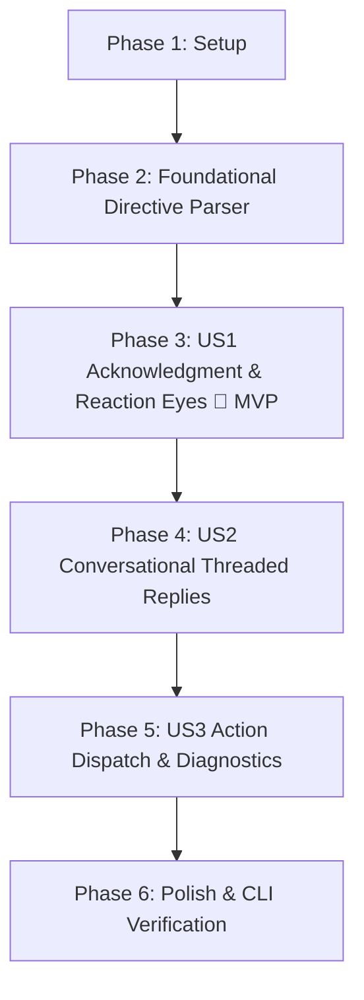

# Tasks: Merge Request Comment Interaction & Acknowledgment

**Input**: Design documents from `/specs/002-mr-comment-interaction/`  
**Prerequisites**: [plan.md](file:///mnt/F024B17C24B145FE/Repos/rust_CACD_autonomous_factory/specs/002-mr-comment-interaction/plan.md), [spec.md](file:///mnt/F024B17C24B145FE/Repos/rust_CACD_autonomous_factory/specs/002-mr-comment-interaction/spec.md), [research.md](file:///mnt/F024B17C24B145FE/Repos/rust_CACD_autonomous_factory/specs/002-mr-comment-interaction/research.md), [data-model.md](file:///mnt/F024B17C24B145FE/Repos/rust_CACD_autonomous_factory/specs/002-mr-comment-interaction/data-model.md), [contracts/mr_comment_interaction.json](file:///mnt/F024B17C24B145FE/Repos/rust_CACD_autonomous_factory/specs/002-mr-comment-interaction/contracts/mr_comment_interaction.json)

---

## Phase 1: Setup (Shared Infrastructure)

**Purpose**: Alignment of workspace models and contract specifications

- [x] T001 Review and align workspace configuration for bot username and polling intervals in crates/factory-core/src/lib.rs
- [x] T002 [P] Register JSON schema contract validation in specs/002-mr-comment-interaction/contracts/mr_comment_interaction.json

---

## Phase 2: Foundational (Blocking Prerequisites)

**Purpose**: Core directive parsing and mention detection models that all stories depend on

**⚠️ CRITICAL**: Must be completed before User Story implementation begins

- [x] T003 [P] Extend PRDirective in crates/factory-core/src/lib.rs with Interact { prompt: String } and Validate variants
- [x] T004 Enhance PRDirective::parse in crates/factory-core/src/lib.rs to detect @darkgravity, @dark-gravity, and @antigravity case-insensitively anywhere in comment body
- [x] T005 [P] Unit tests for PRDirective::parse tag detection and command extraction in crates/factory-core/tests/pr_directive_tests.rs

**Checkpoint**: Core directive and mention parsing verified with passing tests.

---

## Phase 3: User Story 1 - Instant Acknowledgment of Tagged MR Comments (Priority: P1) 🎯 MVP

**Goal**: Apply an eyes reaction (`👀`) to acknowledge tagged comments on GitLab MRs and GitHub PRs within 1 polling interval, suppressing self-comments and preventing duplicates.

**Independent Test**: Post a comment containing `@darkgravity` on an open GitLab MR or GitHub PR; verify the comment receives an eyes reaction (`👀`) within one polling cycle without duplicate reactions on subsequent polling runs.

### Implementation for User Story 1

- [x] T006 [P] [US1] Add add_merge_request_note_award_emoji method to GitlabClient trait and HttpGitlabClient in crates/factory-infrastructure/src/gitlab.rs
- [x] T007 [P] [US1] Add add_comment_reaction method to GithubClient trait and HttpGithubClient in crates/factory-infrastructure/src/github.rs
- [x] T008 [P] [US1] Unit and mock tests for GitLab award emoji and GitHub comment reaction in crates/factory-infrastructure/tests/mr_reaction_tests.rs
- [x] T009 [US1] Update GitPlatformPoller in crates/factory-infrastructure/src/git_poller.rs to accept bot_username and filter out self-authored comments
- [x] T010 [US1] Update poll_gitlab_mr_notes in crates/factory-infrastructure/src/git_poller.rs to immediately apply eyes reaction (👀) on tagged notes
- [x] T011 [US1] Update poll_github_pr_comments in crates/factory-infrastructure/src/git_poller.rs to immediately apply eyes reaction (👀) on tagged comments
- [x] T012 [US1] Integration tests for poller eyes reaction trigger and cursor deduplication in crates/factory-infrastructure/tests/git_poller_reaction_tests.rs

**Checkpoint**: User Story 1 complete — tagged comments are immediately acknowledged with eyes reactions across both GitLab and GitHub.

---

## Phase 4: User Story 2 - Automated Conversation & Task Response in MR Threads (Priority: P2)

**Goal**: Formulate intelligent agent responses and post them as a single comprehensive threaded reply under the user's comment, preserving MR discussion context.

**Independent Test**: Post a query comment (e.g., `@darkgravity explain the recent commit`) in an MR thread; verify Dark Gravity posts a comprehensive threaded response without posting temporary placeholder comments.

### Implementation for User Story 2

- [x] T013 [P] [US2] Implement conversational query handler for PRDirective::Interact in crates/factory-application/src/workflows/mr_comment_interaction.rs
- [x] T014 [US2] Add multi-turn thread context collector in crates/factory-infrastructure/src/git_poller.rs to pass previous thread notes into PRCommentEvent
- [x] T015 [US2] Integrate thread reply publication using post_merge_request_note and post_pull_request_comment in crates/factory-application/src/workflows/mr_comment_interaction.rs
- [x] T016 [US2] Integration tests for threaded conversational reply posting in crates/factory-application/tests/mr_comment_conversation_tests.rs

**Checkpoint**: User Story 2 complete — multi-turn conversational interaction active inside MR/PR threads.

---

## Phase 5: User Story 3 - Action Triggering via MR Commands (Priority: P3)

**Goal**: Trigger automated factory missions from MR comments (e.g. `/validate`, `/refine`, `/spec`) and deliver final summaries or structured diagnostic error reports with remediation guidance.

**Independent Test**: Post `@darkgravity /validate` on an MR; verify validation mission executes and either posts a success summary or an explanatory failure diagnosis with remediation steps.

### Implementation for User Story 3

- [x] T017 [P] [US3] Implement command dispatcher mapping PRDirective::Validate, Spec, Refine to factory missions in crates/factory-application/src/workflows/mr_comment_interaction.rs
- [x] T018 [US3] Implement structured failure report generator formatting diagnosis and remediation steps in crates/factory-application/src/workflows/mr_comment_interaction.rs
- [x] T019 [US3] End-to-end integration test for command dispatch and failure reporting in crates/factory-application/tests/mr_command_dispatch_tests.rs

**Checkpoint**: User Story 3 complete — full action execution and resilient error reporting available from MR comments.

---

## Phase 6: Polish & Cross-Cutting Concerns

**Purpose**: Operational configuration, CLI wiring, and workspace verification

- [x] T020 [P] Configure CLI options and environment variables (DARK_GRAVITY_BOT_USERNAME, polling intervals) in crates/factory-cli/src/main.rs
- [x] T021 [P] End-to-end workspace build and clippy verification with cargo clippy --workspace --all-targets -- -D warnings
- [x] T022 Validate quickstart scenarios against specs/002-mr-comment-interaction/quickstart.md

---

## Dependencies & Completion Order

### Parallel Execution Opportunities
- **Foundational**: T003 and T005 can execute in parallel once T001 is set.
- **User Story 1**: T006 (GitLab API) and T007 (GitHub API) can execute concurrently.
- **User Story 2 & 3**: Handlers T013 and T017 can be implemented in parallel.
- **Polish**: T020 and T021 can run independently.
