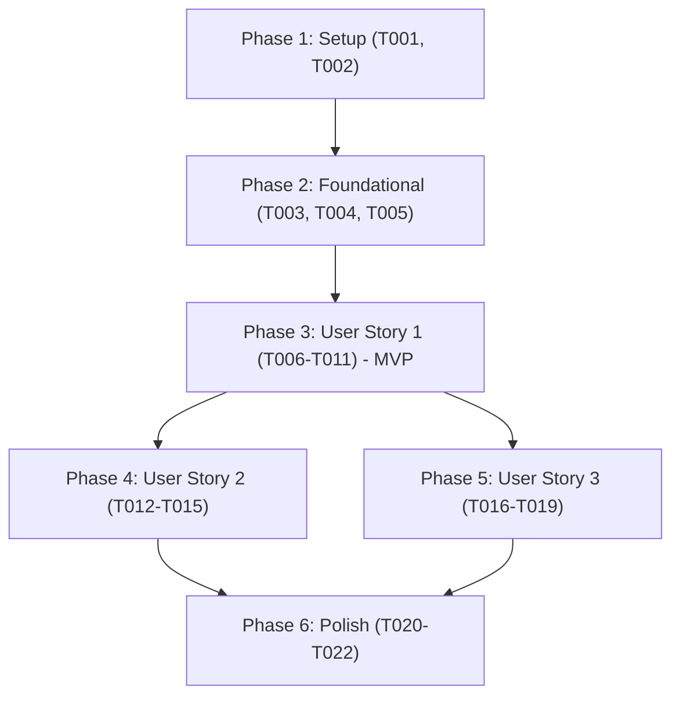

# Tasks: GitLab Communication End-to-End Verification & Testing

**Input**: Design documents from `/specs/003-gitlab-communication-e2e/`  
**Prerequisites**: [plan.md](plan.md), [spec.md](spec.md), [research.md](research.md), [data-model.md](data-model.md), [contracts/gitlab_e2e_contract.json](contracts/gitlab_e2e_contract.json)

---

## Format: `[ID] [P?] [Story] Description`

- **[P]**: Can run in parallel (different files, no shared mutable dependencies)
- **[Story]**: Which user story this task belongs to (`[US1]`, `[US2]`, `[US3]`)
- Exact file paths included in all task descriptions

---

## Phase 1: Setup (Shared Infrastructure)

**Purpose**: Test framework dependencies and contract schema validation

- [ ] T001 Inspect and ensure dev-dependencies (`wiremock`, `tokio`, `serde_json`, `chrono`) are configured in crates/factory-application/Cargo.toml and crates/factory-infrastructure/Cargo.toml
- [ ] T002 [P] Verify JSON schema contract validation for diagnostic scorecards in specs/003-gitlab-communication-e2e/contracts/gitlab_e2e_contract.json

---

## Phase 2: Foundational (Blocking Prerequisites)

**Purpose**: Diagnostic verification models and GitLab probing infrastructure

**⚠️ CRITICAL**: Must be completed before User Story implementation begins

- [ ] T003 [P] Implement GitlabVerificationReport and GitlabCheckResult domain data structures in crates/factory-application/src/gitlab_verifier.rs
- [ ] T004 [P] Expose current user authentication check and project metadata probe methods in crates/factory-infrastructure/src/gitlab.rs
- [ ] T005 Implement GitlabVerifier engine in crates/factory-application/src/gitlab_verifier.rs and export module in crates/factory-application/src/lib.rs

**Checkpoint**: Foundational verification models and engine ready for test harness integration.

---

## Phase 3: User Story 1 - Real-Time Merge Request Interactive Directives & Reaction Feedback (Priority: P1) 🎯 MVP

**Goal**: Validate full round-trip for MR directives (`/status`, `/interact`, `/spec`, `/refine`, `/retry`, `/validate`), immediate eyes (`👀`) reaction award, contextual thread replies, bot self-comment suppression, and cursor idempotency.

**Independent Test**: Execute `cargo test --package factory-application --test gitlab_e2e_integration_test test_mr_directive_reaction_and_reply_flow`; verifies that a mock GitLab MR note containing `@darkgravity /status` triggers a `POST .../award_emoji` with `eyes`, followed by a `POST .../notes` containing the status report, with zero duplicate reactions on subsequent polling cycles.

### Implementation for User Story 1

- [ ] T006 [P] [US1] Create mock GitLab MR note fixtures for directives (/status, /interact, /spec, /refine, /retry, /validate) in crates/factory-application/tests/gitlab_e2e_integration_test.rs
- [ ] T007 [P] [US1] Set up wiremock server route expectations for MR notes, emoji awards, and note replies in crates/factory-application/tests/gitlab_e2e_integration_test.rs
- [ ] T008 [US1] Implement test asserting immediate eyes reaction award (POST /award_emoji) upon discovering tagged developer note in crates/factory-application/tests/gitlab_e2e_integration_test.rs
- [ ] T009 [US1] Implement test asserting Markdown resolution reply is posted back to MR thread (POST /notes) in crates/factory-application/tests/gitlab_e2e_integration_test.rs
- [ ] T010 [US1] Implement test asserting bot self-authored notes (DARK_GRAVITY_BOT_USERNAME) are ignored to prevent loops in crates/factory-application/tests/gitlab_e2e_integration_test.rs
- [ ] T011 [US1] Implement test asserting cursor idempotency guarantees zero duplicate reactions or comments in subsequent polling runs in crates/factory-application/tests/gitlab_e2e_integration_test.rs

**Checkpoint**: User Story 1 (MR Directive & Reaction flow) fully verified end-to-end under wiremock.

---

## Phase 4: User Story 2 - Automated Issue-Driven Mission Ingestion & Ingestion Verification (Priority: P2)

**Goal**: Validate discovery and ingestion of labeled GitLab issues, resource limit parsing, NHI Verifiable Credential issuance, and synchronization cursor persistence.

**Independent Test**: Execute `cargo test --package factory-application --test gitlab_e2e_integration_test test_issue_ingestion_and_credential_issuance`; verifies that a GitLab issue with label `autonomous-mission` is detected, its resource constraints are extracted, and a signed credential is generated without duplicate ingestion on subsequent cycles.

### Implementation for User Story 2

- [ ] T012 [P] [US2] Add mock GitLab issue fixtures with autonomous-mission tags and resource bounds in crates/factory-application/tests/gitlab_e2e_integration_test.rs
- [ ] T013 [US2] Implement test validating resource limit extraction (CPU, RAM, Timeout) from GitLab issue body in crates/factory-application/tests/gitlab_e2e_integration_test.rs
- [ ] T014 [US2] Implement test validating Ed25519-signed NHI Verifiable Credential creation for ingested issue in crates/factory-application/tests/gitlab_e2e_integration_test.rs
- [ ] T015 [US2] Implement test asserting issue cursor persistence prevents re-ingestion in crates/factory-application/tests/gitlab_e2e_integration_test.rs

**Checkpoint**: User Story 2 (Issue Intake & Ingestion flow) verified end-to-end under wiremock.

---

## Phase 5: User Story 3 - End-to-End GitLab Operational Test Suite & Live Diagnostic Verification (Priority: P3)

**Goal**: Provide a native operator CLI command (`factory-cli gitlab-verify`) and live platform test harness to validate connectivity, token permissions, and project health against real GitLab instances.

**Independent Test**: Execute `cargo run --bin factory-cli -- gitlab-verify --help` and run live verification with diagnostic report rendering; verifies health probes for authentication, project access, issue polling, and MR note capabilities.

### Implementation for User Story 3

- [ ] T016 [P] [US3] Add gitlab-verify subcommand and CLI arguments (--gitlab-url, --gitlab-token, --gitlab-projects, --json) in crates/factory-cli/src/main.rs
- [ ] T017 [US3] Wire GitlabVerifier into factory-cli to render formatted ASCII health table and JSON scorecard in crates/factory-cli/src/main.rs
- [ ] T018 [P] [US3] Implement token-gated live GitLab integration test in crates/factory-application/tests/gitlab_live_e2e.rs
- [ ] T019 [US3] Implement error diagnostic formatting and remediation hints in crates/factory-application/src/gitlab_verifier.rs for authentication failures (401) and missing projects (404)

**Checkpoint**: User Story 3 (CLI Diagnostic & Live Platform Verification) complete.

---

## Phase 6: Polish & Cross-Cutting Concerns

**Purpose**: End-to-end regression testing, formatting, and linting compliance

- [ ] T020 Run complete hermetic E2E test suite in crates/factory-application/tests/gitlab_e2e_integration_test.rs
- [ ] T021 [P] Verify full workspace unit and integration test pass: cargo test --workspace
- [ ] T022 [P] Enforce formatting and clippy linter cleanliness: cargo fmt -- --check && cargo clippy --workspace --all-targets -- -D warnings

---

## Dependencies & Execution Order

---

## Parallel Execution Opportunities

- **Phase 1**: `T001` and `T002` can execute concurrently.
- **Phase 2**: `T003` (Data models) and `T004` (Infrastructure probes) can execute concurrently.
- **Phase 3**: `T006` (Fixtures) and `T007` (Mock routes) can execute concurrently.
- **Phase 4 & Phase 5**: Once Foundational and US1 are established, US2 and US3 can proceed in parallel.
- **Phase 6**: `T021` (Workspace tests) and `T022` (Linting/formatting) can execute concurrently.
