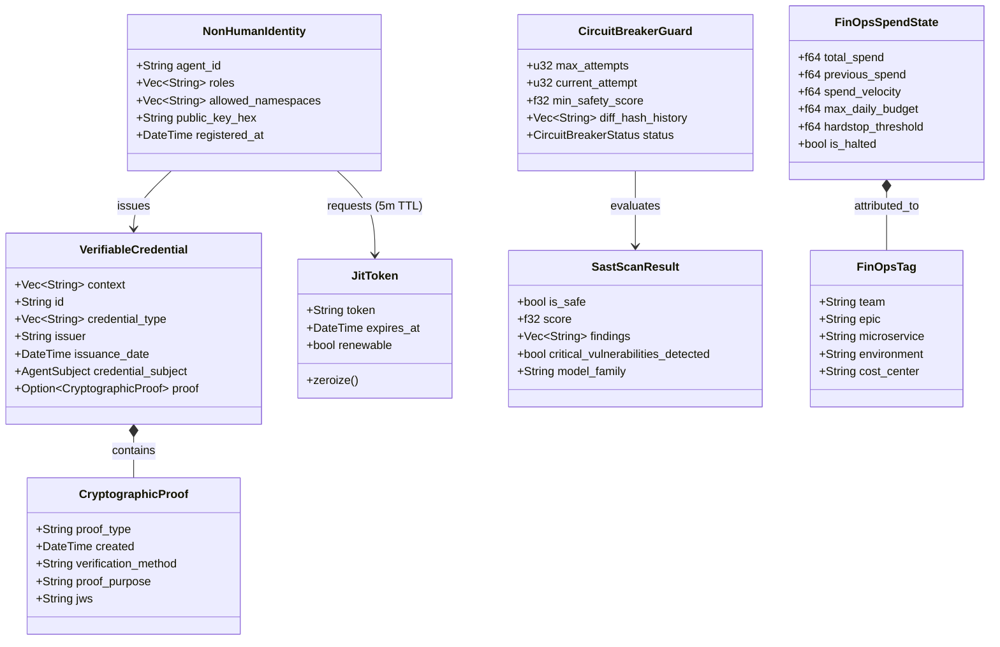

# Phase 1 Data Model: Zero-Trust Cryptographic Security Hardening

**Feature**: [spec.md](spec.md) | **Branch**: `004-crypto-security-hardening` | **Date**: 2026-09-20  
**Status**: Approved / Grounded in Codebase & NotebookLM

---

## 1. Entity Relationship Diagram (Mermaid)

---

## 2. Entity Definitions

### 2.1 Non-Human Identity (NHI) & W3C Verifiable Credentials
- **`AgentSubject`**:
  - `id: String` — Unique agent identifier (e.g., `agent-zeroclaw-01`).
  - `roles: Vec<String>` — Assigned role capabilities (e.g., `["code_generator", "tester"]`).
  - `allowed_namespaces: Vec<String>` — Restricted Kubernetes/Vault namespaces.
- **`CryptographicProof`**:
  - `proof_type: String` — Fixed to `"Ed25519Signature2020"`.
  - `created: DateTime<Utc>` — Timestamp of signature issuance.
  - `verification_method: String` — Public key reference or Key ID (URI in Vault).
  - `proof_purpose: String` — Fixed to `"assertionMethod"`.
  - `jws: String` — Compact JSON Web Signature (`<header>..<signature>`).
- **`VerifiableCredential`**:
  - Encapsulates agent identity and action payload following W3C standards.
  - Implements `.sign(&key, key_id)` and `.sign_async(key, key_id)`.

### 2.2 Ephemeral Credential (`JitToken`)
- **Location**: `crates/factory-core/src/security.rs`
- **Fields**:
  - `token: String` — Vault-issued client token string.
- **Attributes**:
  - Derives `#[derive(Zeroize, ZeroizeOnDrop)]` to guarantee automatic null-byte memory overwrite upon out-of-scope drop.
  - Bound to a strict 5-minute (300 seconds) non-renewable TTL in HashiCorp Vault.

### 2.3 SAST Evaluation & Verification Gate
- **`SastScanResult`**:
  - `is_safe: bool` — Gate pass indicator (true if score $\ge 8.0$ and no critical findings).
  - `score: f32` — Normalized security score ($0.0 - 10.0$).
  - `findings: Vec<String>` — Specific vulnerability diagnostics (RCE, SQLi, hardcoded secrets).
  - `critical_vulnerabilities_detected: bool` — High-severity security flags.
  - `model_family: String` — Identifier of the evaluating model (must be distinct from generator).

### 2.4 Circuit Breaker State & Deadlock Tracking
- **`CircuitBreakerStatus`**:
  - `Passed` — Code review and validation succeeded.
  - `Retrying { attempt: u32, max_attempts: u32 }` — Failed attempt eligible for automatic remediation.
  - `AgentStuck { reason: String }` — Max attempts exhausted (3), diff-hash deadlock detected, or velocity breached.
- **`CircuitBreakerGuard`**:
  - `max_attempts: u32` (default: 3).
  - `current_attempt: u32`.
  - `min_safety_score: f32` (default: 8.0).
  - `diff_hash_history: Vec<String>` — Tracks SHA-256 hashes of generated diffs. If attempt $N$ matches attempt $N-1$, deadlock is tripped immediately.

### 2.5 FinOps Attribution & Spend Guardrails
- **`FinOpsTag`**:
  - `team: String` (e.g., `"dark-gravity-ops"`).
  - `epic: String` (e.g., `"E6.3"`).
  - `microservice: String` (e.g., `"factory-application"`).
  - `environment: String` (e.g., `"production"`).
  - `cost_center: String` (e.g., `"eu-rd-grants"`).
- **`FinOpsSpendState`**:
  - `total_spend: f64` — Current cumulative spend in USD.
  - `previous_spend: f64` — Spend at last 60-second polling interval.
  - `spend_velocity: f64` — Delta spend over 60s window ($\Delta\text{spend}/\Delta t$). Alert trips if $> \$1.00/60\text{s}$.
  - `max_daily_budget: f64` (default: $\$50.00$).
  - `hardstop_threshold: f64` ($90\%$ of daily budget = $\$45.00$).
  - `is_halted: bool` — Flag indicating whether DAG is paused due to budget breach.
