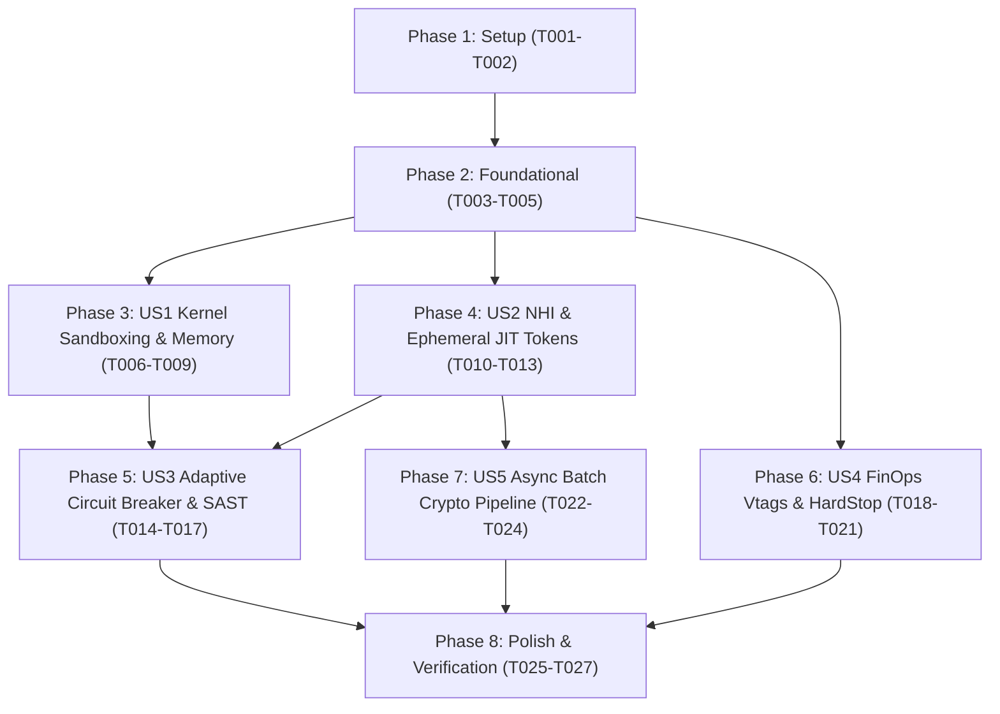

# Tasks: Zero-Trust Cryptographic Security Hardening & AI Agent Governance

**Input**: Design documents from `/specs/004-crypto-security-hardening/`  
**Prerequisites**: [plan.md](plan.md), [spec.md](spec.md), [research.md](research.md), [data-model.md](data-model.md), [contracts/](contracts/)  

---

## Format: `[ID] [P?] [Story] Description`

- **[P]**: Can run in parallel (different files, no shared mutable dependencies)
- **[Story]**: Which user story this task belongs to (`[US1]`, `[US2]`, `[US3]`, `[US4]`, `[US5]`)
- Exact file paths included in all task descriptions

---

## Phase 1: Setup (Shared Infrastructure)

**Purpose**: Test framework dependencies, benchmark configurations, and contract schema validation

- [ ] T001 Inspect and verify dev-dependencies (`zeroize`, `ed25519-dalek`, `wiremock`, `criterion`) in crates/factory-core/Cargo.toml and crates/factory-application/Cargo.toml
- [ ] T002 [P] Verify JSON schema contract validation in specs/004-crypto-security-hardening/contracts/circuit_breaker_contract.json, specs/004-crypto-security-hardening/contracts/sast_evaluation_contract.json, and specs/004-crypto-security-hardening/contracts/finops_tag_contract.json

---

## Phase 2: Foundational (Blocking Prerequisites)

**Purpose**: Core security data models and diff hashing infrastructure

**⚠️ CRITICAL**: Must be completed before User Story implementation begins

- [ ] T003 [P] Verify SandboxConstraint data structures and resource clamping definitions in crates/factory-core/src/security.rs
- [ ] T004 [P] Verify FinOpsTag metadata structure serialization and header mappings in crates/factory-core/src/lib.rs
- [ ] T005 Implement diff-hash computation helper using sha2 to generate SHA-256 digests of patches in crates/factory-application/src/workflows/circuit_breaker.rs

**Checkpoint**: Foundational models and cryptographic utilities ready for User Story implementations.

---

## Phase 3: User Story 1 - Zero-Trust Kernel Sandboxing & Resource Clamping (Priority: P1) 🎯 MVP

**Goal**: Confine all untrusted agent execution within gVisor (`runsc`) user-space sandboxes clamped to $\le 30\text{ MiB}$ RAM / $250\text{m}$ CPU, restrict OpenZiti sidecars to $\le 20\text{ MiB}$ RAM / $100\text{m}$ CPU, and forensically wipe secrets in RAM in $< 4.33\,\mu\text{s}$.

**Independent Test**: Execute `cargo test --package factory-core test_zeroize` and `cargo bench --bench zeroize_benchmark`; confirms credential null-byte overwrite in RAM in $< 4.33\,\mu\text{s}$ and verifies gVisor pod spec resource bounds.

### Implementation for User Story 1

- [ ] T006 [P] [US1] Implement memory zeroization unit test verifying Zeroize on drop for JitToken in crates/factory-core/src/security.rs
- [ ] T007 [P] [US1] Configure Criterion memory wipe benchmark verifying < 4.33 µs wipe latency in benches/zeroize_benchmark.rs
- [ ] T008 [US1] Add validation logic to enforce gVisor runtime constraints (<= 30 MiB RAM for app, <= 20 MiB RAM for sidecar) in crates/factory-application/src/agents/zeroclaw.rs
- [ ] T009 [P] [US1] Create Kubernetes gVisor Pod sandbox profile and NetworkPolicy manifests in config/sandbox-gvisor-profile.yaml

**Checkpoint**: User Story 1 (Kernel Sandboxing & Memory Hygiene) fully functional and testable independently.

---

## Phase 4: User Story 2 - Cryptographic Non-Human Identity (NHI) & Ephemeral Access (Priority: P1)

**Goal**: Issue W3C Verifiable Credentials signed with Ed25519 and enforce 5-minute strict non-renewable JIT tokens from isolated Vault paths.

**Independent Test**: Execute `cargo test --package factory-infrastructure --lib vault::tests::test_vault_issue_and_validate`; verifies 5-minute TTL JIT token creation, validation against Vault mock, and Ed25519 signature verification.

### Implementation for User Story 2

- [ ] T010 [P] [US2] Add repository and agent path isolation (secret/data/repos/<repo>/*) to VaultSecurityBounds::issue_jit_token in crates/factory-infrastructure/src/vault.rs
- [ ] T011 [P] [US2] Implement unit tests verifying 5-minute (300s) non-renewable TTL enforcement and expired token rejection in crates/factory-infrastructure/src/vault.rs
- [ ] T012 [US2] Implement signature validation with Ed25519SecurityValidator on Git commit payloads in crates/factory-infrastructure/src/security_validator.rs
- [ ] T013 [US2] Wire NHI credential issuance and JIT token attachment into mission initialization in crates/factory-application/src/workflows/autonomous_mission.rs

**Checkpoint**: User Story 2 (NHI & JIT Ephemeral Access) fully functional and testable independently.

---

## Phase 5: User Story 3 - Adaptive Circuit Breaker & Heterogeneous SAST Governance (Priority: P2)

**Goal**: Enforce independent frontier model SAST review ($\ge 8.0/10.0$) and enhance `CircuitBreakerGuard` with diff-hash deadlock detection and spend velocity alert tripping.

**Independent Test**: Execute `cargo test --package factory-application --lib workflows::circuit_breaker::tests`; verifies SAST scoring, 3-attempt failure tripping, and immediate deadlock tripping on identical diff hashes.

### Implementation for User Story 3

- [ ] T014 [P] [US3] Implement diff_hash_history tracking and deadlock detection in CircuitBreakerGuard::evaluate_diff in crates/factory-application/src/workflows/circuit_breaker.rs
- [ ] T015 [P] [US3] Add unit test verifying deadlock detection trips AgentStuck on attempt 2 upon duplicate diff hash in crates/factory-application/src/workflows/circuit_breaker.rs
- [ ] T016 [US3] Configure LiteLLM multi-model routing enforcing independent frontier model family for security_review in config/litellm_proxy_config.yaml
- [ ] T017 [US3] Wire circuit breaker freeze, JIT revocation, and HITL Vertex 3 escalation into Hatchet DAG execution in crates/factory-application/src/workflows/autonomous_mission.rs

**Checkpoint**: User Story 3 (Adaptive Circuit Breaker & SAST Gate) fully functional and testable independently.

---

## Phase 6: User Story 4 - FinOps Token Guardrails & Network Egress Confinement (Priority: P2)

**Goal**: Inject Virtual Tags (`x-vtags-*`) into inference requests, monitor spend velocity ($> +\$1.00/60\text{s}$), and trigger HardStop at 90% daily budget ($\$45.00$ of $\$50.00$).

**Independent Test**: Execute `cargo test --package factory-application --lib agents::finops`; verifies header injection, spend velocity alerting, and HardStop threshold tripping with `budget-exceeded` event publishing.

### Implementation for User Story 4

- [ ] T018 [P] [US4] Implement FinOpsTag HTTP header injection (x-vtags-team, x-vtags-epic, x-vtags-microservice, x-vtags-cost_center) in crates/factory-application/src/agents/finops.rs
- [ ] T019 [P] [US4] Implement spend velocity anomaly detection (> +$1.00 / 60s) with warning alert in crates/factory-application/src/agents/finops.rs
- [ ] T020 [US4] Implement HardStop cutoff at 90% daily budget with Kafka budget-exceeded event dispatch in crates/factory-application/src/agents/finops.rs
- [ ] T021 [P] [US4] Create Deny-All egress Kubernetes NetworkPolicy manifest for sandbox pods in config/deny-all-egress-networkpolicy.yaml

**Checkpoint**: User Story 4 (FinOps Guardrails & Egress Dropping) fully functional and testable independently.

---

## Phase 7: User Story 5 - Asynchronous High-Throughput Cryptographic Signature Pipeline (Priority: P3)

**Goal**: Provide async non-blocking signing and batch verification for high-frequency A2A messaging exceeding $100\text{ ops/sec}$.

**Independent Test**: Execute `cargo test --package factory-core --lib security::nhi::tests::test_vc_async_signing_and_batch`; verifies async batch signing throughput and valid JWS proofs.

### Implementation for User Story 5

- [ ] T022 [P] [US5] Implement concurrent batch verification helper verify_batch_async in crates/factory-core/src/security/nhi.rs
- [ ] T023 [US5] Integrate async batch signing into Kafka event publishing pipeline in crates/factory-application/src/bridge/kafka_bridge.rs
- [ ] T024 [P] [US5] Add performance benchmark for async batch Ed25519 signing in benches/crypto_benchmark.rs

**Checkpoint**: User Story 5 (Async Batch Cryptographic Pipeline) fully functional and testable independently.

---

## Phase 8: Polish & Cross-Cutting Concerns

**Purpose**: Quickstart scenario validation, full workspace regression testing, and formatting/clippy cleanliness

- [ ] T025 [P] Run and validate all scenarios from specs/004-crypto-security-hardening/quickstart.md
- [ ] T026 [P] Execute complete workspace unit and integration test pass: cargo test --workspace
- [ ] T027 [P] Enforce formatting and clippy cleanliness: cargo fmt -- --check && cargo clippy --workspace --all-targets -- -D warnings

---

## Dependencies & Execution Strategy

### Parallel Execution Opportunities
- **Foundation Phase**: T003 and T004 can execute in parallel.
- **User Story 1 (P1)**: T006, T007, and T009 can execute in parallel.
- **User Story 2 (P1)**: T010 and T011 can execute in parallel.
- **User Story 3 (P2)**: T014 and T015 can execute in parallel.
- **User Story 4 (P2)**: T018, T019, and T021 can execute in parallel.
- **User Story 5 (P3)**: T022 and T024 can execute in parallel.
- **Polish Phase**: T025, T026, and T027 can execute in parallel.
