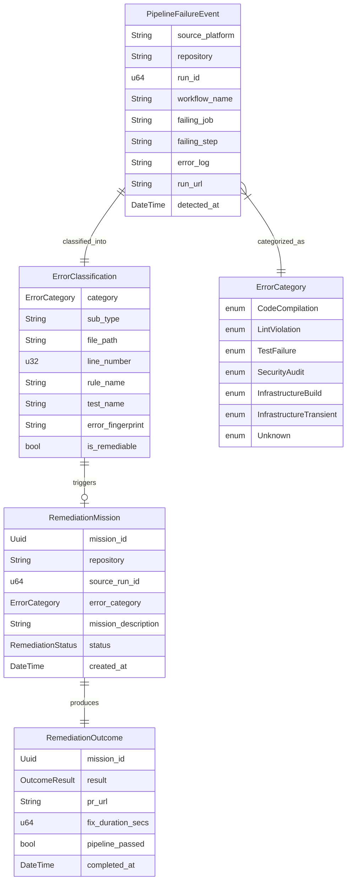
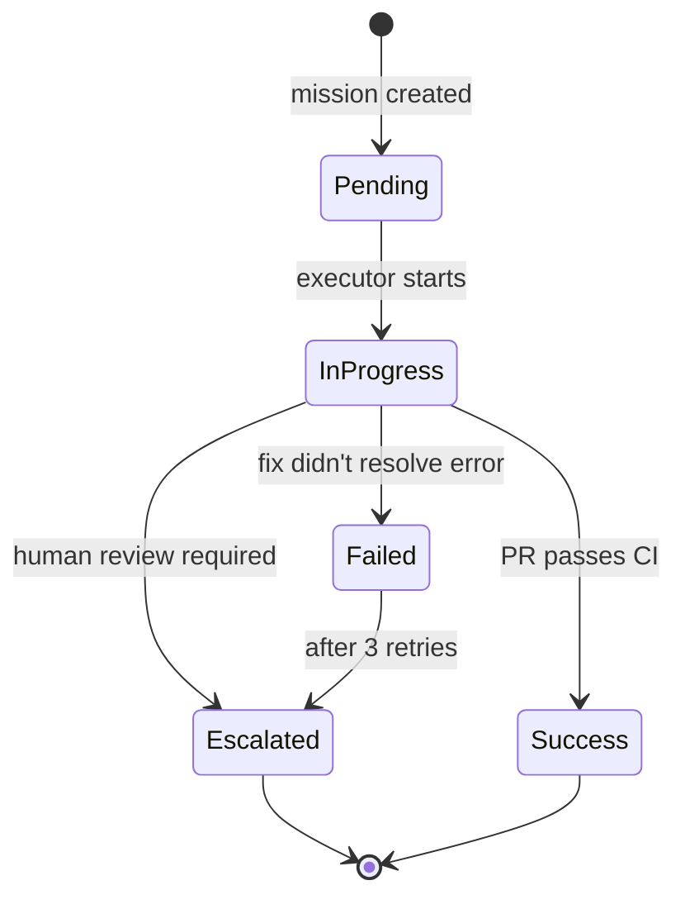

# Data Model: Pipeline Error Remediation

**Feature**: `005-pipeline-error-remediation`
**Date**: 2026-09-21

## Entity Relationship Overview



## Domain Entities (factory-core)

### `ErrorCategory` (enum)

Rust `serde`-tagged enum representing the classification category of a pipeline error.

| Variant | `serde` tag | Autonomously Remediable |
|---------|-------------|------------------------|
| `CodeCompilation` | `code_compilation` | ✅ Yes |
| `LintViolation` | `lint_violation` | ✅ Yes |
| `TestFailure` | `test_failure` | ✅ Yes |
| `SecurityAudit` | `security_audit` | ❌ No (escalate) |
| `InfrastructureBuild` | `infrastructure_build` | ❌ No (escalate) |
| `InfrastructureTransient` | `infrastructure_transient` | ⏳ Retry first |
| `Unknown` | `unknown` | ❌ No (escalate) |

**Validation**: Must be one of the 7 defined variants. The `is_remediable()` method returns `true` only for `CodeCompilation`, `LintViolation`, and `TestFailure`.

### `PipelineFailureEvent` (struct)

Represents a single detected pipeline failure from either GitHub Actions or GitLab CI.

| Field | Type | Description | Validation |
|-------|------|-------------|------------|
| `source_platform` | `String` | `"github"` or `"gitlab"` | Must be one of two values |
| `repository` | `String` | `"owner/repo"` format | Non-empty, contains `/` |
| `run_id` | `u64` | Platform-specific run/pipeline ID | > 0 |
| `workflow_name` | `String` | Name of the workflow or pipeline | Non-empty |
| `failing_job` | `String` | Name of the failing job | Non-empty |
| `failing_step` | `Option<String>` | Name of the failing step (GitHub only) | Optional |
| `error_log` | `String` | Truncated error log output (max 10KB) | Truncated to 10,240 bytes |
| `run_url` | `String` | URL to the failed run | Must be a valid URL |
| `detected_at` | `DateTime<Utc>` | When the failure was detected | Auto-set to `Utc::now()` |

### `ErrorClassification` (struct)

Result of analyzing a `PipelineFailureEvent`. Produced by the `PipelineClassifier`.

| Field | Type | Description | Validation |
|-------|------|-------------|------------|
| `category` | `ErrorCategory` | Classified error category | Required |
| `sub_type` | `Option<String>` | Sub-category (e.g., `"rust_build_error"`) | Optional |
| `file_path` | `Option<String>` | Offending source file path | Optional |
| `line_number` | `Option<u32>` | Offending line number | Optional, > 0 if present |
| `rule_name` | `Option<String>` | Clippy rule or audit ID | Optional |
| `test_name` | `Option<String>` | Failing test name | Optional |
| `error_fingerprint` | `String` | Hash of `(category, file, rule/test)` | Non-empty, deterministic |
| `is_remediable` | `bool` | Whether autonomous fix is attempted | Derived from `category.is_remediable()` |

### `RemediationStatus` (enum)

State machine for remediation missions.



| Variant | Description |
|---------|-------------|
| `Pending` | Mission created, awaiting executor pickup |
| `InProgress` | Executor is working on the fix |
| `Success` | Fix PR/MR created and passes CI |
| `Failed` | Fix attempt did not resolve the error |
| `Escalated` | Escalated to human review (issue created) |

### `RemediationOutcome` (struct)

Final result of a remediation attempt. Published to Kafka `mission-artifact` topic.

| Field | Type | Description |
|-------|------|-------------|
| `mission_id` | `Uuid` | Reference to the remediation mission |
| `result` | `RemediationStatus` | Final status |
| `pr_url` | `Option<String>` | URL of the fix PR/MR if created |
| `fix_duration_secs` | `Option<u64>` | Time from detection to successful fix |
| `pipeline_passed` | `bool` | Whether the fix PR's pipeline passed |
| `completed_at` | `DateTime<Utc>` | When the outcome was recorded |

## Infrastructure Entities

### GitHub Actions API Response Shapes

```rust
// GET /repos/{owner}/{repo}/actions/runs
struct GithubWorkflowRun {
    id: u64,
    name: String,           // workflow name
    status: String,         // "completed"
    conclusion: String,     // "failure", "success"
    html_url: String,
    updated_at: DateTime<Utc>,
}

// GET /repos/{owner}/{repo}/actions/runs/{run_id}/jobs
struct GithubWorkflowJob {
    id: u64,
    name: String,
    conclusion: String,     // "failure"
    steps: Vec<GithubWorkflowStep>,
}

struct GithubWorkflowStep {
    name: String,
    conclusion: String,     // "failure"
}
```

### GitLab CI API Response Shapes

```rust
// GET /projects/{id}/pipelines
struct GitlabPipeline {
    id: u64,
    status: String,         // "failed"
    web_url: String,
    updated_at: DateTime<Utc>,
}

// GET /projects/{id}/pipelines/{id}/jobs
struct GitlabPipelineJob {
    id: u64,
    name: String,
    stage: String,
    status: String,         // "failed"
}
```

## Trait Contracts

### `PipelineClassifier` (infrastructure)

```rust
pub trait PipelineClassifier: Send + Sync {
    fn classify(&self, error_log: &str) -> ErrorClassification;
}
```

Single method, synchronous (regex matching is CPU-bound, not I/O). The default implementation `RegexPipelineClassifier` applies ordered rules from research.md R3.

### Extended `GithubClient` (infrastructure)

New methods added to existing trait:

```rust
async fn list_failed_workflow_runs(
    &self, repo: &str, since: Option<DateTime<Utc>>
) -> anyhow::Result<Vec<GithubWorkflowRun>>;

async fn get_workflow_run_jobs(
    &self, repo: &str, run_id: u64
) -> anyhow::Result<Vec<GithubWorkflowJob>>;

async fn get_job_log(
    &self, repo: &str, job_id: u64
) -> anyhow::Result<String>;
```

### Extended `GitlabClient` (infrastructure)

New methods added to existing trait:

```rust
async fn list_failed_pipelines(
    &self, project_id: &str, since: Option<DateTime<Utc>>
) -> anyhow::Result<Vec<GitlabPipeline>>;

async fn get_pipeline_jobs(
    &self, project_id: &str, pipeline_id: u64
) -> anyhow::Result<Vec<GitlabPipelineJob>>;

async fn get_job_trace(
    &self, project_id: &str, job_id: u64
) -> anyhow::Result<String>;
```
