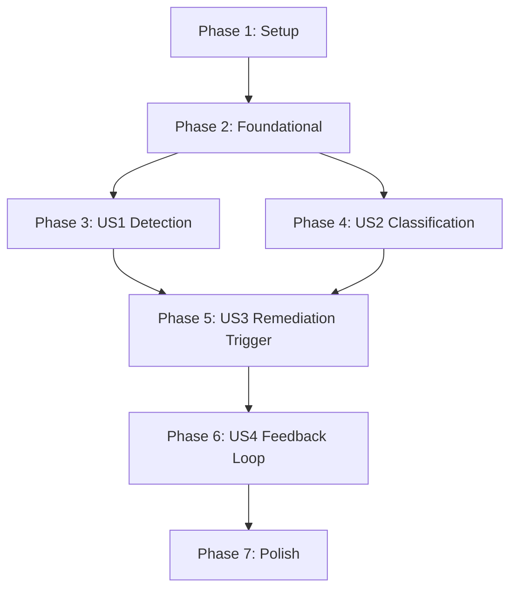

# Tasks: Pipeline Error Remediation

**Input**: Design documents from `specs/005-pipeline-error-remediation/`

**Prerequisites**: plan.md (required), spec.md (required), research.md, data-model.md, contracts/, quickstart.md

**Tests**: Included — the spec requires 95% test coverage per AGENTS.md rules and the quickstart defines 5 validation scenarios.

**Organization**: Tasks are grouped by user story to enable independent implementation and testing of each story.

## Format: `[ID] [P?] [Story] Description`

- **[P]**: Can run in parallel (different files, no dependencies)
- **[Story]**: Which user story this task belongs to (e.g., US1, US2, US3)
- Include exact file paths in descriptions

---

## Phase 1: Setup (Shared Infrastructure)

**Purpose**: Add the `regex` dependency and create the new module files with empty stubs

- [x] T001 Add `regex = "1"` to `[workspace.dependencies]` in `Cargo.toml` and to `factory-infrastructure/Cargo.toml` dependencies
- [x] T002 [P] Create empty module file `crates/factory-infrastructure/src/pipeline_classifier.rs` with module doc comment
- [x] T003 [P] Create empty module file `crates/factory-application/src/workflows/pipeline_remediation.rs` with module doc comment
- [x] T004 Register `pipeline_classifier` module in `crates/factory-infrastructure/src/lib.rs` with pub re-exports
- [x] T005 Register `pipeline_remediation` module in `crates/factory-application/src/workflows/mod.rs`

---

## Phase 2: Foundational (Blocking Prerequisites)

**Purpose**: Domain entities and infrastructure response types that ALL user stories depend on

**⚠️ CRITICAL**: No user story work can begin until this phase is complete

- [x] T006 [P] Add `ErrorCategory` enum with 7 variants and `is_remediable()` method to `crates/factory-core/src/lib.rs` (per data-model.md)
- [x] T007 [P] Add `PipelineFailureEvent` struct to `crates/factory-core/src/lib.rs` with all fields from data-model.md
- [x] T008 [P] Add `ErrorClassification` struct to `crates/factory-core/src/lib.rs` with `error_fingerprint` generation
- [x] T009 [P] Add `RemediationStatus` enum (Pending, InProgress, Success, Failed, Escalated) to `crates/factory-core/src/lib.rs`
- [x] T010 [P] Add `RemediationOutcome` struct to `crates/factory-core/src/lib.rs`
- [x] T011 [P] Add `GithubWorkflowRun`, `GithubWorkflowJob`, `GithubWorkflowStep` response structs to `crates/factory-infrastructure/src/github.rs`
- [x] T012 [P] Add `GitlabPipeline`, `GitlabPipelineJob` response structs to `crates/factory-infrastructure/src/gitlab.rs`
- [x] T013 [P] Write unit tests for `ErrorCategory::is_remediable()` in `crates/factory-core/src/lib.rs` (test all 7 variants)
- [x] T014 [P] Write unit tests for `PipelineFailureEvent` and `ErrorClassification` serialization/deserialization roundtrip in `crates/factory-core/src/lib.rs`

**Checkpoint**: Foundation ready — all domain entities compilable and tested; user story implementation can begin

---

## Phase 3: User Story 1 — Autonomous Pipeline Failure Detection (Priority: P1) 🎯 MVP

**Goal**: The factory automatically detects when CI/CD pipeline runs fail across GitHub and GitLab repositories

**Independent Test**: Trigger a known pipeline failure → verify the factory captures run ID, workflow name, failing job, step, and error log within 5 minutes

### Tests for User Story 1

- [x] T015 [P] [US1] Write `wiremock` test `test_list_failed_github_workflow_runs` in `crates/factory-infrastructure/src/github.rs` — mock `GET /repos/{repo}/actions/runs?status=failure` and verify deserialization
- [x] T016 [P] [US1] Write `wiremock` test `test_get_github_job_log` in `crates/factory-infrastructure/src/github.rs` — mock the job log endpoint and verify 10KB truncation
- [x] T017 [P] [US1] Write `wiremock` test `test_list_failed_gitlab_pipelines` in `crates/factory-infrastructure/src/gitlab.rs` — mock `GET /projects/{id}/pipelines?status=failed` and verify deserialization
- [x] T018 [P] [US1] Write `wiremock` test `test_get_gitlab_job_trace` in `crates/factory-infrastructure/src/gitlab.rs` — mock job trace endpoint and verify truncation
- [x] T019 [US1] Write integration test `test_poll_github_pipeline_runs` in `crates/factory-infrastructure/src/git_poller.rs` — end-to-end mock: poller detects failure, constructs `PipelineFailureEvent`, marks cursor as processed
- [x] T020 [US1] Write integration test `test_pipeline_cursor_idempotency` in `crates/factory-infrastructure/src/git_poller.rs` — verify same run ID is not re-processed on second poll

### Implementation for User Story 1

- [x] T021 [US1] Add `list_failed_workflow_runs(&self, repo: &str, since: Option<DateTime<Utc>>) -> Result<Vec<GithubWorkflowRun>>` to `GithubClient` trait and `HttpGithubClient` impl in `crates/factory-infrastructure/src/github.rs`
- [x] T022 [US1] Add `get_workflow_run_jobs(&self, repo: &str, run_id: u64) -> Result<Vec<GithubWorkflowJob>>` to `GithubClient` trait and `HttpGithubClient` impl in `crates/factory-infrastructure/src/github.rs`
- [x] T023 [US1] Add `get_job_log(&self, repo: &str, job_id: u64) -> Result<String>` to `GithubClient` trait and `HttpGithubClient` impl in `crates/factory-infrastructure/src/github.rs` (truncate to 10KB)
- [x] T024 [US1] Add `list_failed_pipelines(&self, project_id: &str, since: Option<DateTime<Utc>>) -> Result<Vec<GitlabPipeline>>` to `GitlabClient` trait and `HttpGitlabClient` impl in `crates/factory-infrastructure/src/gitlab.rs`
- [x] T025 [US1] Add `get_pipeline_jobs(&self, project_id: &str, pipeline_id: u64) -> Result<Vec<GitlabPipelineJob>>` to `GitlabClient` trait and `HttpGitlabClient` impl in `crates/factory-infrastructure/src/gitlab.rs`
- [x] T026 [US1] Add `get_job_trace(&self, project_id: &str, job_id: u64) -> Result<String>` to `GitlabClient` trait and `HttpGitlabClient` impl in `crates/factory-infrastructure/src/gitlab.rs` (truncate to 10KB)
- [x] T027 [US1] Implement `poll_github_pipeline_runs(&self, repo: &str) -> Result<Vec<PipelineFailureEvent>>` in `crates/factory-infrastructure/src/git_poller.rs` — cursor key `github:{repo}:pipelines`, iterate failed runs, fetch jobs/logs, build `PipelineFailureEvent`, mark processed
- [x] T028 [US1] Implement `poll_gitlab_pipeline_runs(&self, project: &str) -> Result<Vec<PipelineFailureEvent>>` in `crates/factory-infrastructure/src/git_poller.rs` — cursor key `gitlab:{project}:pipelines`, same pattern
- [x] T029 [US1] Update `MockGithubClient` expectations in `crates/factory-infrastructure/src/github.rs` to include new trait methods (mockall auto-derives)
- [x] T030 [US1] Update `MockGitlabClient` expectations in `crates/factory-infrastructure/src/gitlab.rs` to include new trait methods (mockall auto-derives)

**Checkpoint**: Pipeline failure detection works for both GitHub and GitLab — events captured with full metadata, idempotent polling confirmed

---

## Phase 4: User Story 2 — Error Classification and Triage (Priority: P2)

**Goal**: Each detected pipeline error is classified into actionable categories with structured metadata extraction

**Independent Test**: Feed known error logs → verify each is classified into the correct `ErrorCategory` with correct metadata

### Tests for User Story 2

- [x] T031 [P] [US2] Write unit test `test_classify_clippy_error` in `crates/factory-infrastructure/src/pipeline_classifier.rs` — input log with `error[clippy::unused_variable]`, expect `LintViolation` + rule name extracted
- [x] T032 [P] [US2] Write unit test `test_classify_compilation_error` in `crates/factory-infrastructure/src/pipeline_classifier.rs` — input log with `error[E0308]: mismatched types`, expect `CodeCompilation` + file/line extracted
- [x] T033 [P] [US2] Write unit test `test_classify_test_failure` in `crates/factory-infrastructure/src/pipeline_classifier.rs` — input log with `test core::test_parse ... FAILED`, expect `TestFailure` + test name extracted
- [x] T034 [P] [US2] Write unit test `test_classify_docker_build_error` in `crates/factory-infrastructure/src/pipeline_classifier.rs` — input log with Docker apt-get failure, expect `InfrastructureBuild`
- [x] T035 [P] [US2] Write unit test `test_classify_transient_error` in `crates/factory-infrastructure/src/pipeline_classifier.rs` — input log with `Connection timed out`, expect `InfrastructureTransient`
- [x] T036 [P] [US2] Write unit test `test_classify_security_audit` in `crates/factory-infrastructure/src/pipeline_classifier.rs` — input log with RUSTSEC advisory, expect `SecurityAudit` + crate name extracted
- [x] T037 [P] [US2] Write unit test `test_classify_unknown_error` in `crates/factory-infrastructure/src/pipeline_classifier.rs` — input log with unrecognized pattern, expect `Unknown`
- [x] T038 [US2] Write unit test `test_error_fingerprint_deterministic` in `crates/factory-infrastructure/src/pipeline_classifier.rs` — same input produces same fingerprint; different inputs produce different fingerprints

### Implementation for User Story 2

- [x] T039 [US2] Define `PipelineClassifier` trait with `fn classify(&self, error_log: &str) -> ErrorClassification` in `crates/factory-infrastructure/src/pipeline_classifier.rs`
- [x] T040 [US2] Implement `RegexPipelineClassifier` struct with ordered regex rule table (per research.md R3) in `crates/factory-infrastructure/src/pipeline_classifier.rs`
- [x] T041 [US2] Implement metadata extraction methods: `extract_file_line()`, `extract_clippy_rule()`, `extract_test_name()`, `extract_crate_name()` in `crates/factory-infrastructure/src/pipeline_classifier.rs`
- [x] T042 [US2] Implement `error_fingerprint` generation (SHA-256 hash of category + file + rule/test) in `crates/factory-infrastructure/src/pipeline_classifier.rs`
- [x] T043 [US2] Add `pub use pipeline_classifier::{PipelineClassifier, RegexPipelineClassifier}` to `crates/factory-infrastructure/src/lib.rs`

**Checkpoint**: Classifier correctly categorizes all 7 error types with metadata extraction — all unit tests pass

---

## Phase 5: User Story 3 — Autonomous Remediation Mission Trigger (Priority: P3)

**Goal**: Classified pipeline errors automatically spawn remediation missions via the existing Hatchet DAG workflow

**Independent Test**: Inject a classified `lint_violation` error → verify a remediation mission is published to `mission-input` Kafka topic with correct payload

### Tests for User Story 3

- [x] T044 [US3] Write integration test `test_pipeline_remediation_full_cycle` in `crates/factory-application/src/poller_service.rs` — mock pipeline failure detection → classification → mission published to Kafka
- [x] T045 [US3] Write test `test_self_referential_safety_guard` in `crates/factory-application/src/workflows/pipeline_remediation.rs` — verify `lgcorzo/rust_CACD_autonomous_factory` failures create a GitHub issue instead of a mission
- [x] T046 [US3] Write test `test_unknown_error_creates_issue` in `crates/factory-application/src/workflows/pipeline_remediation.rs` — verify `Unknown` category creates a GitHub issue tagged `pipeline-failure-unknown`
- [x] T047 [US3] Write test `test_concurrency_limiter` in `crates/factory-application/src/workflows/pipeline_remediation.rs` — verify `Semaphore` prevents exceeding `MAX_CONCURRENT_REMEDIATIONS`
- [x] T048 [US3] Write test `test_transient_error_retry` in `crates/factory-application/src/workflows/pipeline_remediation.rs` — verify `InfrastructureTransient` errors trigger retry before escalation

### Implementation for User Story 3

- [x] T049 [US3] Create `PipelineRemediationService` struct in `crates/factory-application/src/workflows/pipeline_remediation.rs` with dependencies: `KafkaClient`, `GithubClient`, `GitlabClient`, `PipelineClassifier`, `Semaphore`
- [x] T050 [US3] Implement `handle_pipeline_failure(&self, event: &PipelineFailureEvent) -> Result<()>` — classify → check safety guard → route to remediation or escalation in `crates/factory-application/src/workflows/pipeline_remediation.rs`
- [x] T051 [US3] Implement `trigger_remediation_mission(&self, event: &PipelineFailureEvent, classification: &ErrorClassification) -> Result<()>` — construct mission payload (per contracts/kafka-events.md), sign NHI VC, publish to `mission-input` in `crates/factory-application/src/workflows/pipeline_remediation.rs`
- [x] T052 [US3] Implement `escalate_to_human(&self, event: &PipelineFailureEvent, classification: &ErrorClassification) -> Result<()>` — create GitHub issue or GitLab work item with error context in `crates/factory-application/src/workflows/pipeline_remediation.rs`
- [x] T053 [US3] Implement self-referential safety guard: if `event.repository == "lgcorzo/rust_CACD_autonomous_factory"`, route to `escalate_to_human()` in `crates/factory-application/src/workflows/pipeline_remediation.rs`
- [x] T054 [US3] Implement transient error retry logic: retry up to 3 times with exponential backoff before escalating `InfrastructureTransient` errors in `crates/factory-application/src/workflows/pipeline_remediation.rs`
- [x] T055 [US3] Add pipeline failure polling to `PollerDaemonService::poll_once()` — after existing issue/comment polling, poll `poll_github_pipeline_runs()` and `poll_gitlab_pipeline_runs()`, route each event through `PipelineRemediationService::handle_pipeline_failure()` in `crates/factory-application/src/poller_service.rs`
- [x] T056 [US3] Add `pipelines_remediated: usize` and `pipelines_escalated: usize` counters to `PollerCycleStats` in `crates/factory-application/src/poller_service.rs`
- [x] T057 [US3] Wire `PipelineRemediationService` into the CLI worker daemon — construct it with the same dependencies and pass to `PollerDaemonService` in `crates/factory-cli/src/main.rs`

**Checkpoint**: End-to-end flow works: pipeline failure → classify → remediation mission OR escalation issue — with safety guard and concurrency limit

---

## Phase 6: User Story 4 — Remediation Feedback Loop (Priority: P4)

**Goal**: Track remediation outcomes and feed them back for observability and continuous improvement

**Independent Test**: Run a successful remediation → verify telemetry records contain correct outcome metadata

### Tests for User Story 4

- [x] T058 [P] [US4] Write test `test_remediation_success_telemetry` in `crates/factory-application/src/workflows/pipeline_remediation.rs` — verify success outcome publishes to `mission-artifact` Kafka topic with mission ID, category, and time-to-fix
- [x] T059 [P] [US4] Write test `test_remediation_failure_telemetry` in `crates/factory-application/src/workflows/pipeline_remediation.rs` — verify failure outcome publishes to Kafka with failure reason
- [x] T060 [US4] Write test `test_recurring_failure_escalation` in `crates/factory-application/src/workflows/pipeline_remediation.rs` — verify 3 consecutive identical failures (same fingerprint) triggers escalation to human review

### Implementation for User Story 4

- [x] T061 [US4] Implement `record_remediation_outcome(&self, outcome: &RemediationOutcome) -> Result<()>` — publish to `mission-artifact` Kafka topic in `crates/factory-application/src/workflows/pipeline_remediation.rs`
- [x] T062 [US4] Implement `publish_classification_thought(&self, event: &PipelineFailureEvent, classification: &ErrorClassification) -> Result<()>` — publish to `agent-thought` Kafka topic in `crates/factory-application/src/workflows/pipeline_remediation.rs`
- [x] T063 [US4] Implement recurring failure detection: track `(repository, error_fingerprint)` counter in `CursorStore`, escalate after 3 consecutive identical failures in `crates/factory-application/src/workflows/pipeline_remediation.rs`
- [x] T064 [US4] Add recurring failure counter methods `increment_failure_count()` and `get_failure_count()` to `CursorStore` trait in `crates/factory-infrastructure/src/cursor_store.rs`
- [x] T065 [US4] Implement recurring failure counter in `InMemoryCursorStore` and `PostgresCursorStore` in `crates/factory-infrastructure/src/cursor_store.rs`

**Checkpoint**: Full observability loop — all remediation outcomes logged to Kafka, recurring failures detected and escalated

---

## Phase 7: Polish & Cross-Cutting Concerns

**Purpose**: Quality gates, documentation, and workspace-level validation

- [x] T066 Run `cargo fmt --all -- --check` and fix any formatting issues
- [x] T067 Run `cargo clippy --workspace -- -D warnings` and fix any lint warnings
- [x] T068 Run `cargo test --workspace -- --skip smoke` and verify all tests pass (including new pipeline remediation tests)
- [x] T069 [P] Update `README.md` to document the pipeline error remediation feature in the Automation Workflow section
- [x] T070 [P] Add pipeline remediation configuration to `config/` directory — document `MAX_CONCURRENT_REMEDIATIONS`, `PIPELINE_POLL_INTERVAL_SECS`, `SELF_REPO_GUARD` env vars
- [x] T071 Run full quickstart.md validation scenarios (Scenarios 1–5) and verify all pass
- [x] T072 Run `cargo build --release` to verify production build succeeds


---

## Dependencies & Execution Order

### Phase Dependencies

- **Setup (Phase 1)**: No dependencies — can start immediately
- **Foundational (Phase 2)**: Depends on Setup completion — BLOCKS all user stories
- **US1 Detection (Phase 3)**: Depends on Phase 2 — can start after foundational entities exist
- **US2 Classification (Phase 4)**: Depends on Phase 2 — can run in PARALLEL with Phase 3 (different files)
- **US3 Remediation Trigger (Phase 5)**: Depends on Phase 3 AND Phase 4 — needs both detection and classification
- **US4 Feedback Loop (Phase 6)**: Depends on Phase 5 — extends the remediation service
- **Polish (Phase 7)**: Depends on all user stories being complete

### User Story Dependencies



### Within Each User Story

- Tests MUST be written first and FAIL before implementation
- Response structs before trait methods
- Trait methods before poller integration
- Core implementation before integration with `PollerDaemonService`

### Parallel Opportunities

- **Phase 2**: T006–T012 are all [P] — different files, no dependencies between entities
- **Phase 3 + Phase 4**: US1 (Detection) and US2 (Classification) can run in parallel — they operate on different files (`git_poller.rs` + `github.rs`/`gitlab.rs` vs `pipeline_classifier.rs`)
- **Within Phase 3**: T015–T018 tests are all [P]; T021–T026 API methods are [P] across GitHub/GitLab
- **Within Phase 4**: T031–T037 classifier tests are all [P]
- **Phase 7**: T069–T070 documentation tasks are [P]

---

## Parallel Example: Phase 3 + Phase 4 (US1 + US2 in parallel)

```text
# Agent A: US1 Detection (Phase 3)
Task: T015 — wiremock test for GitHub workflow runs
Task: T021 — GithubClient::list_failed_workflow_runs()
Task: T027 — GitPlatformPoller::poll_github_pipeline_runs()

# Agent B: US2 Classification (Phase 4, simultaneously)
Task: T031 — test_classify_clippy_error
Task: T039 — PipelineClassifier trait
Task: T040 — RegexPipelineClassifier implementation

# Both complete → merge → start US3 (Phase 5) which integrates both
```

---

## Implementation Strategy

### MVP First (User Story 1 Only)

1. Complete Phase 1: Setup (T001–T005)
2. Complete Phase 2: Foundational (T006–T014)
3. Complete Phase 3: US1 Detection (T015–T030)
4. **STOP and VALIDATE**: Run `cargo test --workspace -- pipeline` — confirm detection works
5. Deploy: Factory now detects pipeline failures (value: visibility)

### Incremental Delivery

1. Setup + Foundational → Foundation ready
2. Add US1 Detection → Test → Deploy (factory sees failures)
3. Add US2 Classification → Test → Deploy (factory understands failures)
4. Add US3 Remediation → Test → Deploy (factory fixes failures)
5. Add US4 Feedback → Test → Deploy (factory learns from fixes)
6. Each story adds value without breaking previous stories

### Parallel Team Strategy

With 2 agents/developers:

1. Team completes Setup + Foundational together
2. Once Foundational is done:
   - Agent A: US1 Detection (Phase 3)
   - Agent B: US2 Classification (Phase 4)
3. Both complete → Agent A or B: US3 Remediation (Phase 5, needs both)
4. Then: US4 Feedback → Polish

---

## Notes

- [P] tasks = different files, no dependencies
- [Story] label maps task to specific user story for traceability
- Each user story is independently completable and testable
- Tests MUST fail before implementation begins (TDD)
- Commit after each task or logical group
- Stop at any checkpoint to validate story independently
- The `regex` crate is the only new workspace dependency
- All new trait methods on `GithubClient`/`GitlabClient` get auto-mocked by `mockall`
