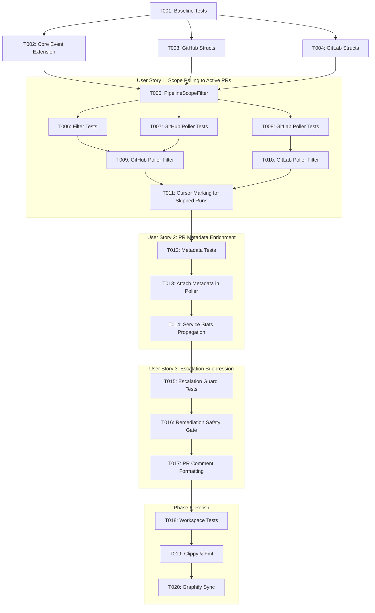

# Tasks: PR Pipeline Scope Filtering for Autonomous Remediation

**Input**: Design documents from `/specs/006-pr-pipeline-scope-filter/`
**Prerequisites**: `plan.md`, `spec.md`, `research.md`, `data-model.md`, `contracts/`

## Format: `[ID] [P?] [Story] Description`

- **[P]**: Can run in parallel (different files, no dependencies)
- **[Story]**: Which user story this task belongs to (US1, US2, US3)
- Include exact file paths in descriptions

---

## Phase 1: Setup (Shared Infrastructure)

**Purpose**: Baseline verification of existing test harness and workspace integrity

- [x] T001 Run existing test suites for `factory-core`, `factory-infrastructure`, and `factory-application` to establish green baseline via `cargo test -p factory-core -p factory-infrastructure -p factory-application`

---

## Phase 2: Foundational (Blocking Prerequisites)

**Purpose**: Core domain and API type extensions that MUST be complete before user story implementation begins

**⚠️ CRITICAL**: Blocks all user stories

- [x] T002 Extend `PipelineFailureEvent` in `crates/factory-core/src/lib.rs` with `pr_number: Option<u64>`, `head_branch: Option<String>`, and `head_sha: Option<String>`
- [x] T003 [P] Extend `GithubWorkflowRun`, `GithubWorkflowRunPr`, and `GithubWorkflowBranchRef` in `crates/factory-infrastructure/src/github.rs` to deserialize `pull_requests`, `head_branch`, and `head_sha`
- [x] T004 [P] Extend `GitlabPipeline` (with `sha`, `source`) and `GitlabMergeRequest` (with `source_branch`, `sha`) in `crates/factory-infrastructure/src/gitlab.rs`
- [x] T005 Implement `PipelineScopeVerdict` enum and `PipelineScopeFilter` matching utility in `crates/factory-core/src/lib.rs`

**Checkpoint**: Foundation ready — domain models and API representations updated with zero compilation errors.

---

## Phase 3: User Story 1 - Scope Pipeline Failure Detection Exclusively to Active PRs/MRs (Priority: P1) 🎯 MVP

**Goal**: Ensure `GitPlatformPoller` discovers active PRs/MRs first, early-exits when 0 active PRs exist, and drops all workflow runs or CI pipelines not associated with an active tracked PR.

**Independent Test**: Simulate failed runs on default branch `main` and on an active PR branch; verify only the PR-associated run produces a `PipelineFailureEvent` while the non-PR run is skipped and marked processed in `CursorStore`.

### Tests for User Story 1

> **NOTE: Write these tests FIRST, ensure they fail before implementation**

- [x] T006 [P] [US1] Unit tests for `PipelineScopeFilter::evaluate_github` and `PipelineScopeFilter::evaluate_gitlab` in `crates/factory-core/tests/pipeline_scope_filter_tests.rs`
- [x] T007 [P] [US1] Integration tests in `crates/factory-infrastructure/src/git_poller.rs` verifying `poll_github_pipeline_runs` early-exits on empty active PRs and skips non-PR workflow runs
- [x] T008 [P] [US1] Integration tests in `crates/factory-infrastructure/src/git_poller.rs` verifying `poll_gitlab_pipeline_runs` early-exits on empty active MRs and filters by MR source branch

### Implementation for User Story 1

- [x] T009 [US1] Update `poll_github_pipeline_runs` in `crates/factory-infrastructure/src/git_poller.rs` to fetch `list_active_pull_requests(repo)`, early-exit if empty, and filter failed runs against active PRs
- [x] T010 [US1] Update `poll_gitlab_pipeline_runs` in `crates/factory-infrastructure/src/git_poller.rs` to fetch `list_active_merge_requests(project)`, early-exit if empty, and filter failed pipelines against active MRs
- [x] T011 [US1] Update `CursorStore` recording in `crates/factory-infrastructure/src/git_poller.rs` to mark skipped non-PR runs as processed so they are never re-evaluated on subsequent cycles

**Checkpoint**: User Story 1 functional — non-PR pipelines completely ignored across GitHub and GitLab polling cycles.

---

## Phase 4: User Story 2 - Contextual PR Metadata Enrichment (Priority: P2)

**Goal**: Populate `pr_number`, `head_branch`, and `head_sha` on emitted `PipelineFailureEvent` objects so downstream remediation missions can immediately target the correct branch.

**Independent Test**: Verify that emitted `PipelineFailureEvent` instances have `pr_number.is_some() == true` matching the active PR number.

### Tests for User Story 2

- [x] T012 [P] [US2] Unit test in `crates/factory-infrastructure/src/git_poller.rs` asserting emitted `PipelineFailureEvent` carries populated `pr_number`, `head_branch`, and `head_sha`

### Implementation for User Story 2

- [x] T013 [US2] Attach `pr_number`, `head_branch`, and `head_sha` when constructing `PipelineFailureEvent` in `crates/factory-infrastructure/src/git_poller.rs`
- [x] T014 [US2] Update `PollerDaemonService::poll_once` in `crates/factory-application/src/poller_service.rs` to log PR context in polling cycle statistics and trace outputs

**Checkpoint**: User Story 2 functional — failure events include complete PR linkage metadata.

---

## Phase 5: User Story 3 - Suppression of False-Positive Human Escalations (Priority: P3)

**Goal**: Enforce a strict precondition guard in `PipelineRemediationService` preventing automated issue creation on GitHub/GitLab when PR context is absent.

**Independent Test**: Pass a `PipelineFailureEvent` with `pr_number: None` to `PipelineRemediationService::handle_pipeline_failure` and verify that `create_issue` is NEVER called and the event is dropped.

### Tests for User Story 3

- [x] T015 [P] [US3] Unit test in `crates/factory-application/src/workflows/pipeline_remediation.rs` asserting that `handle_pipeline_failure` returns `RemediationStatus::Skipped` and creates no issue when `pr_number` is `None`

### Implementation for User Story 3

- [x] T016 [US3] Add `pr_number` presence check in `PipelineRemediationService::handle_pipeline_failure` in `crates/factory-application/src/workflows/pipeline_remediation.rs`, returning `Ok(RemediationStatus::Skipped)` if missing
- [x] T017 [US3] For self-referential repo `lgcorzo/rust_CACD_autonomous_factory`, format human escalations as PR comments on the offending PR rather than standalone repository issues

**Checkpoint**: User Story 3 functional — zero false-positive issues can ever be created in issue trackers.

---

## Phase 6: Polish & Verification

**Purpose**: Full workspace validation, formatting, linting, and knowledge graph synchronization

- [x] T018 Run `cargo test --workspace` to ensure all crates pass unit and integration tests cleanly
- [x] T019 [P] Run `cargo clippy --workspace --all-targets -- -D warnings` and `cargo fmt --check` to enforce lint and style standards
- [x] T020 Run `graphify update .` to synchronize macro AST architecture graph with new types and methods

---

## Dependencies & Execution Order

## Parallel Execution Opportunities

- **Phase 2**: T003 (GitHub structs) and T004 (GitLab structs) can be implemented in parallel.
- **Phase 3**: T006, T007, and T008 (test definitions) can be created in parallel before implementation tasks T009 and T010.
- **Phase 6**: T018 (tests) and T019 (clippy/fmt) can run independently.
