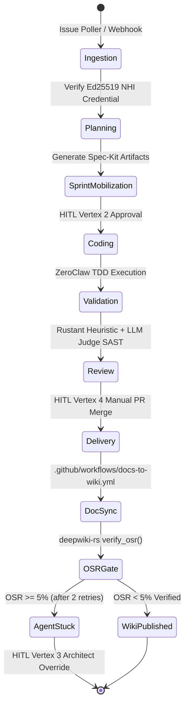
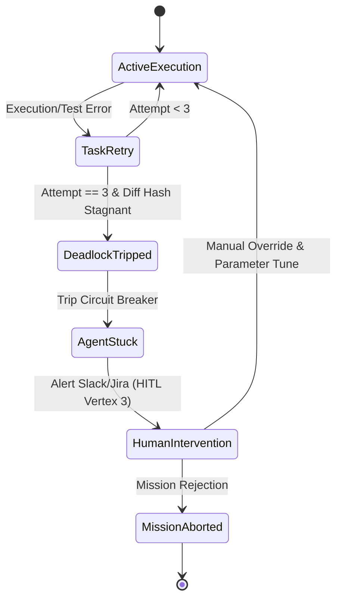

# Phase 1 Data Model: Professional Enterprise Wiki Documentation

**Feature Branch**: `007-professional-wiki-docs`  
**Date**: 2026-09-30  
**Feature Spec**: [spec.md](spec.md)  
**Research Findings**: [research.md](research.md)  

---

## 1. Domain Entities & Schemas

### Entity 1: WikiDocument (Core Markdown Node)
Represents an individual document within `wiki/`.
- **Fields**:
  - `path`: `PathBuf` (Relative repository path, e.g., `wiki/STRATEGIC-DESIGN.md`).
  - `title`: `String` (Human-readable document title).
  - `document_type`: `Enum` (`StrategicDesign`, `TacticalDesign`, `AgentSpec`, `LifecycleWorkflow`, `OperationsGuide`, `ComplianceCharter`, `CrateReference`).
  - `owner_agent`: `String` (`PO Agent (Rustant)`, `Documentation Agent`, `Human Architect`).
  - `review_authority`: `String` (`Tech Lead`, `Senior Reviewer`, `Architect`).
  - `update_trigger`: `String` (e.g., `Post-merge AST sync`, `Architecture change`, `Sprint boundary`).
  - `ast_symbols_covered`: `Vec<String>` (List of Rust structs/traits/functions documented).
  - `diagrams`: `Vec<C4Diagram>` (Embedded Mermaid diagrams).

### Entity 2: C4Diagram (Mermaid Architecture Model)
Represents an architectural diagram embedded in a wiki page.
- **Fields**:
  - `level`: `Enum` (`C1_Context`, `C2_Container`, `C3_Component`, `C4_Code_UML`).
  - `scope`: `String` (System, Crate, Module, or Agent name).
  - `format`: `String` (`mermaid`).
  - `diagram_type`: `Enum` (`SystemContext`, `ContainerTopology`, `ComponentStructure`, `ClassDiagram`, `SequenceDiagram`, `StateMachine`).
  - `source_code`: `String` (Raw valid Mermaid text block).

### Entity 3: HITLVertex (Governance Checkpoint)
Represents one of the 4 Human-in-the-Loop decision gates.
- **Fields**:
  - `vertex_id`: `String` (`Vertex-1`, `Vertex-2`, `Vertex-3`, `Vertex-4`).
  - `name`: `String` (`Strategic Injection`, `Sprint Mobilization`, `Exception Override`, `Categorical Scrutiny`).
  - `human_role`: `String` (`Product Owner`, `Tech Lead`, `Architect`, `Senior Reviewer`).
  - `trigger_condition`: `String` (Pre-plan Epic creation, Post-plan task approval, 3-retry deadlock, PR merge gate).
  - `enforcement_mechanism`: `String` (GitLab tag, Hatchet workflow signal, token revocation, branch protection).

### Entity 4: CompliancePacket (R&D Audit Record)
Represents regulatory and grant audit evidence generated by the factory.
- **Fields**:
  - `mission_id`: `String` (Unique mission event ID).
  - `grant_program`: `String` (`Hazitek 2026`, `SPRI`, `EU AI Act Art. 12 & 14`).
  - `ast_deltas`: `ASTDeltaSummary` (Lines added, modified, removed, symbol modifications).
  - `compute_hours`: `ComputeMetrics` (CPU core-hours, RAM allocation, sandbox duration).
  - `finops_spend`: `FinOpsRecord` (Token counts, prompt tokens, completion tokens, USD equivalent).
  - `nhi_credential`: `Ed25519Claim` (Signed JSON-LD verifiable credential).

---

## 2. State Transitions & Lifecycles

### Mission & Documentation Sync Lifecycle

### Agent Stuck / Circuit Breaker State Transition

