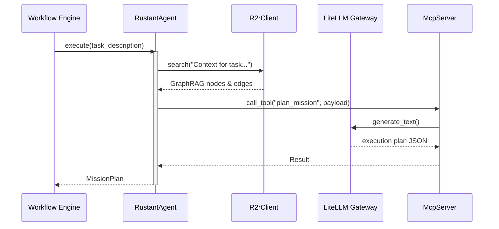
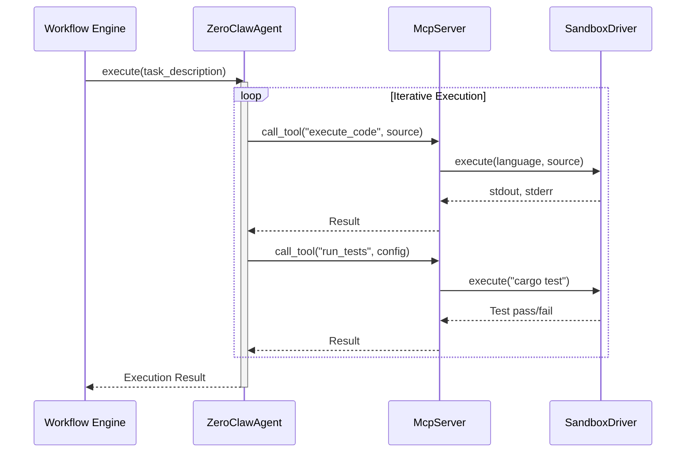
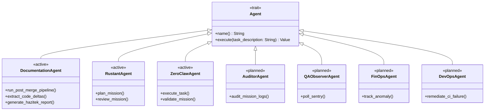
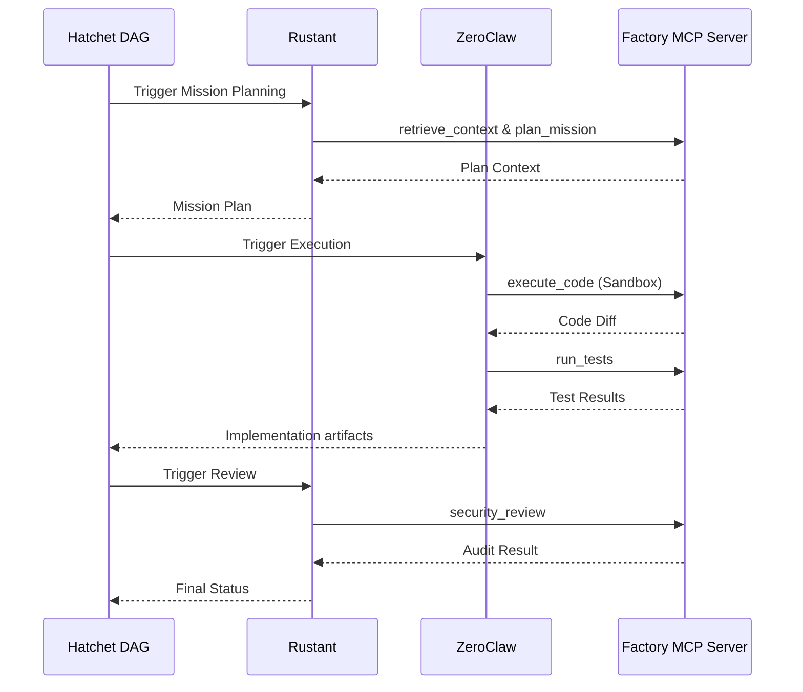

# AGENT-SPECIFICATIONS: Autonomous Workforce

This document specifies the roles, responsibilities, and tooling for the **Dark Gravity** autonomous agents.

---

## Rustant (Planner Agent)

The "Captain" of the mission. Governs the **Intelligence Context**.

### Responsibilities
- **Context-Driven Planning**: Queries R2R GraphRAG via `R2rClient` for semantic context retrieval, then calls `plan_mission` via MCP to plan the mission.
- **Security Review**: Audits code via `security_review` MCP tool using LLM-as-a-Judge.
- **Review**: Reviews execution results and provides feedback for iteration.

### Implementation
- **File**: `crates/factory-application/src/agents/rustant.rs` (lines 12-78)
- **Key Methods**: `new()`, `plan_mission()`, `review_mission()`
- **Dependencies**: `McpClient`, `R2rClient`
- **Agent trait**: Implements `Agent` (`name`, `execute`)

#### Rustant Mission Planning Sequence


---

## ZeroClaw (Executor Agent)

The "Muscle" of the system. Operates within the **Execution Context**.

### Responsibilities
- **Code Implementation**: Translates tasks into source code via `execute_code` MCP tool.
- **Verification**: Runs test suites via `run_tests` inside isolated sandbox.
- **Self-Correction**: Iterates on code based on test failure feedback.

### Implementation
- **File**: `crates/factory-application/src/agents/zeroclaw.rs` (lines 11-98)
- **Key Methods**: `new()`, `execute_task()`, `validate_mission()`, `introspect_k8s()`
- **Dependencies**: `McpClient`
- **Sandbox Drivers**: `SubprocessDriver` (local), `FirecrackerDriver` (micro-VM via KVM)
- **Agent trait**: Implements `Agent` (`name`, `execute`)

#### ZeroClaw Execution Sequence


---

## DevOps Agent (Aethelgard Loop)

> **Status: Planned (Not yet implemented)**

The "Immune System". Governs the **Remediation Context**.

### Responsibilities
- **CI/CD Auto-Remediation**: Parses pipeline failures, queries R2R GraphRAG for historical fixes, directs Developer Agent to apply patches.
- **Circuit Breaker**: Maximum 3 consecutive auto-remediation attempts before escalating.
- **Backlog Automation**: Auto-grades severity and creates backlog issues.

---

## Documentation Agent (Superpowers)

> **Status: Active (Partially implemented)**

The "Memory Keeper". Manages the **Infrastructure Context** for documentation.

### Responsibilities
- **CRG Wiki Generation**: Uses `code-review-graph wiki` to generate auto-documented wiki pages from AST analysis.
- **Graphify Integration**: Maintains `graphify-out/` with code structure graphs and reports.
- **Wiki Refinement**: Uses Superpowers skills to keep documentation accurate.

### Superpowers Skills Loaded
| Skill | Purpose |
| :--- | :--- |
| `writing-plans` | Decompose documentation into atomic tasks |
| `subagent-driven-development` | Execute each subagent with focused context |
| `verification-before-completion` | Verify before marking tasks complete |

---

## Agent Interface

All agents implement the `Agent` trait in `crates/factory-application/src/agents/`:



```rust
#[async_trait]
pub trait Agent: Send + Sync {
    fn name(&self) -> String;
    async fn execute(&self, task_description: &str) -> anyhow::Result<Value>;
}
```

---

## Agentic Interaction Flow



---

## LLM Configuration

All agents route through the **LiteLLM Gateway**:

| Model | Provider | Tool Calling |
| :--- | :--- | :--- |
| `gemma4:12b` | LiteLLM (OpenAI-compatible) | Yes |
| `ollama/qwen2.5-coder:7b` | LiteLLM (Ollama) | Yes |
| `ollama/qwen2.5:7b` | LiteLLM (Ollama) | No |

---

## CRG-Verified Agent Dependencies

Based on `code-review-graph` edge analysis:

- **Rustant** → Outgoing edges: `r2r_client.search()`, `mcp_client.call_tool_json()`, `tracing::info`
- **ZeroClaw** → Outgoing edges: `mcp_client.call_tool_json()`, `tracing::info`
- **Mission Workflow** → Orchestrates: Rustant (plan) → ZeroClaw (code) → Rustant (review) → Delivery
- **Task Workflow** → Individual task execution with `StepCheckpoint` recovery

---

*Last updated: 2026-06-23 — Verified against actual codebase via CRG analysis*