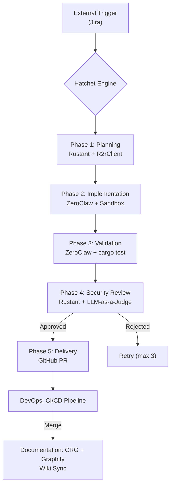

# BUSINESS-CONTEXT: Dark Gravity

## Goal Description

Deploy an **Autonomous Agent Workforce** inside a Zero Trust environment. This factory uses **Hatchet Engine** as the durable backbone, **LiteLLM** for model routing, **R2R GraphRAG** for semantic context, and **MCP** (Model Context Protocol) for agent-tool communication.

### Problem Statement

In restricted (Zero Trust) environments, manual code development, testing, and deployment cycles are slow and prone to errors. Security requirements often create bottlenecks that prevent rapid iteration.

**Dark Gravity** solves this by:

- **Automated Mission Lifecycle**: End-to-end automation from an external trigger to a verified Pull Request.
- **Zero Trust Sovereignty**: All activities occur within secured network perimeters (OpenZiti dark overlay).
- **Context-Driven Development**: Every plan is grounded in semantic context retrieval via R2R GraphRAG.
- **Durable Orchestration**: State management is managed by Hatchet Engine with checkpointing.

---

## ROI & Key Performance Indicators (KPIs)

| KPI | Metric | Target |
| :--- | :--- | :--- |
| **Cycle Time** | Mission ingestion to Delivery | < 60 minutes |
| **Verification Rate** | Missions passing Verification Triad | > 95% |
| **Autonomy Level** | Missions without human intervention | > 70% |
| **Compliance Score** | Automated security audits | 100% |

---

## Mission Lifecycle Flow

### The Autonomous Workforce

| Agent | Role | Context |
| :--- | :--- | :--- |
| **Rustant** | Planner | Strategic decomposition via R2rClient, security review |
| **ZeroClaw** | Executor | Code implementation, sandbox validation |
| **DevOps Agent** | Self-Healing | CI/CD auto-remediation loop **(planned)** |
| **Documentation Agent** | Memory Keeper | CRG wiki generation, Graphify reports |

---

*Last updated: 2026-06-23 — Verified against actual codebase via CRG analysis*