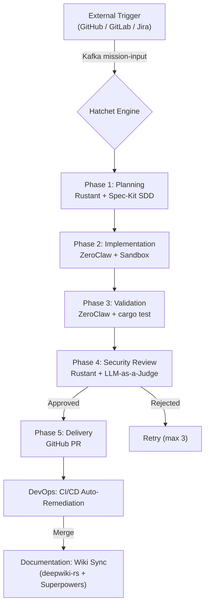

# BUSINESS-CONTEXT: Dark Gravity

## Goal Description

Deploy an **Autonomous Agent Workforce** inside a Zero Trust environment. This factory uses **Hatchet Engine** as the durable backbone, **Spec-Kit** for spec-driven development, **Superpowers** for skill orchestration, and **MCP** (Model Context Protocol) for agent-tool communication.

### Problem Statement

In restricted (Zero Trust) environments, manual code development, testing, and deployment cycles are slow and prone to errors. Security requirements often create bottlenecks that prevent rapid iteration.

**Dark Gravity** solves this by:

- **Automated Mission Lifecycle**: End-to-end automation from an external trigger to a verified Pull Request.
- **Zero Trust Sovereignty**: All activities occur within secured network perimeters (OpenZiti dark overlay) with strict identity-based access (NHI / Ed25519 VCs).
- **Spec-Driven Development**: Every code change is grounded in version-controlled specifications via GitHub Spec-Kit.
- **Durable Orchestration**: State management and retries are managed by Hatchet Engine with checkpointing via superspec bridge.

---

## ROI & Key Performance Indicators (KPIs)

| KPI | Metric | Target |
| :--- | :--- | :--- |
| **Cycle Time** | Mission ingestion to Delivery | < 60 minutes |
| **Verification Rate** | Missions passing Verification Triad | > 95% |
| **Autonomy Level** | Missions without human intervention | > 70% |
| **Compliance Score** | Automated security/architectural audits | 100% |
| **OSR** | Orphan Symbol Rate (doc quality) | < 5% |
| **Token Cost Attribution** | Per-Epic LLM spend tracked | 100% |

---

## Mission Lifecycle Flow

### The Autonomous Workforce

| Agent | Role | Context |
| :--- | :--- | :--- |
| **Rustant** | Product Owner | Strategic decomposition, Spec-Kit pipeline, security review |
| **ZeroClaw** | Developer | Code implementation, sandbox validation |
| **DevOps Agent** | Self-Healing | Aethelgard auto-remediation loop, Sentry polling |
| **Documentation Agent** | Memory Keeper | deepwiki-rs AST sync, Superpowers wiki regeneration |

### The Verification Triad

No artifact reaches delivery without passing:
- **Logical Verification**: Tests in isolated sandbox
- **Architectural Verification**: Spec-Kit compliance + clippy
- **Security Verification**: OWASP SAST + LLM-as-a-Judge ≥ 8.0/10

---

## Strategic Alignment

> For technical terminology, refer to the **[GLOSSARY](GLOSSARY)**.
> This architecture is designed to **eliminate redundant management layers** and promote autonomous decision-making within the guardrails of the **Verification Triad**.
