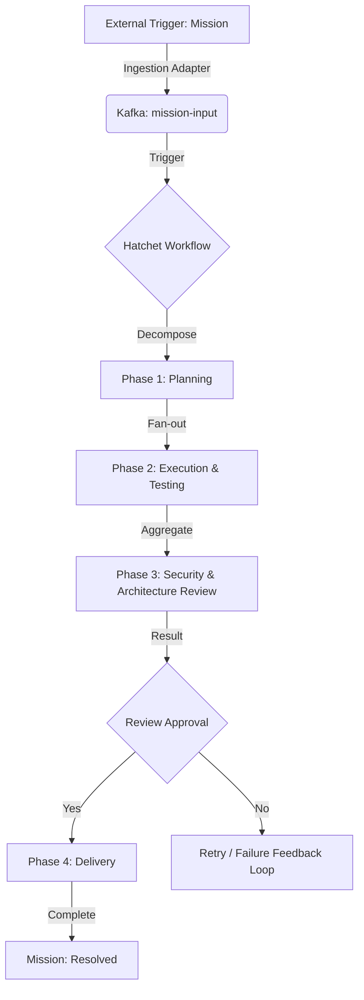

# 🏭 BUSINESS-CONTEXT: [PROJECT_NAME]

## 🎯 Goal Description

Deploy an **Autonomous Agent Workforce** inside a Zero Trust environment. This factory uses **[MISSION_INPUT_TOOL]** for mission ingestion and **Hatchet** as the durable backbone to orchestrate autonomous workers.

### 💼 Problem Statement (Domain Vision)

In restricted (Zero Trust) environments, manual code development, testing, and deployment cycles are slow and prone to errors. Security requirements often create bottlenecks that prevent rapid iteration.

**[PROJECT_NAME]** solves this by:

- **Automated Mission Lifecycle**: End-to-end automation from an external trigger to a verified delivery.
- **Zero Trust Sovereignty**: All activities occur within secured network perimeters with strict identity-based access.
- **Durable Orchestration**: State management and retries are managed by the factory backbone, ensuring eventually consistent success.

---

## 📈 ROI & Key Performance Indicators (KPIs)

| KPI | Metric | Target |
| :--- | :--- | :--- |
| **Cycle Time** | Time from Mission ingestion to Delivery | < 60 minutes |
| **Verification Rate** | Percentage of missions passing the Verification Triad | > 95% |
| **Autonomy Level** | Percentage of missions completed without human intervention | > 70% |
| **Compliance Score** | Success in automated security and architectural audits | 100% |

---

## 🔄 Mission Lifecycle Flow

The following lifecycle represents the logical path of a single **Mission** through the factory domains.

### 1. Ingestion Area
Since the cluster is secured, the Ingestion Adapters proactively fetch missions from external sources (GitHub, GitLab, Jira) and publish them to an internal event stream.

### 2. Durable Orchestration Layer
The Backbone ensures that every mission is durable. If a node fails or an API call times out, the system retries the specific step, preserving the entire mission state.

### 3. The Verification Triad
No artifact reaches the delivery phase without passing through a multi-agent verification loop:
- **Logical Verification**: Validates functional requirements via execution.
- **Architectural Verification**: Checks for alignment with established patterns.
- **Security Verification**: Scans for vulnerabilities and compliance risks.

---

## 🛡️ Strategic Alignment

> [!IMPORTANT]
> For a deep dive into the technical terminology, refer to the **[GLOSSARY](GLOSSARY)**.
> This architecture is designed to **eliminate redundant management layers** and promote autonomous decision-making within the guardrails of the **Verification Triad**.
