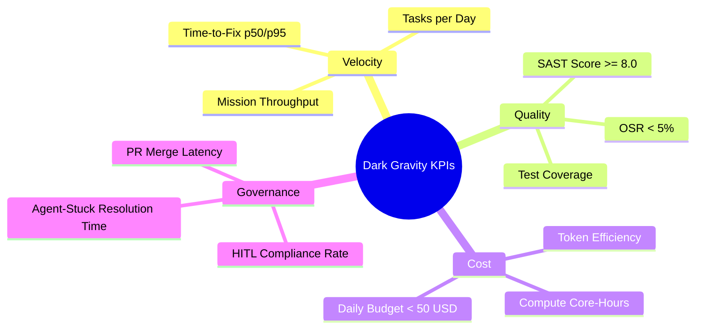

# Business Context — Dark Gravity CA/CD Autonomous Factory

> **Purpose**: Define the business rationale, innovation objectives, and value proposition of the Dark Gravity Autonomous Factory for stakeholders, investors, and compliance bodies.

---

## 1. Vision: Continuous Agentic / Continuous Deployment (CA/CD)

The Dark Gravity Autonomous Factory implements a paradigm shift from traditional CI/CD to **CA/CD** — Continuous Agentic / Continuous Deployment. In this model, AI agents autonomously:

1. **Ingest** issues and PR comments from GitHub, GitLab, and Jira
2. **Plan** implementation via Spec-Driven Development (SDD) with formal specifications
3. **Code** solutions inside gVisor-sandboxed Kubernetes pods
4. **Validate** changes through TDD (Red-Green-Refactor) and SAST security scanning
5. **Review** via heuristic analysis and LLM-powered code judges
6. **Deliver** code changes via PRs/MRs — **never auto-merged** (Human-in-the-Loop)

This transforms the software engineering lifecycle from a **human-intensive, serial process** into an **agent-accelerated, parallel pipeline** with formal governance.

---

## 2. Hazitek 2026 Innovation Objectives

The project is funded under the **Hazitek 2026** program administered by **SPRI** (Sociedad para la Promoción y Reconversión Industrial) of the Basque Country government:

| Objective | Target | Metric |
|:---|:---|:---|
| **Autonomous Code Generation** | ≥ 70% of routine tasks handled by agents | Tasks completed / Total tasks |
| **Zero-Toil Operations** | < 5 min human intervention per mission | Avg. human time per mission cycle |
| **Code Quality Assurance** | SAST score ≥ 8.0/10.0 on all agent output | `SastScanResult.score` |
| **Security Compliance** | 100% Ed25519 NHI credential coverage | Verified credentials / Total missions |
| **Financial Control** | < €50/day autonomous spend | `DailyBudgetConfig.max_daily_budget_usd` |
| **Documentation Currency** | OSR < 5% across all crates | `OsrMetric.osr_value` |

---

## 3. Return on Investment (ROI) Model

### Cost Structure

| Cost Center | Description | Tracking Mechanism |
|:---|:---|:---|
| **LLM Inference** | Token consumption across all agents | `FinOpsTag` virtual headers + spend velocity alerts |
| **Compute** | gVisor sandbox pod CPU/RAM usage | Kubernetes resource quotas + core-hours telemetry |
| **Infrastructure** | Kafka, Ziti, Vault, Hatchet hosting | FluxCD GitOps cost attribution |
| **Human Oversight** | HITL governance time at 4 vertices | Sprint ceremony tracking |

### Value Drivers

| Value Driver | Quantification |
|:---|:---|
| **Developer Time Savings** | Autonomous handling of lint fixes, test failures, and compilation errors |
| **Time-to-Fix Reduction** | From hours (manual triage + fix + review) to minutes (agent detection → fix PR) |
| **Quality Improvement** | Enforced TDD + SAST gates eliminate classes of defects before human review |
| **Compliance Automation** | Automated R&D audit trail packaging replaces manual engineering timesheets |
| **24/7 Operations** | Agents operate continuously; no on-call fatigue for routine remediations |

---

## 4. KPI Matrix

```mermaid
mindmap
  root((Dark Gravity KPIs))
    Velocity
      Mission Throughput
      Time-to-Fix p50/p95
      Tasks per Day
    Quality
      SAST Score >= 8.0
      OSR < 5%
      Test Coverage
    Cost
      Daily Budget < 50 USD
      Token Efficiency
      Compute Core-Hours
    Governance
      HITL Compliance Rate
      Agent-Stuck Resolution Time
      PR Merge Latency
```

---

## 5. Stakeholder Map

| Stakeholder | Role | Primary Interest |
|:---|:---|:---|
| **Product Owner** | HITL Vertex 1: Strategic Injection | Business alignment, ROI, mission prioritization |
| **Tech Lead** | HITL Vertex 2: Sprint Mobilization | Task decomposition quality, sprint velocity |
| **Architect** | HITL Vertex 3: Exception Override | System integrity, deadlock resolution, architectural decisions |
| **Senior Reviewer** | HITL Vertex 4: Categorical Scrutiny | Code quality, security posture, merge approval |
| **DevOps Engineer** | Operator | Deployment stability, cluster health, troubleshooting |
| **Security Auditor** | Compliance | Zero Trust enforcement, NHI verification, SAST coverage |
| **R&D Grant Evaluator** | Hazitek / SPRI | Innovation output, compute investment, compliance evidence |

---

## 6. Domain Vocabulary

See the comprehensive [Glossary](GLOSSARY.md) for all domain terms, architectural concepts, and technical acronyms used throughout this documentation.

---

> *Related: [Strategic Design](STRATEGIC-DESIGN.md) · [HITL Governance](HITL-GOVERNANCE.md) · [Compliance & Audit](COMPLIANCE-AUDIT.md)*