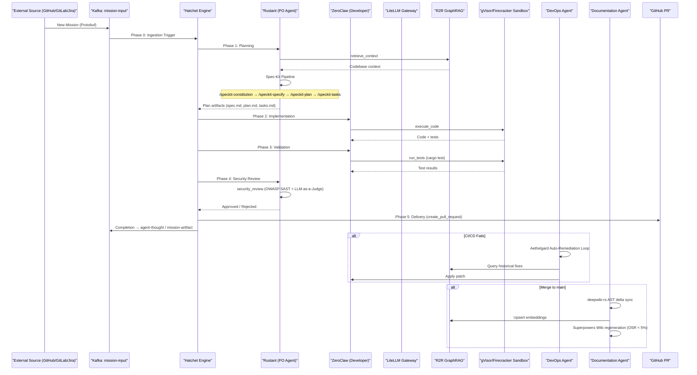
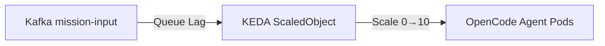

# EXPERIMENT-LIFECYCLE: Mission Execution

This document maps the journey of a mission through the factory, detailing the **6-Phase DAG** (Ingestion + 5 execution phases) orchestrated by Hatchet Engine.

---

## The 6-Phase DAG

Every mission follows a deterministic path of execution to ensure durability and quality.

---

## Phase Details

| Phase | Agent | Tool | Description |
| :--- | :--- | :--- | :--- |
| **0. Ingestion** | Hatchet | Kafka consumer | External trigger → `mission-input` topic |
| **1. Planning** | Rustant | `plan_mission`, `retrieve_context`, Spec-Kit | Decompose goal into spec-driven tasks |
| **2. Implementation** | ZeroClaw | `execute_code` | Generate code in gVisor/Firecracker sandbox |
| **3. Validation** | ZeroClaw | `run_tests` | Execute `cargo test` in sandbox |
| **4. Security Review** | Rustant | `security_review` | OWASP SAST + LLM-as-a-Judge ≥ 8.0/10 |
| **5. Delivery** | Hatchet | `create_pull_request` | Create GitHub PR with mission artifacts |

---

## Telemetry & MLOps

| Stream | Topic | Content |
| :--- | :--- | :--- |
| Agent Thoughts | `agent-thought` | Reasoning chains, phase transitions |
| Mission Artifacts | `mission-artifact` | Delivery summaries, PR URLs |
| Cost Attribution | Vtags (StackSpend/Finout) | Per-Epic LLM spend tracking |

---

## Closed-Loop QA

When production errors occur, the **DevOps Agent**:

1. Polls Sentry API every 15 minutes for new exceptions.
2. Grades severity (auto-filter benign warnings).
3. Maps exception to responsible microservice via R2R GraphRAG.
4. Creates prioritized backlog issue tagged `autonomous-plan`.

---

## KEDA & Scalability

- **Min Replicas**: 0 (Scale to zero when idle)
- **Max Replicas**: 10
- **Trigger**: Kafka lag threshold > 1
