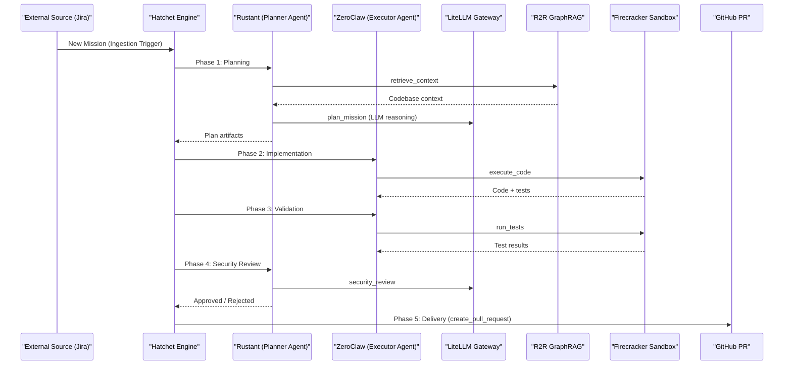
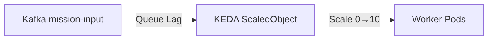

# EXPERIMENT-LIFECYCLE: Mission Execution

This document maps the journey of a mission through the factory, detailing the **6-Phase DAG** orchestrated by Hatchet Engine.

---

## The 6-Phase DAG

Every mission follows a deterministic path of execution to ensure durability and quality.

---

## Phase Details

| Phase | Agent | MCP Tool | Description |
| :--- | :--- | :--- | :--- |
| **0. Ingestion** | Hatchet | — | External trigger → New mission workflow |
| **1. Planning** | Rustant | `plan_mission`, `retrieve_context` | Retrieve context via R2R, decompose goal into tasks |
| **2. Implementation** | ZeroClaw | `execute_code` | Generate code in sandboxed environment |
| **3. Validation** | ZeroClaw | `run_tests` | Execute test suite in sandbox |
| **4. Security Review** | Rustant | `security_review` | LLM-as-a-Judge security audit |
| **5. Delivery** | Hatchet | — | Create GitHub PR with mission artifacts |

---

## State Checkpoints

The system uses Hatchet's durable task execution with `StepCheckpoint`s:

- **`MissionInput`**: Initial mission parameters (goal, jira_key)
- **`MissionOutput`**: Final delivery results (pr_url, status)
- **`TaskInput`**: Individual task parameters
- **`TaskOutput`**: Task results and metadata

All state is persisted to Hatchet's PostgreSQL backend, enabling automatic recovery from worker crashes.

---

## Telemetry

| Stream | Content |
| :--- | :--- |
| Agent Thoughts | Reasoning chains, phase transitions (published via `publish_thought`) |
| Mission Artifacts | Delivery summaries, PR URLs |

---

## KEDA & Scalability

- **Min Replicas**: 0 (Scale to zero when idle)
- **Max Replicas**: 10
- **Trigger**: Kafka lag threshold > 1

---

## CRG-Verified Workflow Structure

Based on `code-review-graph` analysis of `factory-application/src/workflows/`:

### `autonomous_mission.rs` (6-phase DAG)
- **Size**: 6 nodes (`MissionInput`, `MissionOutput`, `create_mission_workflow`)
- **Key Dependencies**: `Hatchet`, `RustantAgent`, `ZeroClawAgent`, `KafkaClient`, `McpClient`, `R2rClient`
- **Edges**: 33 outgoing edges including `clone`, `publish_thought`, `Uuid::new_v4`

### `develop_task.rs` (Individual task workflow)
- **Size**: 3 nodes (`TaskInput`, `TaskOutput`, `create_develop_task_workflow`)
- **Key Features**: Task-level checkpointing, error handling

---

*Last updated: 2026-06-23 — Verified against actual codebase via CRG analysis*