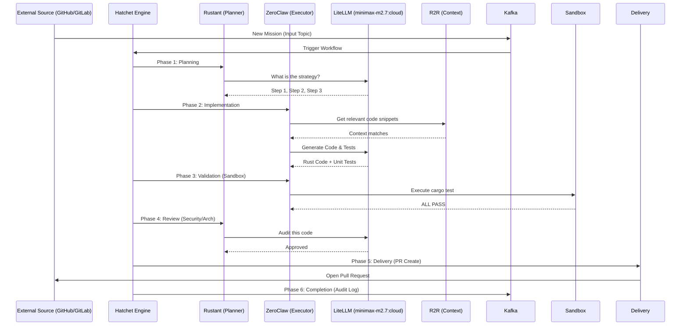
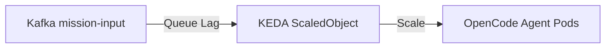

# 📈 EXPERIMENT-LIFECYCLE: Mission Execution

This document maps the journey of a mission through the factory, detailing the **6-Phase DAG** and the **MLflow Experiment Trace**.

---

## 🛤️ The 6-Phase DAG

Every mission follows a deterministic path of execution to ensure durability and quality.

---

## 📊 MLOps Integration: The Experiment Trace

We treat every mission as an **MLflow Run** to track performance and regressions.

| Phase | Metric Logged | Artifact Saved |
| :--- | :--- | :--- |
| **Ingestion** | `is_valid_mission` | Metadata JSON |
| **Planning** | `token_usage`, `strategy_score` | `plan.md` |
| **Execution** | `implement_latency` | `diff.patch` |
| **Validation** | `test_pass_rate` | `test_logs.txt` |
| **Review** | `security_risk_score` | `review_report.pdf` |
| **Delivery** | `success_rate` | PR URL |

### Feedback Loop
If any phase fails, the reason and context are captured and published to the **R2R Feedback Cluster**, allowing future missions with similar patterns to avoid the same pitfalls.

---

## 🌩️ KEDA & Scalability

The factory scales based on mission demand (message lag in the input topic).

