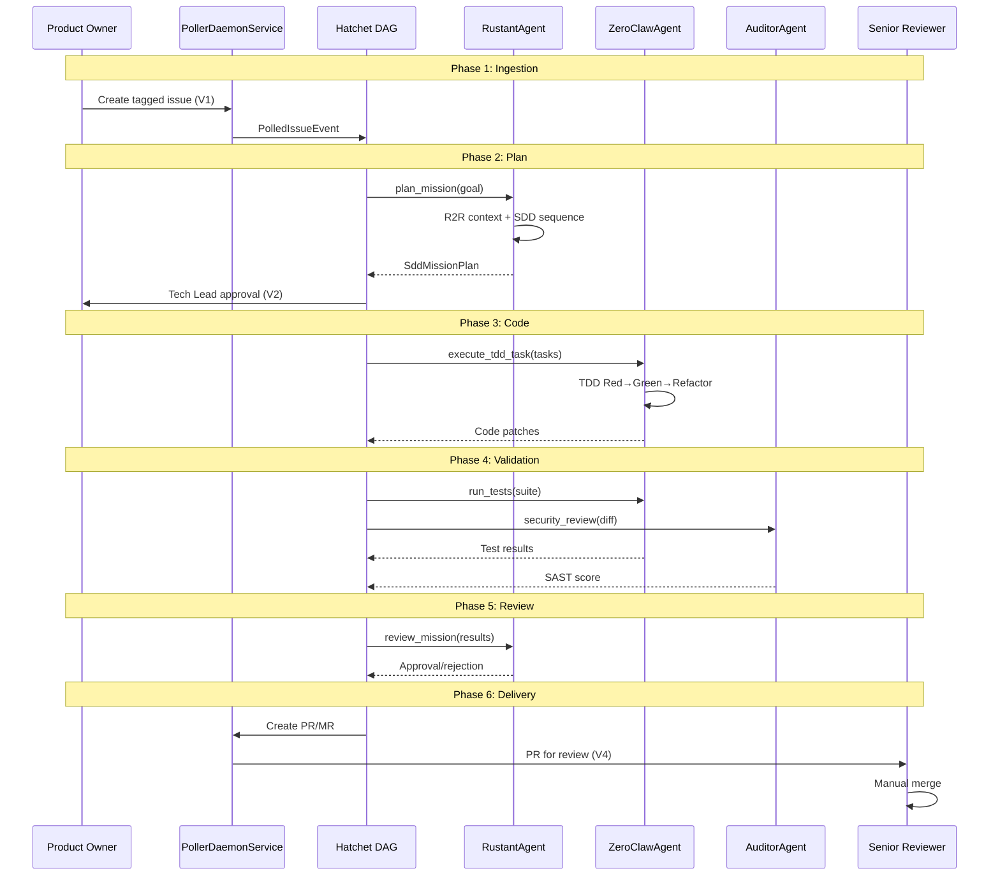

# Experiment Lifecycle — 6-Phase Hatchet DAG

> **Purpose**: Phase-by-phase breakdown of the autonomous mission lifecycle with responsible agents, I/O artifacts, and transitions.

---

## Phase Sequence Diagram

```mermaid
sequenceDiagram
    participant PO as Product Owner
    participant Poller as PollerDaemonService
    participant Hatchet as Hatchet DAG
    participant Rustant as RustantAgent
    participant ZeroClaw as ZeroClawAgent
    participant Auditor as AuditorAgent
    participant Reviewer as Senior Reviewer

    Note over PO,Reviewer: Phase 1: Ingestion
    PO->>Poller: Create tagged issue (V1)
    Poller->>Hatchet: PolledIssueEvent

    Note over PO,Reviewer: Phase 2: Plan
    Hatchet->>Rustant: plan_mission(goal)
    Rustant->>Rustant: R2R context + SDD sequence
    Rustant-->>Hatchet: SddMissionPlan
    Hatchet->>PO: Tech Lead approval (V2)

    Note over PO,Reviewer: Phase 3: Code
    Hatchet->>ZeroClaw: execute_tdd_task(tasks)
    ZeroClaw->>ZeroClaw: TDD Red→Green→Refactor
    ZeroClaw-->>Hatchet: Code patches

    Note over PO,Reviewer: Phase 4: Validation
    Hatchet->>ZeroClaw: run_tests(suite)
    Hatchet->>Auditor: security_review(diff)
    ZeroClaw-->>Hatchet: Test results
    Auditor-->>Hatchet: SAST score

    Note over PO,Reviewer: Phase 5: Review
    Hatchet->>Rustant: review_mission(results)
    Rustant-->>Hatchet: Approval/rejection

    Note over PO,Reviewer: Phase 6: Delivery
    Hatchet->>Poller: Create PR/MR
    Poller->>Reviewer: PR for review (V4)
    Reviewer->>Reviewer: Manual merge
```

## Phase Detail Table

| Phase | Agent | Input | Output | HITL Gate | Failure Mode |
|:---|:---|:---|:---|:---|:---|
| 1. Ingestion | PollerDaemonService | GitHub/GitLab/Jira event | PolledIssueEvent | V1: PO creates Epic | Invalid labels → Skip |
| 2. Plan | RustantAgent | Goal + R2R context | SddMissionPlan | V2: Tech Lead approves | LLM timeout → Retry |
| 3. Code | ZeroClawAgent | SddTaskItem list | Code patches | — | Compilation error → Retry |
| 4. Validation | ZeroClaw + Auditor | Code patches | Test + SAST results | V3: Architect (deadlock) | SAST < 8.0 → Block |
| 5. Review | RustantAgent | Validation results | Review decision | — | Rejection → Back to Phase 3 |
| 6. Delivery | PollerDaemonService | Approved changes | PR/MR | V4: Reviewer merges | — |

---

> *Related: [Agent Specifications](AGENT-SPECIFICATIONS.md) · [HITL Governance](HITL-GOVERNANCE.md)*
