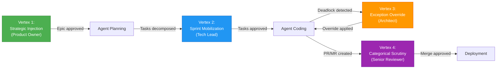
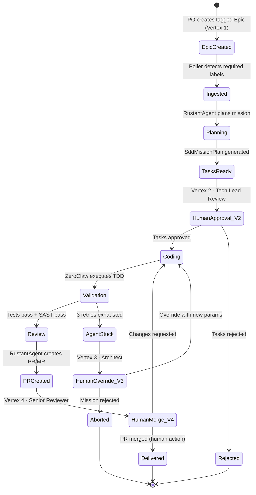
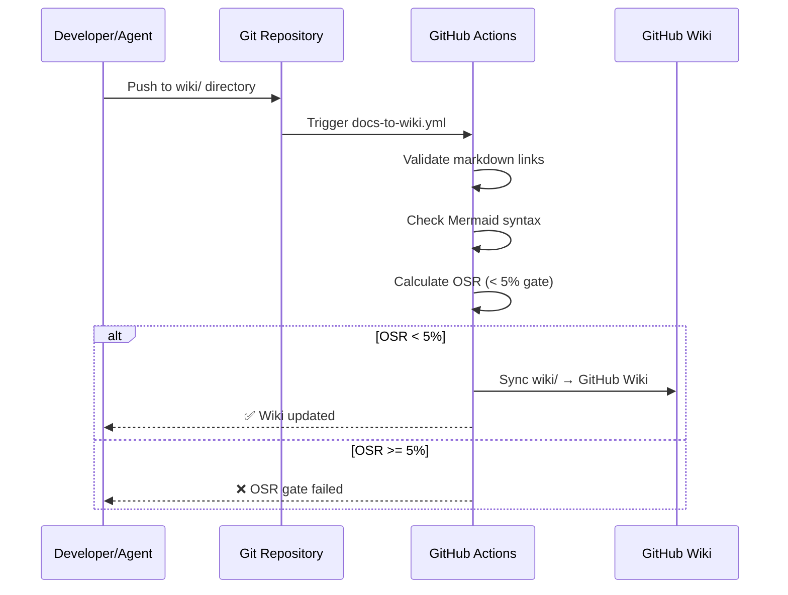

# HITL Governance — Dark Gravity CA/CD Autonomous Factory

> **Purpose**: Formal specification of the 4-Vertex Human-in-the-Loop governance mesh ensuring human oversight at critical decision points in the autonomous pipeline.

---

## 1. Governance Model Overview

The Dark Gravity Factory implements a **4-Vertex HITL Mesh** — four strategically placed human decision gates that prevent fully autonomous operation while maximizing agent acceleration.

> **Core Principle**: Agents are empowered to create branches, commit code, push upstream, create PRs/MRs, and resolve CI/CD failures. **Under no circumstances may an agent automatically merge a PR or MR into `main`** or default branches. The merge process **MUST be a manual human action**.

---

## 2. Vertex Specifications

### Vertex 1: Strategic Injection

| Attribute | Value |
|:---|:---|
| **Human Role** | Product Owner |
| **Trigger Condition** | Creation of Epic tagged `autonomous-plan` / `autonomous-mission` / `dark-gravity` |
| **Enforcement Mechanism** | GitHub/GitLab label requirements; Poller only ingests issues with required labels |
| **Decision** | Whether a mission should be autonomously executed |
| **Output** | `PolledIssueEvent` dispatched to ingestion pipeline |

### Vertex 2: Sprint Mobilization

| Attribute | Value |
|:---|:---|
| **Human Role** | Tech Lead |
| **Trigger Condition** | RustantAgent generates `SddMissionPlan` with decomposed tasks |
| **Enforcement Mechanism** | Hatchet DAG `Plan` phase waits for approval signal; `/speckit-tasks` generates tasks requiring human review |
| **Decision** | Whether the task decomposition is correct and safe to execute |
| **Output** | Approved `SddTaskItem` list dispatched to `Code` phase |

### Vertex 3: Exception Override

| Attribute | Value |
|:---|:---|
| **Human Role** | Architect |
| **Trigger Condition** | Aethelgard circuit breaker trips: 3 consecutive failures with stagnant diff hash |
| **Enforcement Mechanism** | `Agent-Stuck` state triggers Slack/Jira alert; DAG pauses until human override |
| **Decision** | Override parameters, abort mission, or reassign to different agent strategy |
| **Output** | Resumed execution with tuned parameters OR mission abortion |

### Vertex 4: Categorical Scrutiny

| Attribute | Value |
|:---|:---|
| **Human Role** | Senior Reviewer |
| **Trigger Condition** | PR/MR created by agent after successful validation + review phases |
| **Enforcement Mechanism** | Branch protection rules require human approval; agents cannot merge |
| **Decision** | Final design review, security posture validation, merge approval |
| **Output** | Merged PR/MR → FluxCD deployment |

---

## 3. Governance State Machine

---

## 4. Documentation Sync Pipeline

The wiki documentation is synchronized via the `.github/workflows/docs-to-wiki.yml` pipeline:

---

> *Related: [Security Architecture](SECURITY-ARCHITECTURE.md) · [Business Context](BUSINESS-CONTEXT.md) · [Compliance & Audit](COMPLIANCE-AUDIT.md)*
