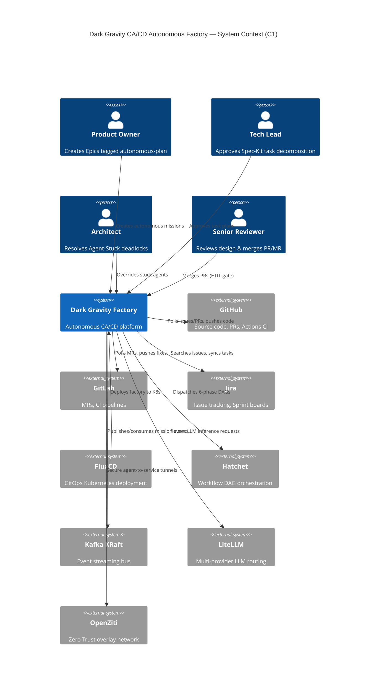

# Dark Gravity CA/CD Autonomous Factory — Wiki

Welcome to the **Dark Gravity Autonomous Factory** professional enterprise wiki. This documentation provides a comprehensive, C4-model-driven view of the CA/CD (Continuous Agentic / Continuous Deployment) platform — from executive business context through to deep tactical code-level UML diagrams.

---

## 🏠 Quick Navigation

| Section | Description |
|:---|:---|
| [📋 Business Context](architecture/business_context.md) | CA/CD vision, Hazitek 2026, ROI, KPIs |
| [🏗️ Strategic Design](architecture/strategic_design.md) | C4 Context & Container diagrams, Bounded Contexts, Onion Architecture |
| [⚙️ Tactical Design](architecture/tactical_design.md) | C4 Component diagrams, 5-crate mapping, DAG phases |
| [🤖 Agent Specifications](architecture/agent_specifications.md) | Rustant, ZeroClaw, Auditor, FinOps, QAObserver, DocAgent |
| [🔄 Experiment Lifecycle](architecture/runtime_sequences.md) | 6-phase Hatchet DAG, Spec-Kit SDD workflows |
| [🔌 Infrastructure Adapters](architecture/infrastructure_adapters.md) | Kafka, R2R GraphRAG, OpenZiti, Vault, Sentry |
| [✅ Verification Triad](security/verification_triad.md) | Logical, Architectural, Security gates |
| [🚀 Production Operations](operations/production_operations.md) | FluxCD GitOps, K8s topology, LiteLLM, troubleshooting |
| [📖 User Manual](operations/user_manual.md) | CLI usage, environment config, interactive directives |
| [🔒 Security Architecture](security/security_architecture.md) | Zero Trust, Ed25519 NHI, gVisor sandbox isolation |
| [🏛️ HITL Governance](security/hitl_governance.md) | 4-Vertex governance mesh, human oversight model |
| [📜 Compliance & Audit](security/compliance_audit.md) | Hazitek 2026, EU AI Act, R&D telemetry packaging |
| [📚 Glossary](GLOSSARY.md) | DDD ubiquitous language, acronyms, domain terms |
| [📑 Master Index](index.md) | Complete file listing with categories |

---

## 🔧 Crate Reference (OKF Source Maps)

Each crate in the workspace has per-module OKF documentation pages:

| Crate | Layer | Pages |
|:---|:---|:---:|
| [`factory-core`](modules/core/lib.md) | Domain | 5 |
| [`factory-application`](modules/application/lib.md) | Application | 20+ |
| [`factory-infrastructure`](modules/infrastructure/lib.md) | Infrastructure | 15+ |
| [`factory-mcp-server`](modules/mcp_server/lib.md) | Interface (MCP) | 20+ |
| [`factory-cli`](modules/cli/main.md) | CLI | 3 |

---

## 📊 Architecture at a Glance

---

## 📄 Documentation Standards

- **Diagrams**: All architectural diagrams use [Mermaid.js](https://mermaid.js.org/) for portable, text-based rendering
- **Format**: Follows the [Open Knowledge Format (OKF)](https://github.com/openwiki-spec) / OpenWiki standard
- **Quality Gate**: Orphan Symbol Rate (OSR) < 5% — every public Rust AST symbol is documented
- **Sync**: Documentation auto-syncs via `.github/workflows/docs-to-wiki.yml`

---

> *Generated for the Dark Gravity CA/CD Autonomous Factory — Professional Enterprise Wiki*
> *Branch: `007-professional-wiki-docs` | Last updated: 2026-09-30*