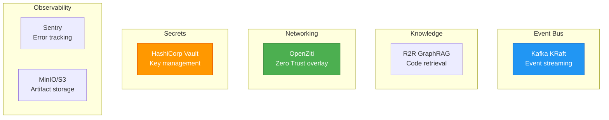
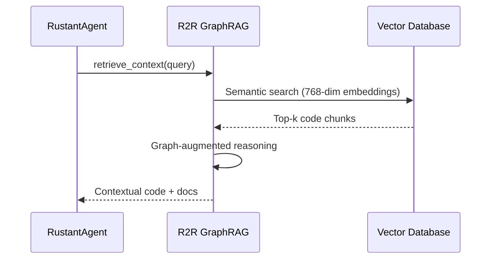

# Infrastructure Adapters — Dark Gravity Factory

> **Purpose**: Comprehensive documentation of all infrastructure adapters with UML diagrams.

---

## Adapter Overview

## Kafka KRaft Architecture

| Topic | Producer | Consumer | Purpose |
|:---|:---|:---|:---|
| `mission-events` | PollerDaemonService | Hatchet | Mission ingestion |
| `budget-exceeded` | FinOpsAgent | Ops alerts | Budget hardstop |
| `compliance-audit` | Telemetry export | S3 archiver | Audit trail |

## R2R GraphRAG Knowledge Retrieval

---

> *Related: [Tactical Design](TACTICAL-DESIGN.md) · [Production Operations](PRODUCTION-OPERATIONS.md)*
