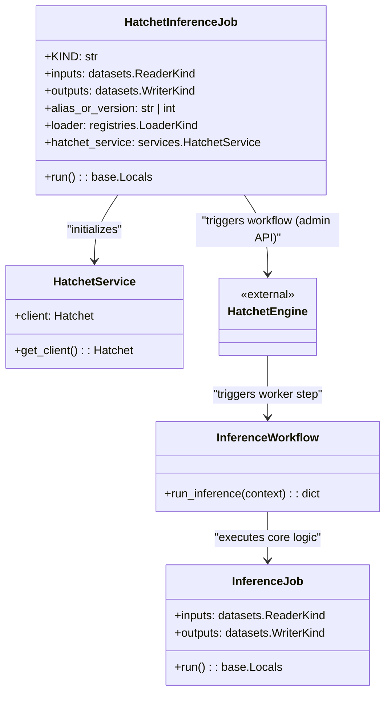

# US [Asynchronous Model Inference with Hatchet](./backlog_llmops_autogen.md)

- [US Asynchronous Model Inference with Hatchet](#us-asynchronous-model-inference-with-hatchet)
  - [Overview](#overview)
  - [Architecture and Class Relations](#architecture-and-class-relations)
  - [**User Stories: Asynchronous Orchestration**](#user-stories-asynchronous-orchestration)
    - [**1. User Story: Trigger Async Inference via CLI**](#1-user-story-trigger-async-inference-via-cli)
    - [**2. User Story: Managed Lifecycle with Hatchet Service**](#2-user-story-managed-lifecycle-with-hatchet-service)
    - [**3. User Story: Workflow Execution and Step-Level Isolation**](#3-user-story-workflow-execution-and-step-level-isolation)
  - [**How to Use**](#how-to-use)
    - [**1. Environment Setup**](#1-environment-setup)
    - [**2. Configuration**](#2-configuration)
    - [**3. Execution**](#3-execution)
    - [**4. Monitoring**](#4-monitoring)
  - [Code location](#code-location)
  - [Test location](#test-location)

---

## Overview

The asynchronous inference process allows the system to trigger model prediction workflows that run independently of the triggering process. This is particularly useful for large-scale batch predictions, ensuring high availability and robust error handling (retries, timeouts) through the Hatchet engine.

## Architecture and Class Relations



## **User Stories: Asynchronous Orchestration**

---

### **1. User Story: Trigger Async Inference via CLI**

**Title:**
As a **data engineer**, I want to trigger an inference job from the CLI that immediately returns while the actual work happens in the background, so that I don't have to maintain a long-lived terminal connection for extensive datasets.

**Description:**
The `HatchetInferenceJob` acts as a proxy. It collects the necessary configurations, serializes them, and sends a signal to the Hatchet engine to start the `InferenceWorkflow`.

**Acceptance Criteria:**

- The CLI command completes rapidly after the workflow is queued.
- The job parameters are correctly serialized and transmitted to Hatchet.
- The system provides feedback that the workflow was successfully triggered.

---

### **2. User Story: Managed Lifecycle with Hatchet Service**

**Title:**
As a **system administrator**, I want a centralized service to manage connection tokens and client instances for the orchestration engine, so that I can ensure secure and consistent access to the workflow infrastructure.

**Description:**
`HatchetService` provides a singleton client instance, handling authentication via environment variables and providing a robust fallback for local tests.

**Acceptance Criteria:**

- The service correctly loads `HATCHET_CLIENT_TOKEN` and `HATCHET_NAMESPACE`.
- A singleton pattern is used to prevent redundant client initializations.
- The service allows registering and triggering workflows.

---

### **3. User Story: Workflow Execution and Step-Level Isolation**

**Title:**
As a **DevOps engineer**, I want inference steps to run in isolated, retriable units, so that failures in one part of the process don't require restarting the entire pipeline and can be automatically recovered.

**Description:**
The `InferenceWorkflow` defined in the orchestration layer uses Hatchet decorators to define atomic steps that execute the `InferenceJob`.

**Acceptance Criteria:**

- The workflow correctly extracts inputs from the Hatchet context.
- Errors in the execution are captured and reported back to the Hatchet engine.
- The workflow returns a summary of the processed data.

---

## **How to Use**

### **1. Environment Setup**

Ensure you have the Hatchet SDK installed and the following environment variables configured:

```bash
HATCHET_CLIENT_TOKEN="your_token_here"
HATCHET_NAMESPACE="your_namespace"
```

### **2. Configuration**

Create a configuration file (e.g., `confs/hatchet_inference.yaml`):

```yaml
job:
  KIND: HatchetInferenceJob
  inputs:
    KIND: ParquetReader
    path: data/inputs_test.parquet
    limit: 100
  outputs:
    KIND: ParquetWriter
    path: outputs/predictions_test.parquet
  alias_or_version: Champion
```

### **3. Execution**

Run the job using the `inv` (invoke) tool:

```bash
poetry run invoke projects.run --job hatchet_inference
```

This will trigger the workflow in your configured Hatchet instance.

### **4. Monitoring**

Check the status of your jobs in the Hatchet Dashboard to see:

- Run status (Succeeded, Failed, In Progress).
- Step-level logs.
- Input/Output payloads.

---

## Code location

- **Application Layer**: [src/autogen_team/application/jobs/hatchet_inference.py](../src/autogen_team/application/jobs/hatchet_inference.py)
- **Infrastructure Layer (Service)**: [src/autogen_team/infrastructure/services/hatchet_service.py](../src/autogen_team/infrastructure/services/hatchet_service.py)
- **Orchestration Layer (Inference)**: [src/autogen_team/infrastructure/orchestration/hatchet_workflows.py](../src/autogen_team/infrastructure/orchestration/hatchet_workflows.py)
- **Orchestration Layer (Autonomous Mission)**: [src/autogen_team/application/workflows/autonomous_mission.py](../src/autogen_team/application/workflows/autonomous_mission.py)

## Test location

- **Job Tests**: [tests/application/jobs/test_hatchet_inference.py](../tests/application/jobs/test_hatchet_inference.py)
- **Service Tests**: [tests/infrastructure/services/test_hatchet_service.py](../tests/infrastructure/services/test_hatchet_service.py)
- **Orchestration Tests**: [tests/infrastructure/orchestration/test_hatchet_orchestration.py](../tests/infrastructure/orchestration/test_hatchet_orchestration.py)
