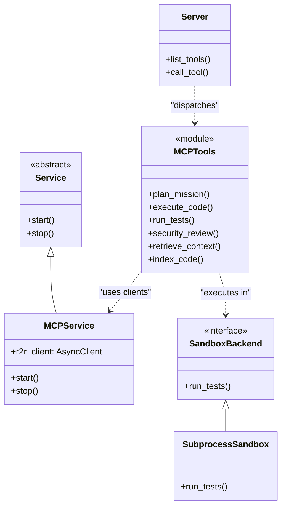

# US [MCP Autonomous Capabilities](./backlog_llmlops_regresion.md) : Provide standardized AI tools for autonomous mission execution.

- [US MCP Autonomous Capabilities : Provide standardized AI tools for autonomous mission execution.](#us-mcp-autonomous-capabilities--provide-standardized-ai-tools-for-autonomous-mission-execution)
  - [classes relations](#classes-relations)
  - [**User Stories: MCP Tools**](#user-stories-mcp-tools)
    - [**1. User Story: Mission Planning**](#1-user-story-mission-planning)
    - [**2. User Story: Sandboxed Testing**](#2-user-story-sandboxed-testing)
    - [**3. User Story: Security Analysis**](#3-user-story-security-analysis)
    - [**Common Acceptance Criteria**](#common-acceptance-criteria)
  - [Code location](#code-location)
  - [Test location](#test-location)

---

## classes relations

## **User Stories: MCP Tools**

---

### **1. User Story: Mission Planning**

**Title:**
As an **autonomous agent**, I want to decompose a high-level goal into a task DAG, so I can execute complex missions step-by-step.

**Description:**
The `plan_mission` tool uses Gemini Pro (via LiteLLM) to take an arbitrary goal and return a JSON structure of interdependent tasks.

**Acceptance Criteria:**
- Returns a valid JSON DAG with IDs, names, and dependency lists.
- Handles empty or nonsense goals gracefully.

---

### **2. User Story: Sandboxed Testing**

**Title:**
As a **developer**, I want to run generated code in an isolated environment, so I can verify correctness without risking the main workspace.

**Description:**
The `run_tests` tool leverages `SubprocessSandbox` to execute `pytest` in a transient directory containing the proposed code changes.

**Acceptance Criteria:**
- Captures pass/fail status and stdout/stderr results.
- Supports configurable timeouts to prevent hanging processes.

---

### **3. User Story: Security Analysis**

**Title:**
As a **security officer**, I want every code change to be automatically reviewed for vulnerabilities, so I can maintain high security standards.

**Description:**
The `security_review` tool combines regex-based OWASP pattern detection with R2R RAG retrieval of security best practices to provide a final "Approved" or "Rejected" verdict.

**Acceptance Criteria:**
- Detects Command Injection, SQL Injection, and Hardcoded Secrets.
- Rejects any code containing high-severity OWASP findings.

---

### **Common Acceptance Criteria**

1. **JSON Schema Compliance**: Every tool must expose a valid JSON Schema for its inputs.
2. **Standardized Response**: All tools must return JSON-serializable results wrapped in `TextContent`.
3. **Traceability**: All LLM and RAG calls must be traceable via standard logging.

## Code location

- **MCP Application Layer**: [src/autogen_team/application/mcp/](file:///home/lgcorzo/llmops-python-package/src/autogen_team/application/mcp/)
- **MCP Infrastructure Layer**: [src/autogen_team/infrastructure/services/mcp_service.py](file:///home/lgcorzo/llmops-python-package/src/autogen_team/infrastructure/services/mcp_service.py)

## Test location

- [tests/application/mcp/](file:///home/lgcorzo/llmops-python-package/tests/application/mcp/)
