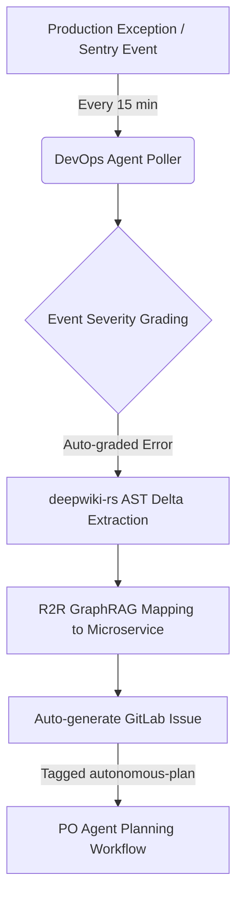

# 🚀 PRODUCTION-OPERATIONS: Deployment & Scaling

This document details the **GitOps** and **Kubernetes** operations for the **Dark Gravity** autonomous factory.

---

## 🛠️ GitOps Delivery Model

The factory is deployed using a GitOps controller (FluxCD/ArgoCD) to ensure the cluster state matches the git repository.

- **Source**: `[GITOPS_REPO_URL]`
- **Target**: Production Cluster (namespace: `autonomous-factory`)

### Reconciliation Cycle
1. Changes pushed to the Ops repo.
2. GitOps controller detects the delta.
3. Manifests are applied via **Server-Side Apply (SSA)**.
4. Health checks verify the **Backbone** and **Agent** pods are running.

---

## 🌊 Autoscaling (KEDA)

We use **KEDA** (Kubernetes Event-Driven Autoscaling) to scale the workforce based on mission volume.

### ScaledObject Configuration
- **Trigger**: Kafka (lag in `mission-input` topic).
- **Min Replicas**: 0 (Scale to zero when idle).
- **Max Replicas**: 20 (Horizontal throughput burst).

```yaml
apiVersion: keda.sh/v1alpha1
kind: ScaledObject
metadata:
  name: agent-scaler
spec:
  scaleTargetRef:
    name: opencode-agent
  triggers:
  - type: kafka
    metadata:
      topic: mission-input
      bootstrapServers: kafka:9092
      lagThreshold: "1"
```

---

## 🔐 Secrets & Security

All sensitive data is encrypted using **Sealed Secrets**.

### How to add a new Secret:
1. Create a local Kubernetes Secret YAML.
2. Encrypt it using `kubeseal`.
3. Commit the resulting `SealedSecret` file to the Ops repo.
4. The cluster controller will automatically decrypt it for the applications.

---

## 📈 Monitoring, Logging & Remediation

| Component | Focus | Tooling |
| :--- | :--- | :--- |
| **System Health** | CPU, Memory, Pod Status | Prometheus / Grafana |
| **Agent Thought** | Reasoning & Strategies | Kafka Consumer (`agent-thought` stream) |
| **MLOps Metrics** | Success & Latency Experiments | MLflow Dashboard |
| **Application Logs** | STDOUT / STDERR streams | Loki / Fluentbit |
| **Error Tracking** | Production Exception Capturing | Sentry |
| **Auto-Remediator** | Error Mapping & Auto-backlogging | DevOps Agent Poller / `deepwiki-rs` / GraphRAG |

---

## 🔄 Closed-Loop DevOps (Sentry Integration)

To achieve autonomous self-healing, the DevOps Agent implements a proactive closed-loop remediation flow:

1. **Sentry Polling**: A background poller queries the Sentry API every 15 minutes for new exceptions in production.
2. **Event Severity Grading**: The system grades the severity of incoming alerts to filter out benign warnings and prevent backlog noise.
3. **AST Delta Extraction**: For high-priority exceptions, **`deepwiki-rs`** extracts the abstract syntax tree (AST) delta from recent codebase commits.
4. **GraphRAG Mapping**: R2R GraphRAG maps the AST delta and exception trace directly to the responsible microservice.
5. **Backlog Automation**: The system automatically creates a GitLab Issue in the repository backlog, tagged with `autonomous-plan`. This triggers the PO Agent's planning workflow to resolve the issue without human intervention.


