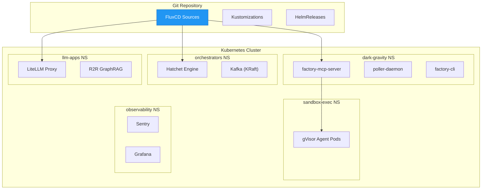

# Production Operations — Dark Gravity CA/CD Autonomous Factory

> **Purpose**: FluxCD deployment topology, K8s namespace layout, LiteLLM routing, and troubleshooting runbook.

---

## 1. FluxCD GitOps Deployment Topology


```mermaid
graph TB
    subgraph "Git Repository"
        FLUX["FluxCD Sources"]
        KUST["Kustomizations"]
        HELM["HelmReleases"]
    end
    subgraph "Kubernetes Cluster"
        subgraph "dark-gravity NS"
            MCP["factory-mcp-server"]
            POLLER["poller-daemon"]
            CLI["factory-cli"]
        end
        subgraph "orchestrators NS"
            HATCHET["Hatchet Engine"]
            KAFKA["Kafka (KRaft)"]
        end
        subgraph "llm-apps NS"
            LITELLM["LiteLLM Proxy"]
            R2R["R2R GraphRAG"]
        end
        subgraph "sandbox-exec NS"
            GVISOR["gVisor Agent Pods"]
        end
        subgraph "observability NS"
            SENTRY["Sentry"]
            GRAFANA["Grafana"]
        end
    end

    FLUX --> MCP
    FLUX --> HATCHET
    FLUX --> LITELLM
    MCP --> GVISOR

    style FLUX fill:#2196F3,stroke:#1565C0,color:#fff
```

---

## 2. Kubernetes Namespace Layout

| Namespace | Purpose | Key Workloads | Node Affinity |
|:---|:---|:---|:---|
| `dark-gravity` | Core factory services | MCP server, Poller, CLI | `factory-core` nodes |
| `orchestrators` | Workflow orchestration | Hatchet, Kafka | `orchestrator` nodes |
| `llm-apps` | AI/ML inference | LiteLLM, R2R | GPU-capable nodes |
| `sandbox-exec` | Isolated agent execution | gVisor pods | `sandbox` nodes (tainted) |
| `observability` | Monitoring & alerting | Sentry, Grafana, Prometheus | `monitoring` nodes |

---

## 3. LiteLLM Routing Configuration

```yaml
# LiteLLM config.yaml
model_list:
  - model_name: ollama/qwen2.5:7b
    litellm_params:
      model: ollama/qwen2.5:7b
      api_base: http://ollama.llm-apps:11434
  - model_name: gpt-oss-120b
    litellm_params:
      model: azure/gpt-oss-120b
      api_base: ${AZURE_OPENAI_ENDPOINT}
      api_key: ${AZURE_OPENAI_KEY}

general_settings:
  virtual_key_management: true  # FinOps virtual tags
```

---

## 4. Troubleshooting Runbook

### Pod Crash Loops

| Symptom | Cause | Resolution |
|:---|:---|:---|
| MCP server CrashLoopBackOff | Missing env vars | Check `LITELLM_API_BASE`, `HATCHET_API_URL` |
| Poller CrashLoopBackOff | GitHub token expired | Rotate `GITHUB_TOKEN` in sealed-secrets |
| Sandbox pod OOMKilled | Memory limit exceeded | Verify `SandboxConstraint.max_memory_mb <= 30` |

### Kafka Lag

| Symptom | Cause | Resolution |
|:---|:---|:---|
| Consumer lag > 1000 | Slow consumer | Scale consumer replicas |
| Topic not found | Topic not created | Run `kafka-topics --create` |

### Ziti Tunnel Drops

| Symptom | Cause | Resolution |
|:---|:---|:---|
| Connection refused on ziti endpoint | Tunnel pod restart | Check `ziti-tunnel` sidecar logs |
| Certificate expired | PKI rotation needed | Renew OpenZiti identity |

### Hatchet DAG Failures

| Symptom | Cause | Resolution |
|:---|:---|:---|
| Phase 2 timeout | LLM model too slow | Switch to faster model via `LITELLM_PLANNER_MODEL` |
| Phase 3 circuit breaker | Stagnant diff hash | HITL Vertex 3 override required |
| Phase 4 SAST gate fail | Score < 8.0 | Review generated code for security issues |

---

> *Related: [User Manual](USER-MANUAL.md) · [Experiment Lifecycle](EXPERIMENT-LIFECYCLE.md)*