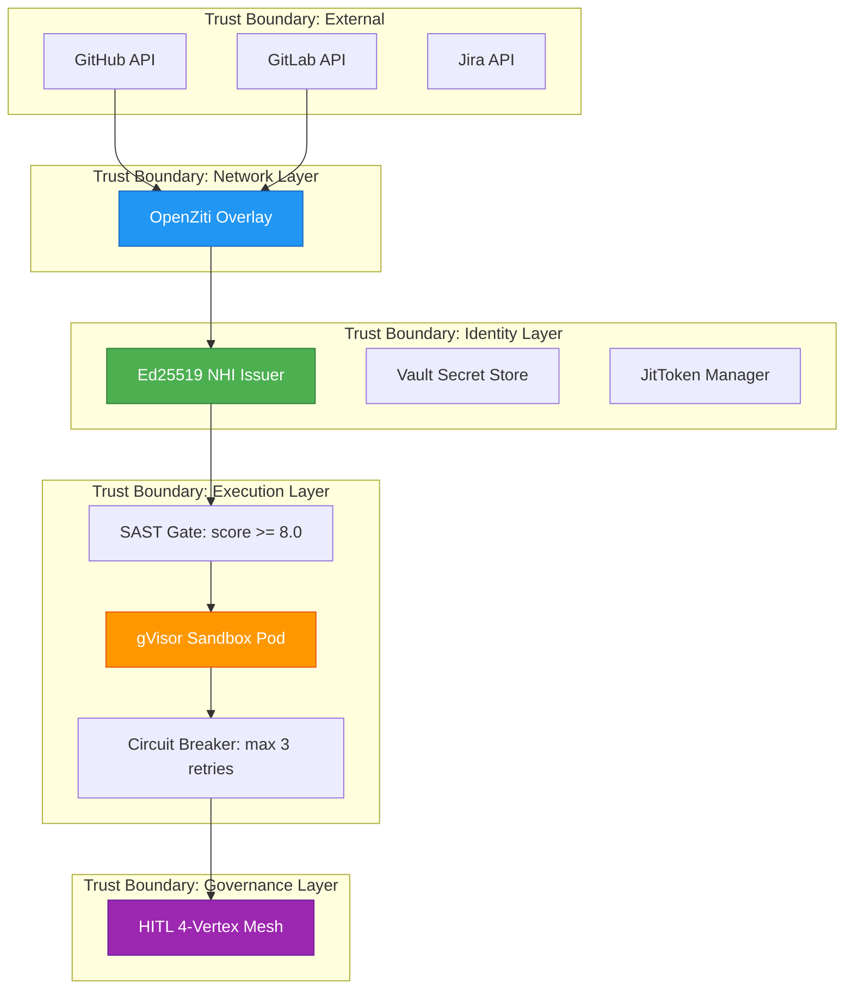
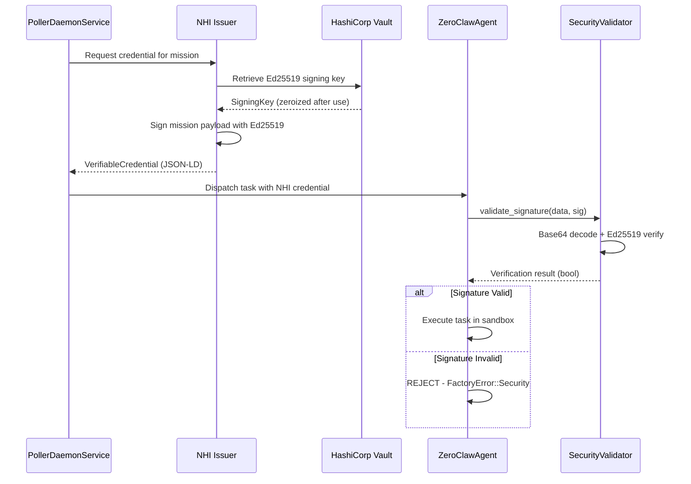
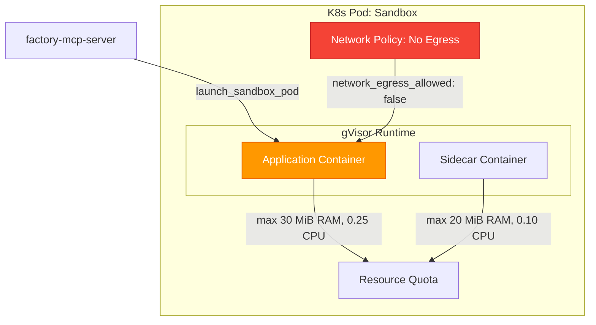
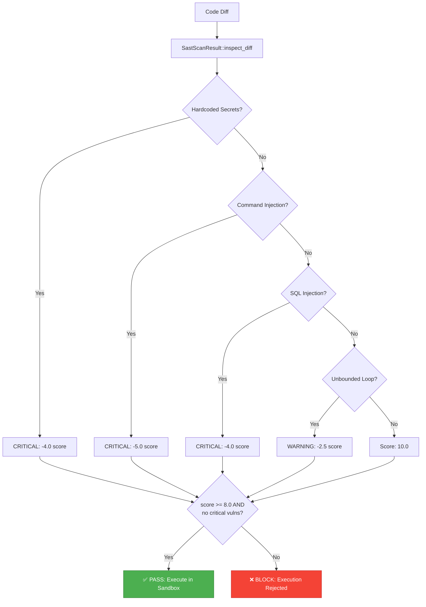
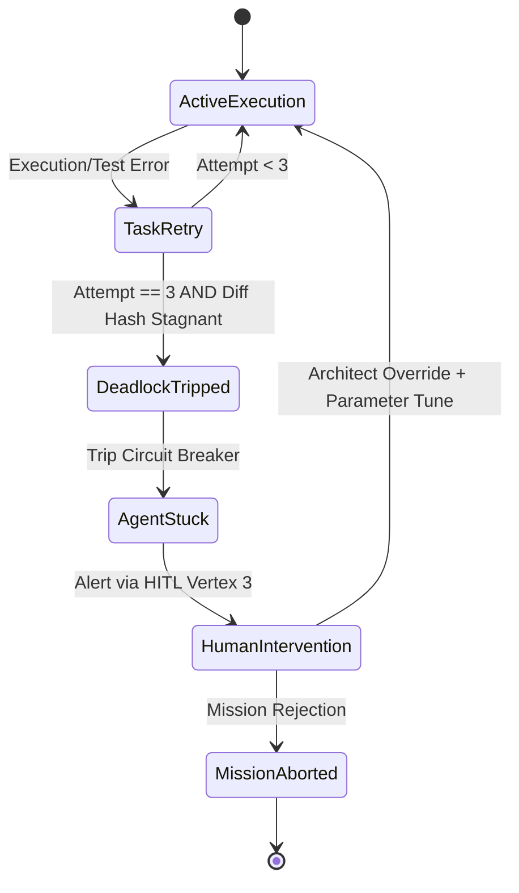

# Security Architecture — Dark Gravity CA/CD Autonomous Factory

> **Purpose**: Comprehensive documentation of the Zero Trust security model, Ed25519 Non-Human Identity credentials, sandbox containment, SAST gates, and threat model mapping.

---

## 1. Zero Trust Security Model Overview

The Dark Gravity Factory operates under a **Zero Trust** security posture: no implicit trust is granted to any agent, service, or network path. Every action requires explicit cryptographic verification.



---

## 2. Ed25519 Non-Human Identity (NHI) Lifecycle

Every autonomous mission requires a cryptographic identity. The NHI lifecycle ensures traceability from issue ingestion through code delivery.



### Key Security Types

| Type | Module | Description |
|:---|:---|:---|
| `Ed25519SecurityValidator` | `factory-core::security` | Implements `SecurityValidator` trait with `ed25519-dalek` |
| `JitToken` | `factory-core::security` | Ephemeral token with `zeroize::ZeroizeOnDrop` — wiped from memory on drop |
| `SecurityBounds` | `factory-core::security` | Trait for token validation and JIT issuance |
| `AuditResult` | `factory-core::security` | Content audit output: `is_safe`, `findings` |

---

## 3. Sandbox Containment Architecture

Agent code execution is isolated in gVisor-sandboxed Kubernetes pods with strict resource constraints.



### SandboxConstraint Enforcement

```rust
// From factory-core::security
pub struct SandboxConstraint {
    pub max_memory_mb: u32,      // Default: 30 MiB
    pub max_cpu_cores: f32,       // Default: 0.25 cores
    pub network_egress_allowed: bool, // Default: false
}

// ZeroClawAgent validates before every execution:
// - App container: max_memory_mb <= 30, max_cpu_cores <= 0.25
// - Sidecar container: max_memory_mb <= 20, max_cpu_cores <= 0.10
// - network_egress_allowed must be false for both
```

---

## 4. SAST Gate Integration

Every code change passes through a Static Application Security Testing gate before execution. The `SastScanResult` enforces a minimum score of **8.0/10.0**.



---

## 5. Circuit Breaker Anti-Deadlock (Aethelgard)

The Aethelgard circuit breaker prevents infinite agent retry loops:



---

## 6. STRIDE Threat Model Mapping

| Threat | Category | Control | Implementation |
|:---|:---|:---|:---|
| Agent impersonation | Spoofing | Ed25519 NHI credentials | `SecurityValidator::validate_signature()` |
| Unauthorized code execution | Tampering | SAST gate + sandbox isolation | `SastScanResult::passes_gate()` + gVisor |
| Mission data exposure | Information Disclosure | OpenZiti encrypted tunnels | `ZitiClient` Zero Trust overlay |
| Denial of service via token burn | Denial of Service | FinOps budget hardstops | `DailyBudgetConfig::hardstop_threshold_ratio` |
| Privilege escalation | Elevation of Privilege | Minimal sandbox constraints | `SandboxConstraint::validate_bounds()` |
| Audit trail tampering | Repudiation | Cryptographic NHI claims | Ed25519 signed verifiable credentials |

---

> *Related: [HITL Governance](HITL-GOVERNANCE.md) · [Verification Triad](VERIFICATION-TRIAD.md) · [Compliance & Audit](COMPLIANCE-AUDIT.md)*
